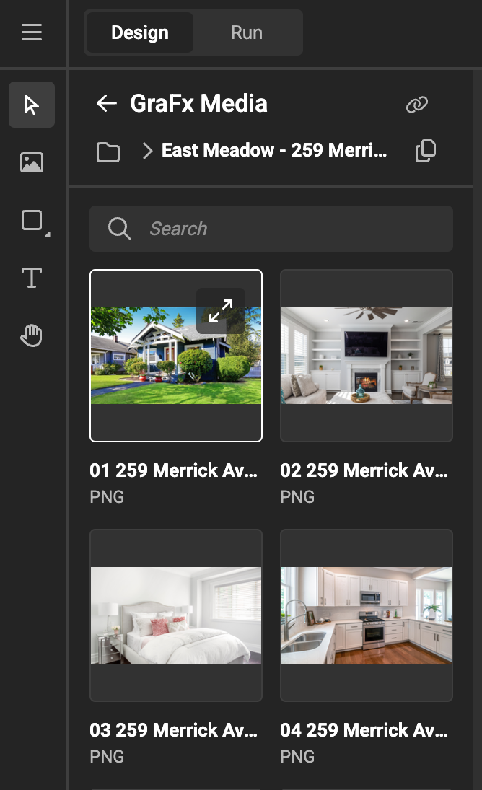

# Frame: Image

See concept [Image frames](/GraFx-Studio/concepts/frames/#image-frame)

## Create image frame

Select the image tool in the sidebar. You can also use the shortcut for the shape you wish to draw.

Drag a rectangle on the canvas. The frame will initially look like a crossed rectangle.

## Feature Channel

<iframe width="690" height="388" src="https://www.youtube.com/embed/KgVcr821tII?si=D-p32N58ssZSoD90&controls=1&mute=1&showinfo=0&rel=0&autoplay=0&loop=1" title="YouTube video player" frameborder="0" allow="accelerometer; autoplay; clipboard-write; encrypted-media; gyroscope; picture-in-picture; web-share" referrerpolicy="strict-origin-when-cross-origin" allowfullscreen></iframe>

[All feature videos](https://www.youtube.com/playlist?list=PLLHtQ1R6R-B_m7XAVySM9OjbbUscsgBOH)

## Choose media

With the frame selected, open the **resource panel** > **media panel**, and select an asset.

The initial fit of the asset in the frame is to fill the frame. (see Fill properties below)

## Smart Crop

Similar to setting Subject Area and POI in GraFx Media, you can do this in GraFx Studio Workspace.

This also allows the Template Designer to overrule the POI and Subject area sent by an external Asset Provider (user Media Connectors).

Click on the diagonal arrows to see the details of the asset.

The information about the asset is displayed, and the option to define the subject area and POI.

Click the "Subject Area" button, and you'll be able to set the Subject Area and POI.

See also [Concept of Smart Crop](/concepts/genie-smart-crop/) and [Set Subject Area in GraFx Media](/GraFx-Media/guides/smart-crop-subject-area/)

!!! warning "Watch out!"
    If you set the Subject Area here, it will impact all templates where this asset is used, as the Subject Area and POI are stored alongside the media.

!!! warning "Known issue"
    If you made changes, reselect the Smart Crop Fit, to see the effect.

## Properties

Similar properties as with all frames. See [Basic properties](/GraFx-Studio/concepts/frames/#basic-properties).

### Fill properties

#### Fit

Choose the Fit property, to fit the full image inside the frame. Whitespace is created if needed, to fit the full image.

#### Fill

Choose the Fill property, to fill the full frame with the image. No whitespace is left inside the frame. Part of the image is hidden.

#### Smart Crop

Choose the Smart Crop property, to let GraFx Genie assist to position the subject area and POI in the frame.

See [Concept of Smart Crop](../../concepts/genie-smart-crop/) for more details

See [How to use Smart Crop](../smart-crop/) for more details

#### Aspect radio

If the image and the frame have the exact aspect ratio, there will be no difference between fitt and fill.

#### Manual Crop

See [Cropping an Image](/GraFx-Studio/guides/cropping/)

### Appearance

See [Blend modes](/GraFx-Studio/guides/blendmodes/)