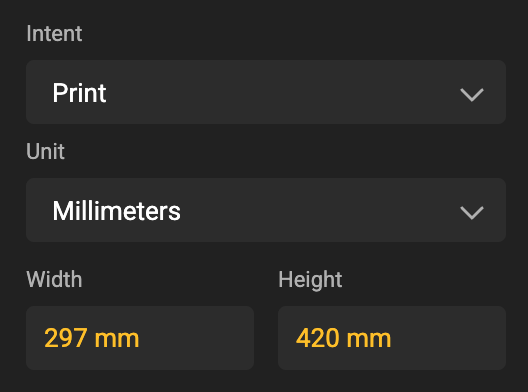
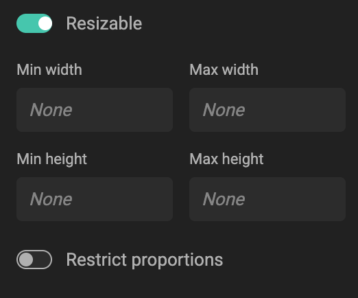
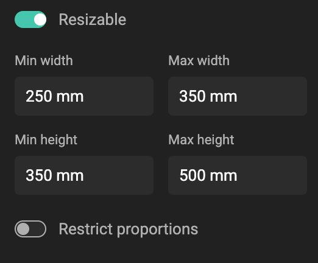
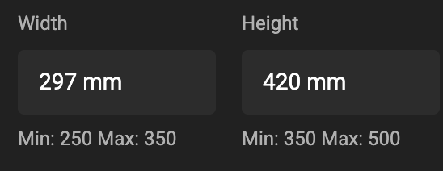
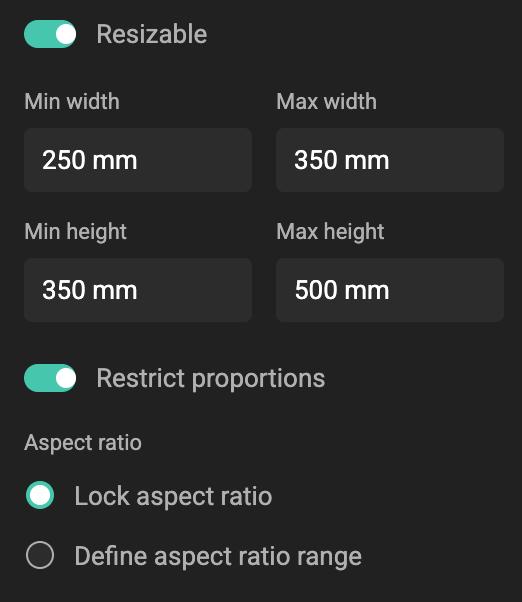
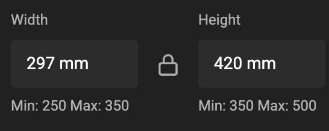
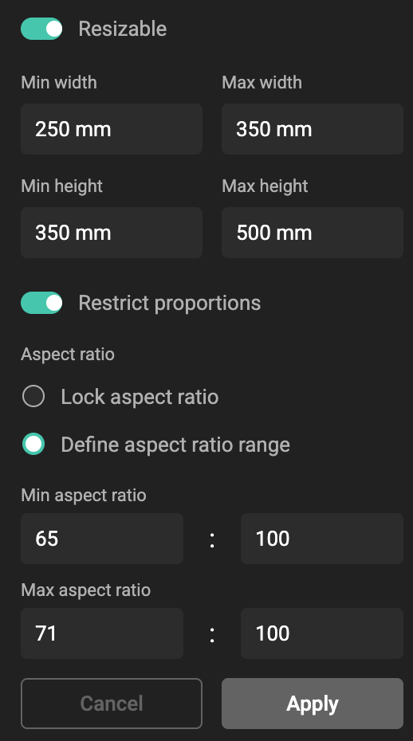

# How to Set Layout Size Constraints

In this example, we start from a Layout, with print intent, set to A3 (297mm x 420mm).

In the restrictions, the units of the layout will be used.

{.screenshot}

## 1. Enable resizing
1. Select your layout in GraFx Studio.  
2. In the **Layout Settings** panel, switch on **Resizable**.  
   - This unlocks the options for **Min/Max width and height** and **Restrict proportions**.

{.screenshot}

## 2. Set dimension limits
- Enter values for **Min width** and **Max width**.  
- Enter values for **Min height** and **Max height**.  
- These define the absolute size range for resizing.  

{.screenshot}

How this looks on the end-user side.

{.screenshot}

## 3. Restrict proportions (optional)
1. Toggle **Restrict proportions**.  
2. Choose one of two options:

### Option A — Lock aspect ratio
- Select **Lock aspect ratio**.  
- Width and height always scale together, preserving proportions.  
- Example: Ratio 297:420 always remains a portrait layout.

{.screenshot}

How this looks on the end-user side.

{.screenshot}

### Option B — Define aspect ratio range
- Select **Define aspect ratio range**.  
- Enter a **Min aspect ratio** (width ÷ height).  
- Enter a **Max aspect ratio** (width ÷ height).  
- Users can resize freely, as long as the proportions stay within this range.  

#### Example

To serve European and American sizes, we will limit the Aspect ratio between 0.65 and 0.71.
This will allow the end user to finetune, but stay within aspect ratio boundaries.

How did we arrive to these ratios?

| Format   | Width | Height | Unit | Aspect Ratio (W ÷ H) | Aspect Ratio (Fraction) |
|----------|-------|--------|------|----------------------|--------------------------|
| A3       | 297   | 420    | mm   | 0.71                 | 71:100                   |
| A3       | 11.69 | 16.54  | in   | 0.71                 | 71:100                   |
| Tabloid  | 279   | 432    | mm   | 0.65                 | 65:100                   |
| Tabloid  | 11.00 | 17.00  | in   | 0.65                 | 65:100                   |

{.screenshot}

## 4. Apply and test
- Click **Apply**.  
- Test resizing the layout to confirm the limits behave as expected.  
- If users try to resize outside the allowed range, they’ll see a warning.

## Related

- [Concept: Restricting aspect ratio](/GraFx-Studio/concepts/layout-size-constraints/)