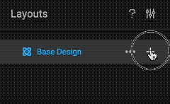
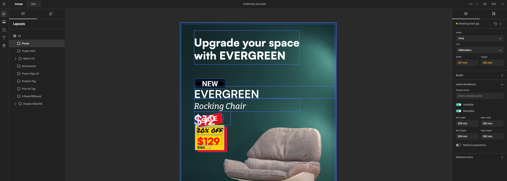
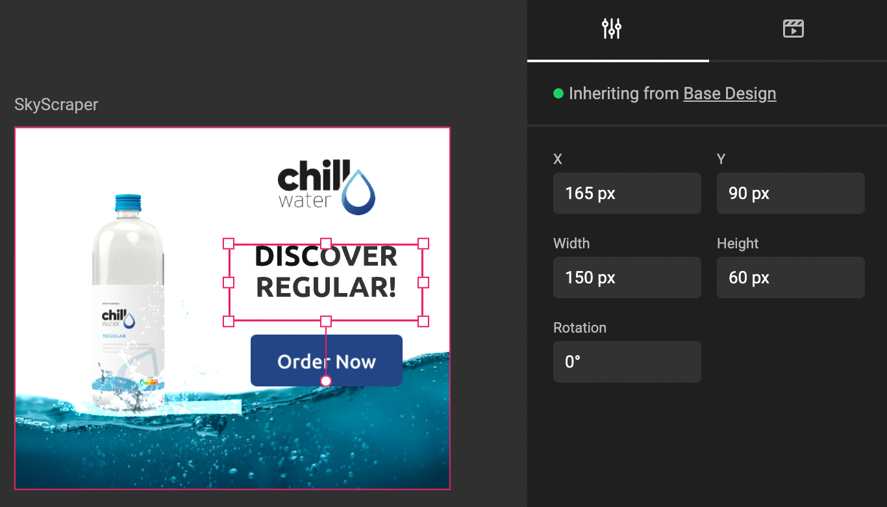
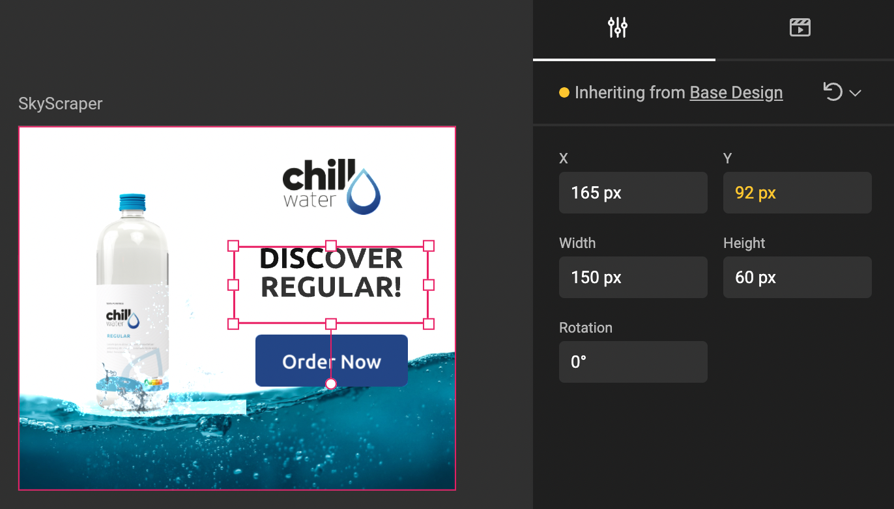
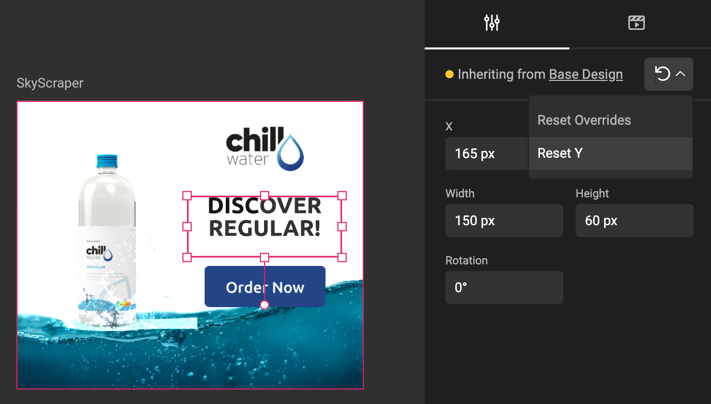
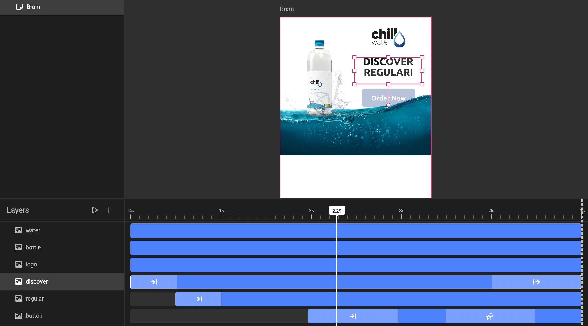
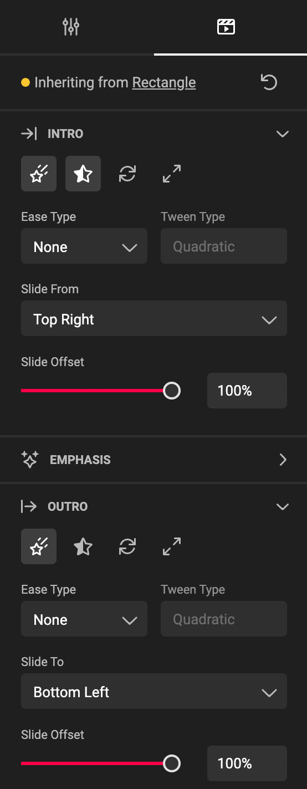
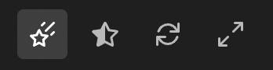

# Layouts

## Create the Layout

Click on the **plus** sign or three dots "Add sub-layout"

Rename the layout to "Skyscraper". Since your renamed, it's selected.

Select the properties panel, and change the dimentions to 160 x 600.

The new dimensions appear colored. This is because they differ from the base values.

## Move the elements on the layout

Select an element in the page, and change the value of a property in the properties panel.

You can also move the elements around on the page.

The updated value will be colored, as it's changed compared to the inherited value.

You can reset the value to the inherited one, by clicking on the left turning arrow, and select the value you want to reset. Only changed values you can reset will appear in this dropdown. Or you can choose to resel all values **Reset Overrides**

## Change the animation

If the base layout contains an animation, the animation is also available in the layout.

Enable / Activate the [Layers panel](/GraFx-Studio/overview/frames-timeline/) via the [Bottom quick tools icon](/GraFx-Studio/overview/bottom-quicktools/).

Select an element for which you want to change the animation.

In the example below, we selected the Text frame "Discover"

In the Animation Properties panel, change the values you want to change for this Layout.

If you don't change values, they will be inherited from the base layout.

If you want to disable the specific animation, de-select the specific animation with the respective buttons.

The active options are shown with a lighter background.

From left to right:

- Movement
- Transparency
- Rotation
- Scaling

