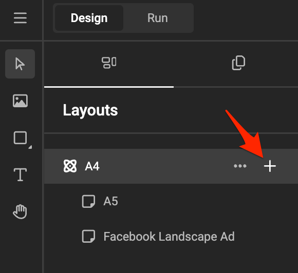
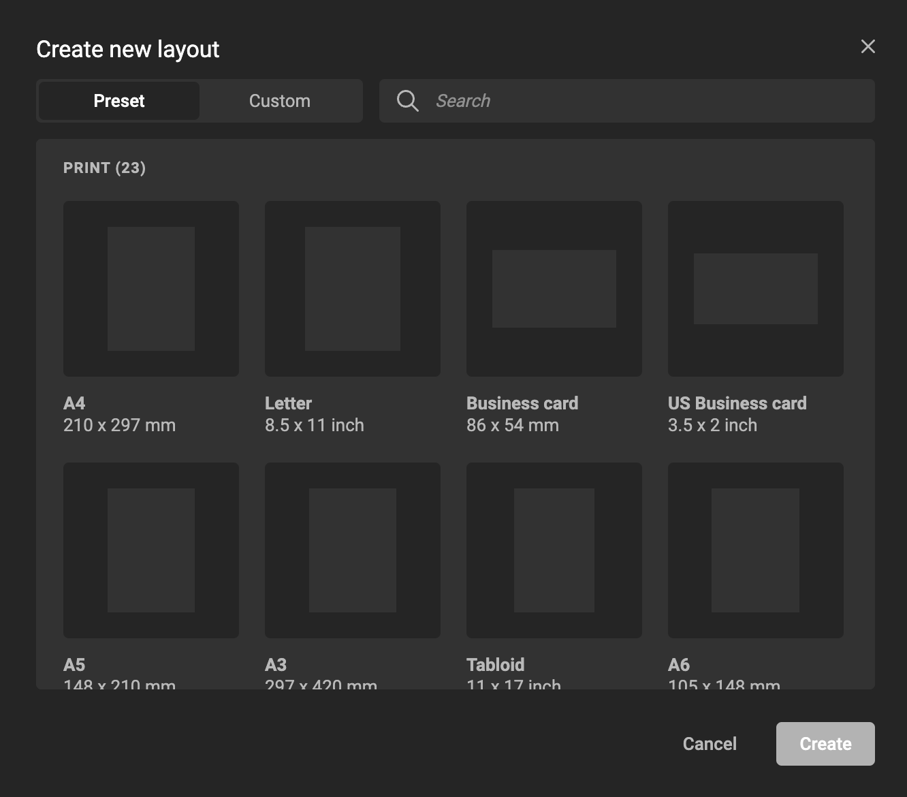
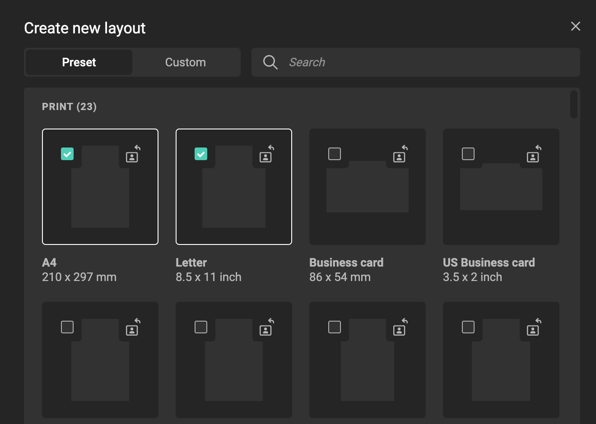
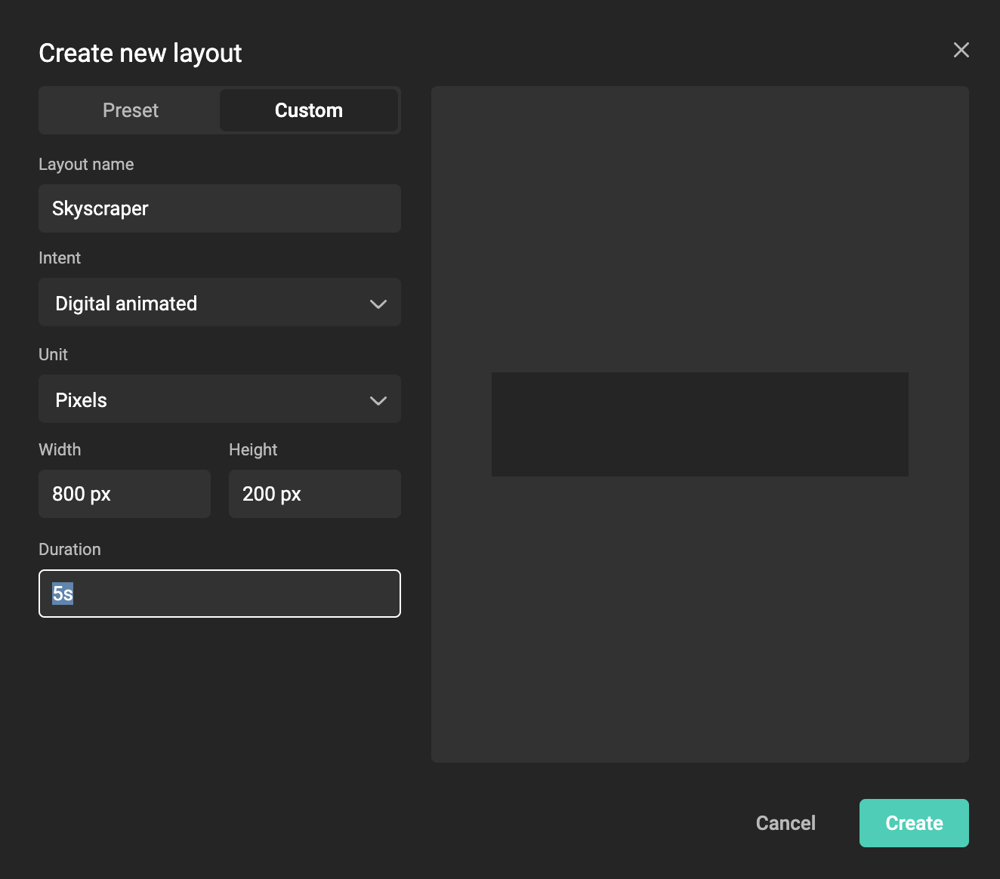
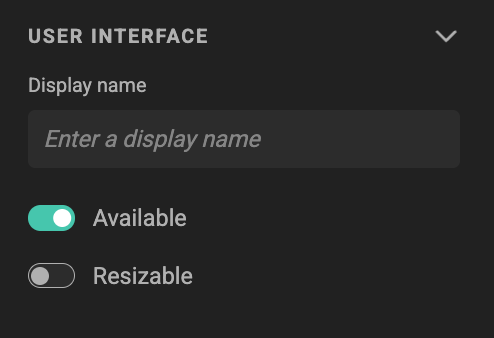
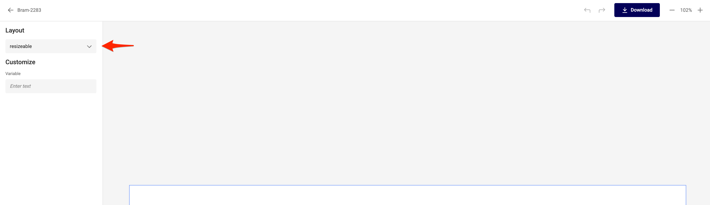
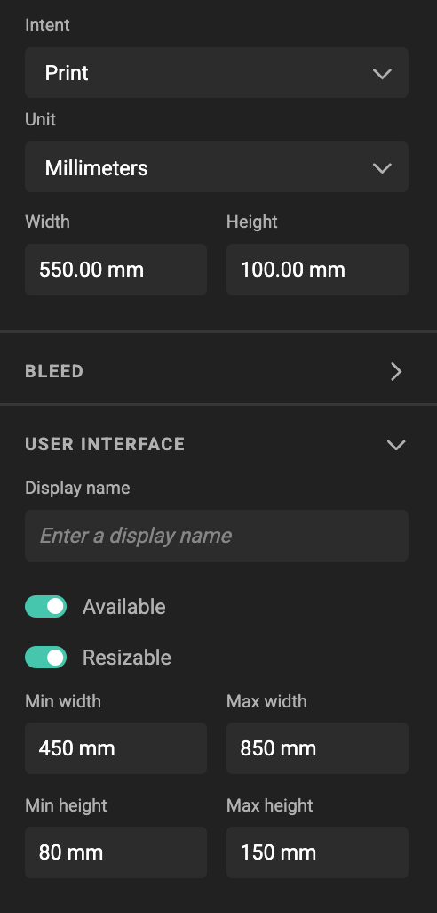

# Layouts

## Create the Layout

Click on the **plus** sign or three dots "Add sub-layout"

A window appears to allow you to choose from a [list of Layout Presets](#reference-available-layout-preset-sizes).

Select 1 or more presets you would like to add to your Layout List.

If your preset is not available in the list, choose "Custom" and define the name, size and intent of your Layout.

Click create!

In the properties panel, you'll see the layout size.

If the values appear colored, it's because they differ from the base values. To learn more, read about the [Inheritance model](/GraFx-Studio/concepts/layout-intent/#inheritance-model).

## Layouts in the Studio UI

See also [Studio UI](../../concepts/template-management/#studio-ui)

Every Layout created, is available (by default) in Studio UI. You can also check this in [Run Mode](../../concepts/design-run/).

In Studio UI or Run Mode, a dropdown will be available, with all "Available" Layouts.

If available, you can also set if a Layout is resizable in the End User Interfact (Studio UI).

When set, the end user will be able to set the width and height of the layout, to be resized, up to a minimum and/or maximum size.

## Move the elements on the layout

Select an element in the page, and change the value of a property in the properties panel.

You can also move the elements around on the page.

The updated value will be colored, as it's changed compared to the inherited value.

You can reset the value to the inherited one, by clicking on the left turning arrow, and select the value you want to reset. Only changed values you can reset will appear in this dropdown. Or you can choose to resel all values **Reset Overrides**

## Change the animation

If the base layout contains an animation, the animation is also available in the layout.

Enable / Activate the [Layers panel](/GraFx-Studio/overview/frames-timeline/) via the [Bottom quick tools icon](/GraFx-Studio/overview/bottom-quicktools/).

Select an element for which you want to change the animation.

In the example below, we selected the Text frame "Discover"

In the Animation Properties panel, change the values you want to change for this Layout.

If you don't change values, they will be inherited from the base layout.

If you want to disable the specific animation, de-select the specific animation with the respective buttons.

The active options are shown with a lighter background.

From left to right:

- Movement
- Transparency
- Rotation
- Scaling

## Reference Available Layout Preset Sizes

### Print

**ISO (A Series) Sizes**

- A0: 841 x 1188 mm
- A1: 594 x 841 mm
- A2: 420 x 594 mm
- A3: 297 x 420 mm
- A4: 210 x 297 mm
- A5: 148 x 210 mm
- A6: 105 x 148 mm
- A7: 74 x 105 mm
- A8: 52 x 74 mm

**B Sizes**

- B5: 176 x 250 mm
	
**Other Standard Paper Sizes**

- Letter: 8.5 × 11 in
- Legal: 8.5 × 14 in
- Government Letter: 8 × 10.5 in
- Government Legal: 8.5 × 13 in
- Executive: 7.25 × 10.5 in
- Tabloid: 11 × 17 in
- Ledger: 17 × 11 in
- Half Letter: 5.5 × 8.5 in
- Statement: 5.5 × 8.5 in
- Junior Legal: 5 × 8 in

**Cards and Postcards**

- Business Card: 86 x 54 mm
- US Business Card: 3.5 × 2 in
- Postcard: 6 × 4 in

### Digital: Social media

**Facebook**

- Facebook Square Ad: 1080 x 1080 px
- Facebook Landscape Ad: 1200 x 628 px
- Facebook Carousel Ad: 1200 x 628 px
- Facebook Click-to-Messenger Ad: 1080 x 1920 px
- Facebook App Ad: 810 x 450 px
- Facebook Video Ad: 1920 x 1080 px

**Instagram**

- Instagram Square Ad: 1080 x 1080 px
- Instagram Portrait Ad: 1080 x 1350 px
- Instagram Story Ad: 1080 x 1920 px

**X (formerly Twitter)**

- X Ad: 1600 x 900 px
- X Landscape Ad: 800 x 450 px
- X Carousel Ad: 1600 x 900 px
- X Image Ad: 800 x 800 px
- X Video Ad: 1920 x 1080 px

**LinkedIn**

- LinkedIn Square Ad: 1200 x 1200 px
- LinkedIn Portrait Ad: 1080 x 1350 px
- LinkedIn Vertical Ad: 1080 x 1920 px
- LinkedIn Landscape Ad: 1200 x 628 px
- LinkedIn Carousel Ad: 1080 x 1080 px

**YouTube**

- YouTube Display Ad: 300 x 60 px
- YouTube Video Ad: 1920 x 1080 px

**Pinterest**

- Pinterest Square Ad: 1000 x 1000 px
- Pinterest Portrait Ad: 1000 x 1500 px
- Pinterest Vertical Ad: 1080 x 1920 px
- Pinterest Carousel Ad: 1000 x 1500 px

**TikTok**

- TikTok Square Ad: 1080 x 1080 px
- TikTok Video Ad: 1080 x 1920 px

**Snapchat**

- Snapchat Vertical Ad: 1080 x 1920 px
- Snapchat Collection Ad: 160 x 160 px

### Digital: Display Network sizes

**Mobile Ads**

- Mobile Banner: 300 x 50 px
- Mobile Leaderboard: 320 x 50 px
- Large Mobile: 320 x 100 px
- Mobile Billboard: 540 x 150 px

**Square and Rectangle Ads**

- Small Square: 200 x 200 px
- Square: 250 x 250 px
- Small Rectangle: 180 x 150 px
- Medium Rectangle: 300 x 250 px
- Large Rectangle: 336 x 280 px

**Vertical and Skyscraper Ads**

- Vertical Banner: 120 x 240 px
- Skyscraper: 120 x 600 px
- Wide Skyscraper: 160 x 600 px
- Half Page: 300 x 600 px
- Portrait: 300 x 1050 px

**Banner Ads**

- Half Banner: 234 x 60 px
- Banner: 468 x 60 px
- Leaderboard: 728 x 90 px
- Large Leaderboard: 970 x 90 px
- Top Banner: 930 x 180 px

**Large Format Ads**

- Triple Widescreen: 250 x 360 px
- Billboard: 970 x 250 px
- Netboard: 580 x 400 px
- Panorama: 980 x 120 px

**Splash Ads**

- Small Splash: 500 x 400 px
- Medium Splash: 640 x 480 px

### Digital: DOOH

“Digital Out-of-Home,” refers to digital advertising displayed on screens in public spaces, unlike traditional static billboards or posters.

- HD: 1280 x 720 px
- Full HD: 1920 x 1080 px
- 2K: 2560 x 1440 px
- 4K: 3840 x 2160 px