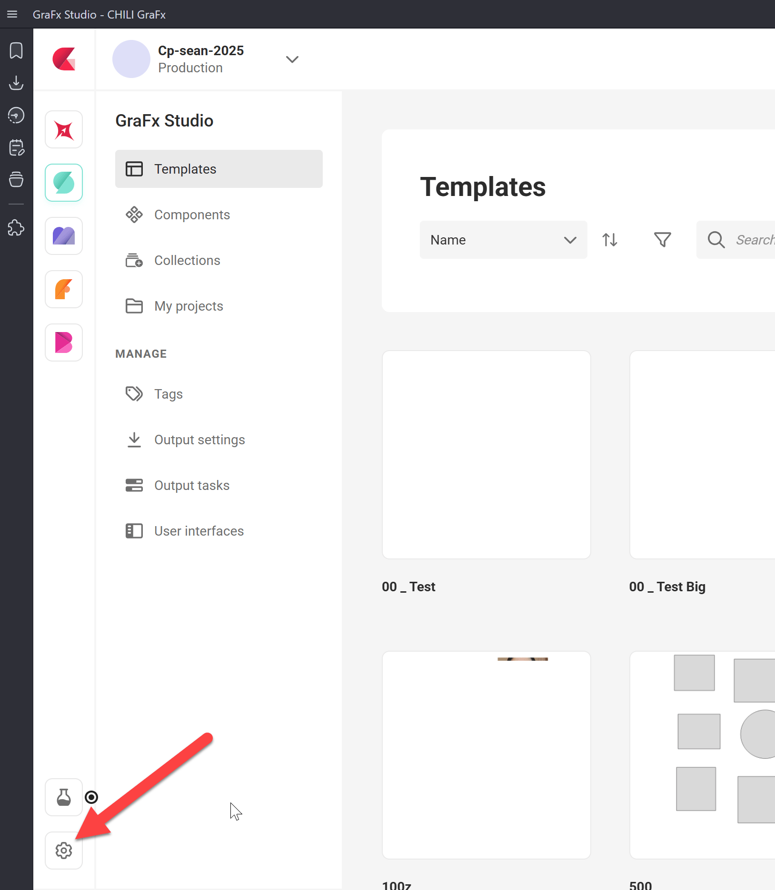
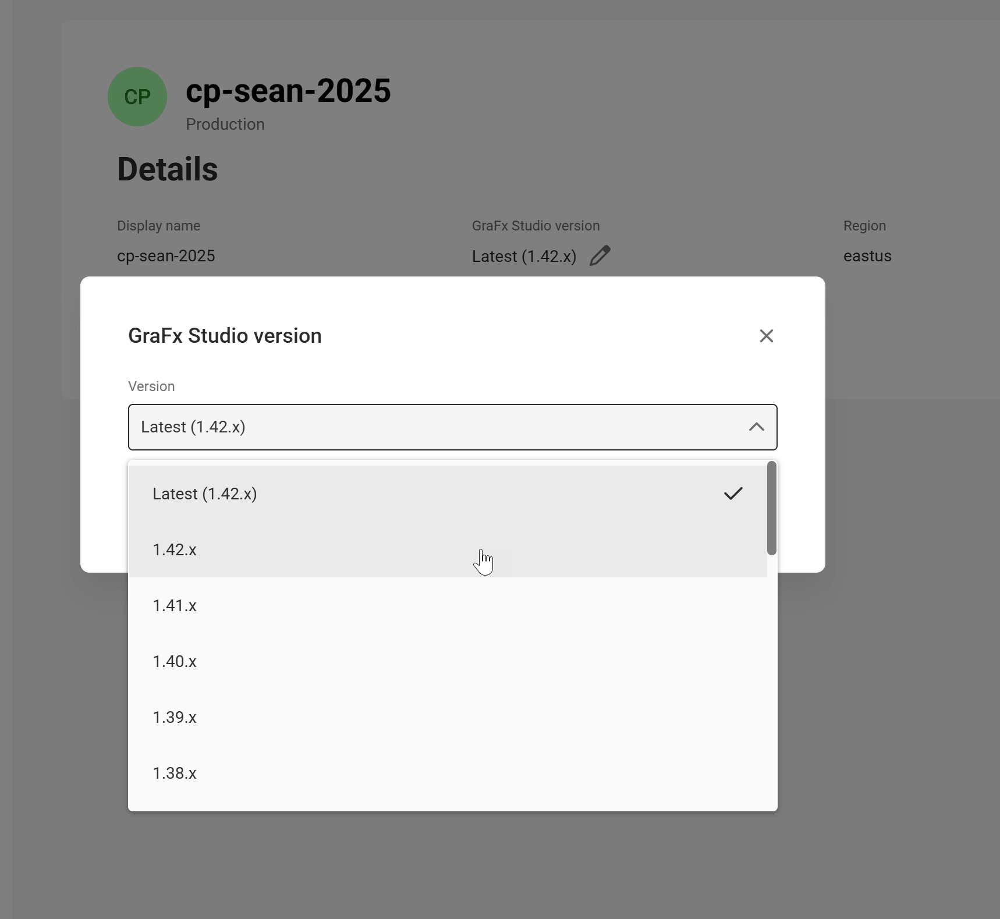

# Manage environment versions

Every GraFx Studio environment is tied to a Studio version. This setting controls which version of Studio templates and projects in that environment open and save in. Pin to a specific version for stability, or set it to **Latest** to auto-update with each new release.

!!! warning "Admin access required"
    Only environment admins can change the version. If you don't see the settings described below, you don't have admin access on this environment.

## Set the version

To set or change the version of an environment:

1. Open the environment settings. You can do this two ways:

    **From inside an environment:** click the settings icon.

    

    **From the environments overview** at [https://chiligrafx.com/environments](https://chiligrafx.com/environments): hover over an environment and click the settings button.

    

2. In environment settings, find the current version. By default this is **Latest** — meaning the environment auto-updates to the newest Studio release as soon as it ships.

    

3. Click the **pen icon** next to the version.

4. Choose a specific version to pin to, or select **Latest** to switch back to automatic updates.

    

After you change the version, the environment settings reflect your choice.

!!! note "Existing templates and projects don't auto-upgrade"
    Changing the environment version doesn't migrate existing content. Templates and projects keep their current saved version until someone opens and saves them — at which point they're saved in the new version.

## When to pin vs. stay on Latest

Pinning a version gives you control over when new Studio releases reach your environment. Without a deliberate versioning strategy, automatic updates can introduce behavior changes, break existing templates, or disrupt production workflows.

Common patterns:

- **Production environments:** pin to a specific version. Test new releases in a separate environment first, then update production once you're confident.
- **Test or staging environments:** stay on Latest to catch issues with new releases before they affect production.
- **Single-environment setups:** pin to a specific version and update on a schedule you control.

## Compatibility rules

Compatibility determines which versions can open which content. Getting this wrong can make templates and projects inaccessible.

!!! success "Backwards compatibility — supported"
    Templates and projects saved in an older version can always be opened in a newer version.

    **Example:** a template saved in `1.26` opens in `1.27`.

!!! danger "Forwards compatibility — not supported"
    Templates and projects saved in a newer version **cannot** be opened in an older version.

    **Example:** a template saved in `1.27` cannot be opened in `1.26`.

    This affects downgrades. You can pin an environment to an older version, but any template or project already saved in a newer version will not open until you re-pin upward.

## Related

### For designers

If you design templates, the version your environment runs on directly affects which environments can later open the templates you save. See [Guidance for Designers](/GraFx-Developers/grafx-studio/integration-overview/05-versioning/#guidance-for-designers) for the rollback problem and best practices.

### For integrators

If you build the application that loads Studio UI or the Studio SDK, your integration code must stay in sync with the environment's configured version. See [Guidance for Integrators](/GraFx-Developers/grafx-studio/integration-overview/05-versioning/#guidance-for-integrators) for CDN URL structure, SDK pinning with `~` vs `^`, and how to read the environment's current version via the API.

### Full picture

For the full picture of how versioning works — including compatibility rules, the patch update policy, the one-year grace period, the API for reading and changing the environment version, and a recommended update workflow — see [Versioning Your Integration](/GraFx-Developers/grafx-studio/integration-overview/05-versioning/) in the developer documentation.

