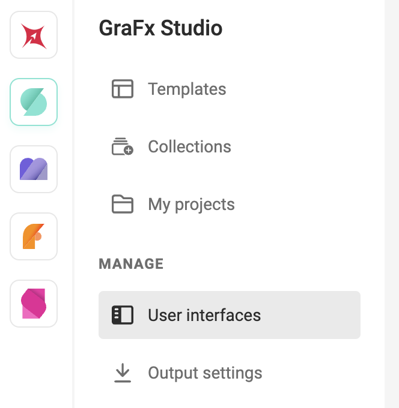
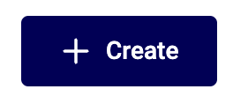
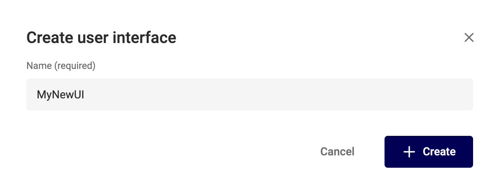
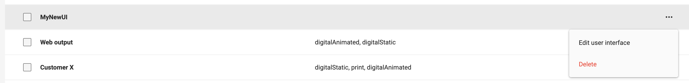
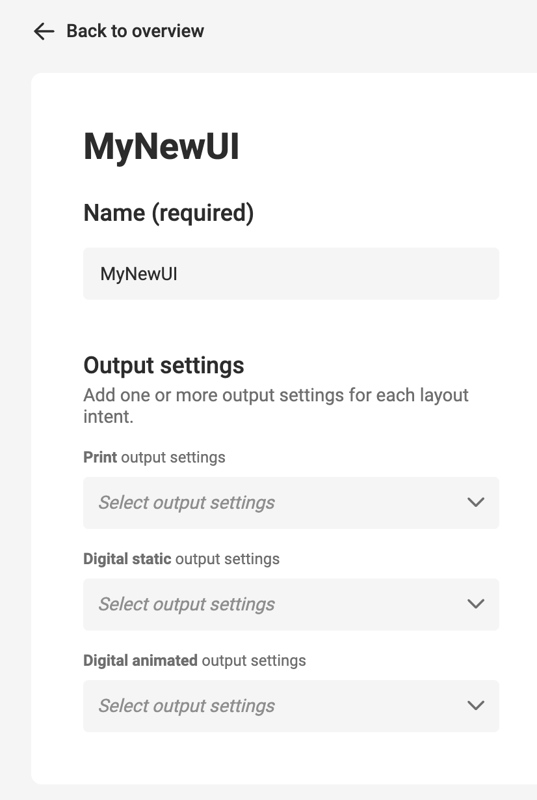
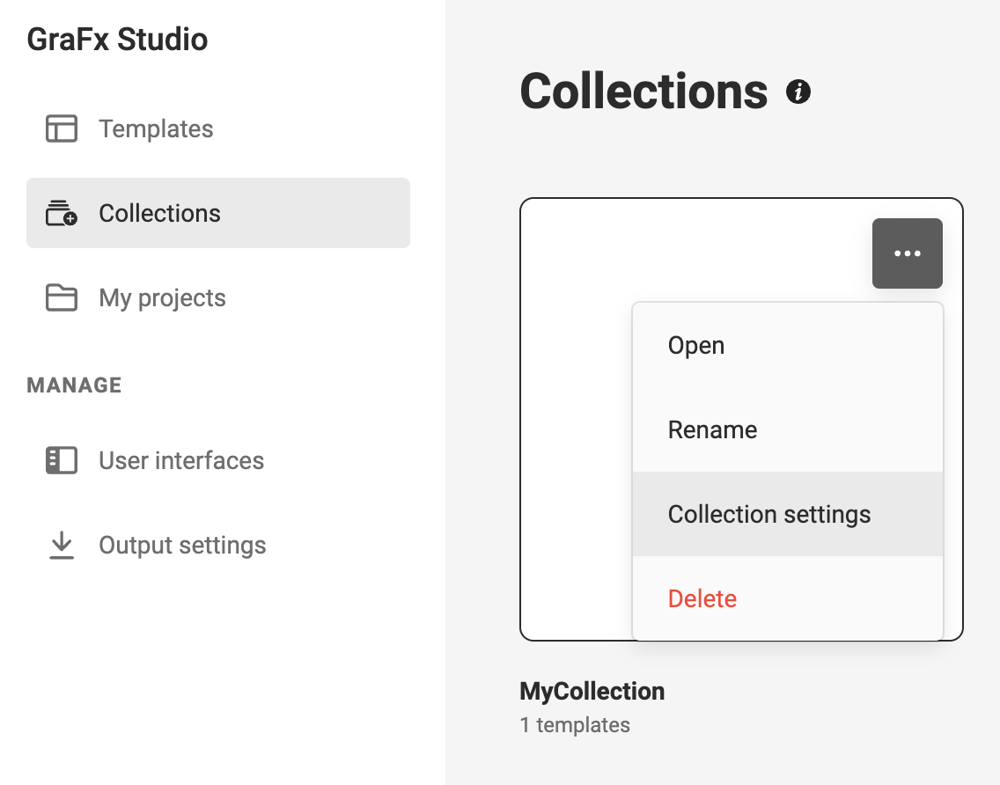
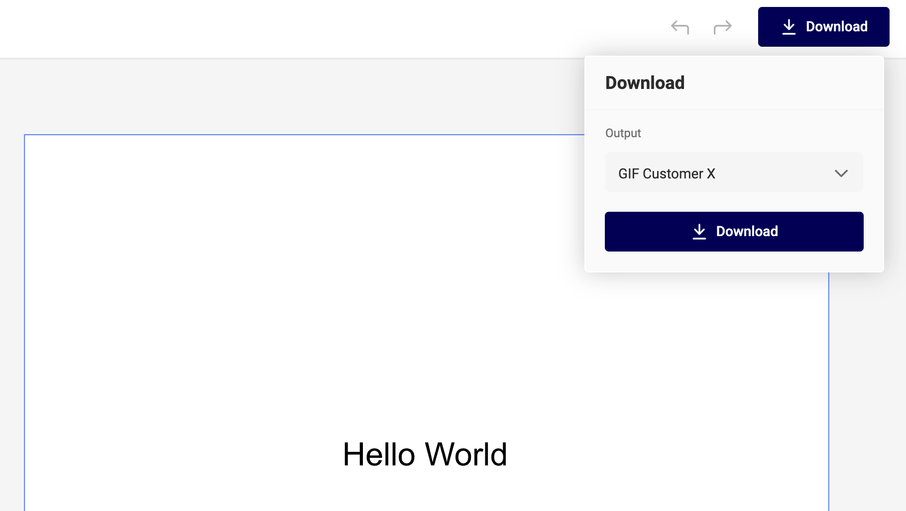

# User interfaces

See also what is a [User Interface](/GraFx-Studio/concepts/user-interface/)

## Create

In your environment, go to **GraFx Studio** > **Manage** > **User Interfaces**

{.screenshot}

Click "Create"... 

{.screenshot}

... and provide a **Unique** name.

{.screenshot-full}

You can now edit the settings for this User Interface

## Edit

{.screenshot-full}

Click a settings or choose "Edit user interface" in the "..." menu.

{.screenshot}

Update the name (should still be unique)

Add or update [output settings](/GraFx-Studio/concepts/output-settings/).

For each of the 3 [Layout Intents](/GraFx-Studio/concepts/layout-intent/), you can add Output Settings. This way, only these settings are available for output, with the chosen User Interface.

## Delete

Choose "Delete" in the "..." menu.

{.screenshot-full}

## Layout Intents

See Layout Intent.

For each of the Layout Intents, your can set 0, 1 or more output settings. These settings will be available, when choosing this User Interface.

## Default settings

Default settings are always available. 

You can edit the settings, but not change the name nor delete them.

## Where to use: Collections

In [collections](/GraFx-Studio/guides/manage-collections/), go to Collection Settings.

{.screenshot}

Set the created **User Interface**

{.screenshot}

For each new [project](/GraFx-Studio/concepts/template-management/#my-projects) created based on this template in the collection, the user interface will be applied.

This means only the output settings will be available, for the specific layout Intent.

{.screenshot}
