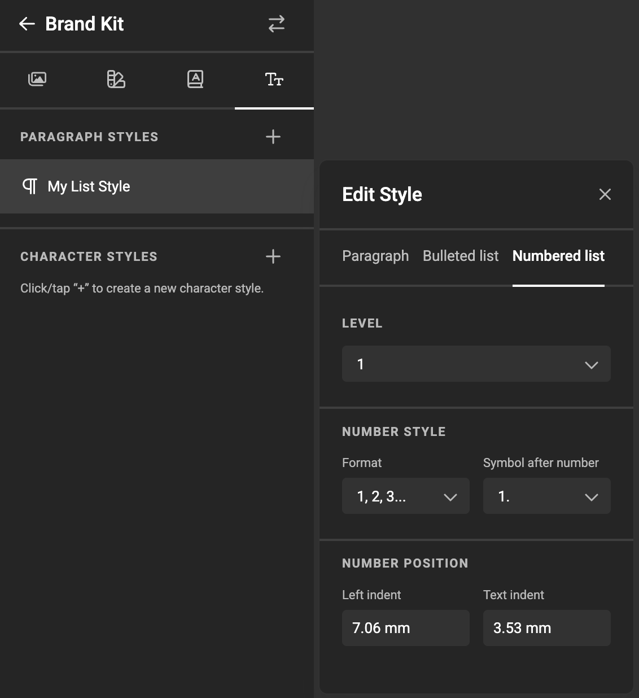
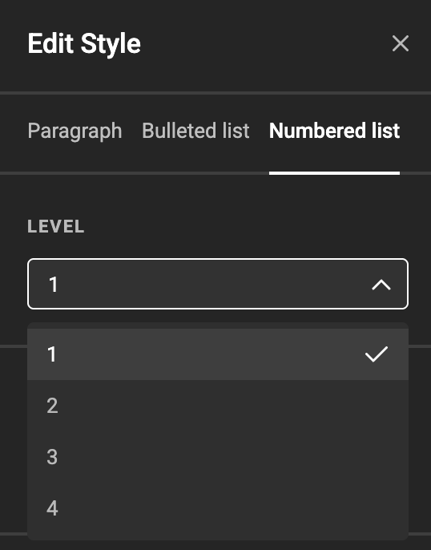
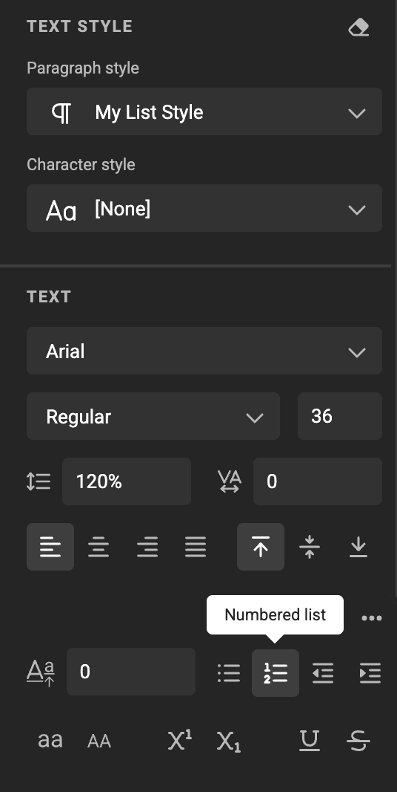
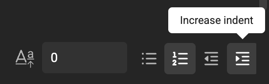
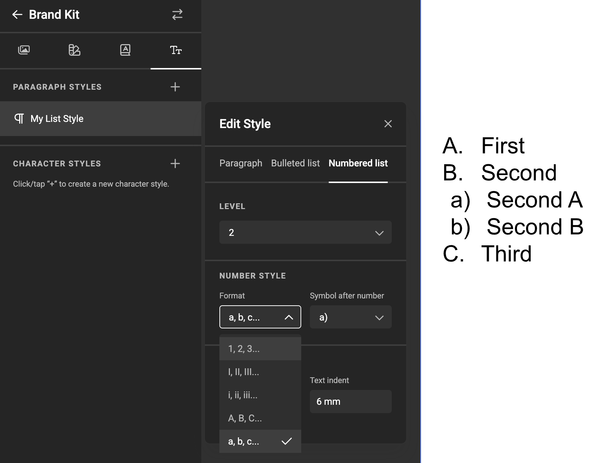

# How to use Numbered Lists in your text

## Overview

Numbered lists are ordered lists that automatically number each item. They’re part of the paragraph style system, just like [bulleted lists](/GraFx-Studio/guides/bulleted-lists/).

Numbered lists support multiple levels, each with its own numbering format, symbol, and indentation. Paragraph styles define how numbering behaves, and you can convert any text to a numbered list or back to plain text at any time.

## Define numbered list styles in Paragraph Styles

1. Open your Brand Kit inside GraFx Studio and select **Text** → **Paragraph Styles**.  
2. Pick a paragraph style or create one. In the *Edit Style* dialog, switch the **Paragraph** field to **Numbered list**.  
   {.screenshot}
3. Select the **Level** you want to configure (1–4). Each level is defined independently.  
   {.screenshot}

### Configure number style

For each level, define how numbering is rendered:

- **Format**  
  Choose the numbering format:
  - `1, 2, 3…`
  - `I, II, III…`
  - `i, ii, iii…`
  - `A, B, C…`
  - `a, b, c…`

- **Symbol after number**  
  Choose how the number is terminated:
  - `1`
  - `1-`
  - `1.`
  - `1:`
  - `1)`

### Configure number position

Control alignment and spacing:

- **Left indent**  
  Defines the base position of the number for the current level. This value is added to the left indent of the previous level, so indentation accumulates as you go deeper in the list hierarchy.

- **Text indent**  
  Defines where the text starts after the number for the current level. This value also accumulates per level, keeping text alignment consistent as list depth increases.
  
## Apply numbered lists in GraFx Studio

1. Select a text frame and place the cursor inside the text.  
2. Choose a paragraph style that has a numbered list defined.  
3. Click the **Numbered list** button to convert the text. Click again to revert to plain text.  

{.screenshot}

4. Use the indent controls to increase or decrease the list level. Decreasing from level 1 removes numbering.

{.screenshot}

5. The result

{.screenshot-full}

## See also

[Bulleted Lists](/GraFx-Studio/guides/bulleted-lists/)