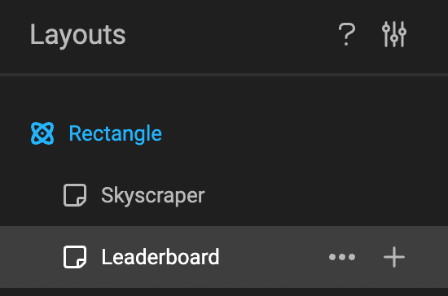
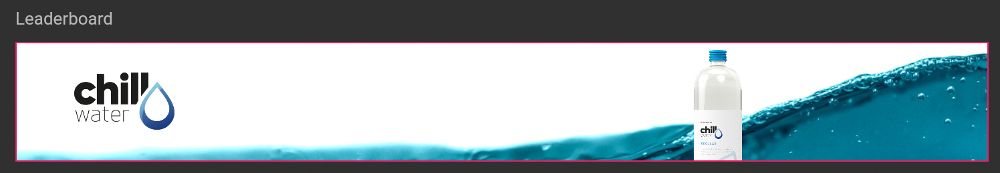
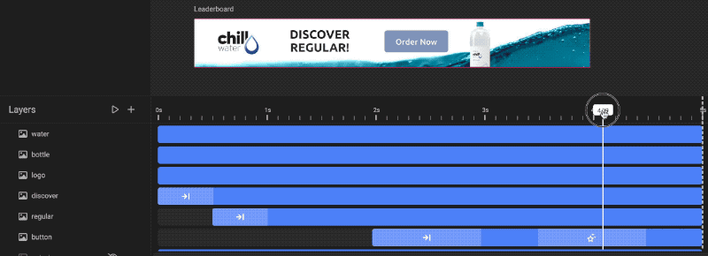
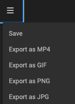

# Output to GIF

## Select the right Layout

In the tree of layouts, select the one you wish to output.

## Check the timeline

Have a quick glance at your timeline. Take the Scrubber, and run through the timeline. This will reassure you, this is the animation you will output.

## Output (to GIF)

Click "Export as" and choose GIF in the dropdown.

When the export is ready, your browser will download the file into your downloads folder.