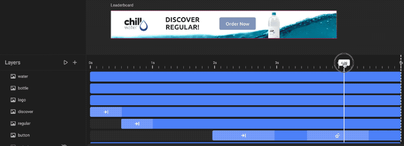
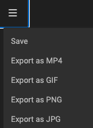

# Output to GIF

## Select the right Layout

In the tree of layouts, select the one you wish to output.

{.screenshot}

{.screenshot-full}

## Check the timeline

Have a quick glance at your timeline. Take the Scrubber, and run through the timeline. This will reassure you, this is the animation you will output.

{.screenshot-full}

## Output (to GIF)

Click "Export as" and choose GIF in the dropdown.

{.screenshotsmall}

When the export is ready, your browser will download the file into your downloads folder.

!!! Warning
	When outputting to GIF format in GraFx Studio, it's important to be aware of the color limitations inherent to GIF files. The GIF format supports a limited color palette, which can affect the fidelity of color reproduction in your images. This means that complex graphics with a wide range of colors might not be accurately represented in the GIF format. Understanding these limitations is crucial when choosing the appropriate file format for your output needs.  
	
	The GIF format has a hard limit of 256 colors, which is a significant constraint compared to other image formats that can handle millions of colors. This limitation can lead to color banding or a reduction in image quality, especially in graphics with gradients or a wide color spectrum. When exporting to GIF, it's crucial to consider how this color cap might affect the visual outcome of your content.