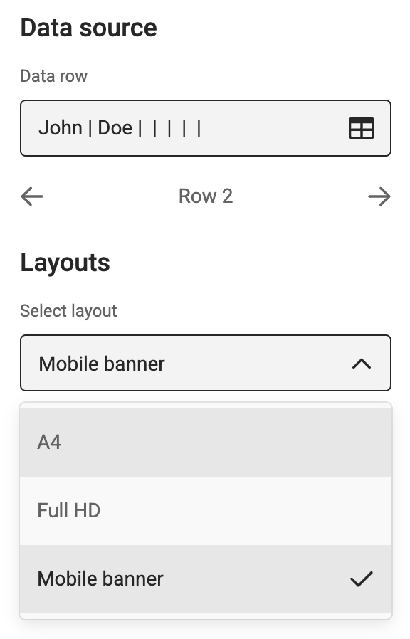
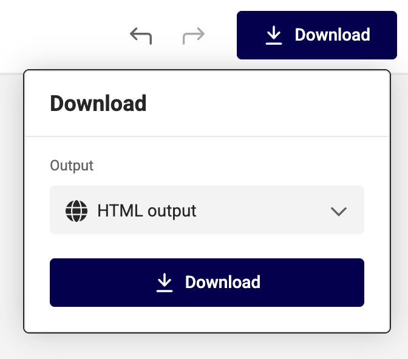

# Output to HTML

!!! example "HTML output is Experimental"
	To give you early access to the latest and greatest, we will release some features as "**Experimental**".
	
	This feature and related endpoints (for the API) are not yet final: syntax might change, response could be different, etc. Don't base your production code on experimental features.

## Create an output setting

[How to create an export setting?](/GraFx-Studio/guides/output/settings/)

{.screenshot-full}

## In GraFx Studio

### Select the right Layout

In [run mode](/GraFx-Studio/concepts/design-run/) select the right layout.

{.screenshot}

### Choose Export (to HTML)

Click "Export as" and choose your output setting in the dropdown.

{.screenshot}

When the export is ready, your browser will download the zip file into your downloads folder.

## In Studio UI

Very similar in [Studio UI](/GraFx-Studio/concepts/template-management/?h=studio#studio-ui).

### Select the right Layout

{.screenshot}

### Choose Download (to HTML)

Click "Download" and choose your output setting in the dropdown.

{.screenshot}

If you don't see the correct output settings, check the [User interface](/GraFx-Studio/guides/manage-user-interfaces/), and if it's assigned to the Collection before you create a project.

More on the [workflow](/GraFx-Studio/concepts/template-management/#process) on how to make templates available in My projects with the right output settings.