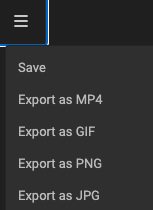

# Output to PNG or JPG

## Select the right Layout

In the tree of layouts, select the one you wish to output.

## Timeline

Since your outputting a static file, the first frame will be selected from the timeline.

## Output

Click "Export as" and choose PNG or JPG in the dropdown.

When the export is ready, your browser will download the file into your downloads folder.