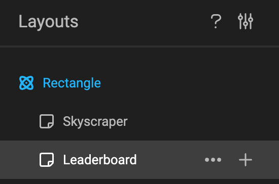
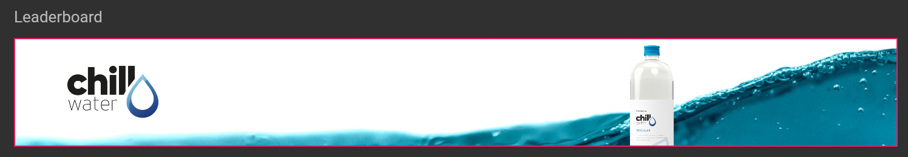

# Output to PNG or JPG

## Select the right Layout

In the tree of layouts, select the one you wish to output.

## Timeline

Since JPG and PNG are static files, the timeline does not have any effect on the image output. The output engine will disregard all animation information, and generate the image as if no animation was made.

<iframe width="560" height="315" src="https://www.youtube.com/embed/-Y3YAx_CAAU?si=CccBWgygg7zwRVpe" title="YouTube video player" frameborder="0" allow="accelerometer; autoplay; clipboard-write; encrypted-media; gyroscope; picture-in-picture; web-share" referrerpolicy="strict-origin-when-cross-origin" allowfullscreen></iframe>

In the example above, the frame flies in from the left (as an intro animation), bounces in the middle (for emphasis), and then flies out (as an outro animation). This means the frame is always in motion and never has a stagnant or still moment.

If you were to remove all animations, as initially shown, the position and size of the frame would determine how it appears in the image.

## Output

Click "Export as" and choose PNG or JPG in the dropdown.

When the export is ready, your browser will download the file into your downloads folder.