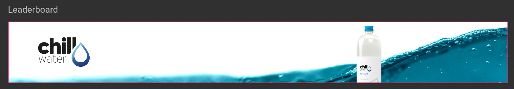
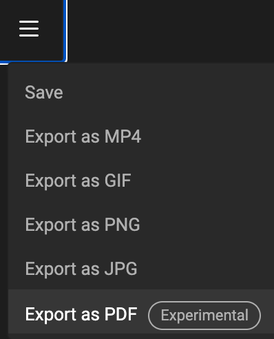
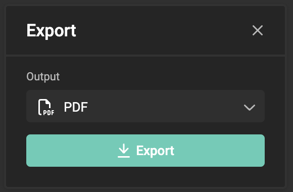

# Output to PDF

## Select the right Layout

In the tree of layouts, select the one you wish to output.

## The timeline

Since a PDF is a static file, the timeline does not have any effect on the PDF output. The output engine will disregard all animation information, and generate the PDF as if no animation was made.

&nbsp;

In the example above, the frame flies in from the left (as an intro animation), bounces in the middle (for emphasis), and then flies out (as an outro animation). This means the frame is always in motion and never has a stagnant or still moment.

If you were to remove all animations, as initially shown, the position and size of the frame would determine how it appears in the PDF.

## Output (to PDF)

Click "Hamburger menu" and Export.

Choose the right [output setting](/GraFx-Studio/concepts/output-settings/), you have predefined as PDF output.

When the export is ready, your browser will download the file into your downloads folder.