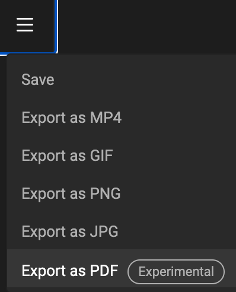

# Output to PDF

## Select the right Layout

In the tree of layouts, select the one you wish to output.

## The timeline

Since a PDF is a static file, the timeline does not have any effect on the PDF output. The output engine will disregard all animation information, and generate the PDF as if no animation was made.

<iframe width="560" height="315" src="https://www.youtube.com/embed/-Y3YAx_CAAU?si=CccBWgygg7zwRVpe" title="YouTube video player" frameborder="0" allow="accelerometer; autoplay; clipboard-write; encrypted-media; gyroscope; picture-in-picture; web-share" referrerpolicy="strict-origin-when-cross-origin" allowfullscreen></iframe>

In the example above, the frame flies in from the left (as an intro animation), bounces in the middle (for emphasis), and then flies out (as an outro animation). This means the frame is always in motion and never has a stagnant or still moment.

If you were to remove all animations, as initially shown, the position and size of the frame would determine how it appears in the PDF.

## Output (to PDF)

Click "Hamburger menu" and Export.

Choose the right [output setting](/GraFx-Studio/concepts/output-settings/), you have predefined as PDF output.

When the export is ready, your browser will download the file into your downloads folder.

## Embedded PDF assets

When you place a PDF as an asset inside an image frame, its content is embedded in the final PDF output.

**PDF assets are not flattened.** The placed PDF keeps its vector content in the output. It is not rasterized, not converted to an image, and not re-compressed. Text stays live text, vector artwork stays vector, and spot colors stay separate inks.

### What is preserved

| Content | Behavior in the output |
|---------|------------------------|
| Vector artwork | Kept at full fidelity, including hairlines |
| Text | Stays live, selectable text, and is not converted to outlines |
| Fonts | Embedded font programs are carried over unchanged |
| Spot colors | Stay separate inks, so they still separate correctly for print |
| Transparency and blend modes | Kept, including transparency placed over a spot color |
| Overprint | Kept, as described below |
| Layers | Optional content groups are carried into the output document |
| Images inside the PDF | Kept at their original resolution, and are not resampled |
| Color profiles | Carried over with the content they apply to |

!!! info "Overprint"
    Overprint statements inside embedded PDF assets are preserved in the final output — the overprint behavior of the source PDF is kept in the exported document.

### What is not preserved

| Content | Behavior in the output |
|---------|------------------------|
| Pages after the first | Only the first page of a multi-page PDF is embedded |
| Annotations | Links, form fields, and comments are removed |
| Document structure | Tagging and structure information is not carried over |

!!! warning "Drop shadow"
    You cannot apply a drop shadow to an image frame that contains a PDF asset. Use a PDF that already includes the shadow, or place a raster image instead.
