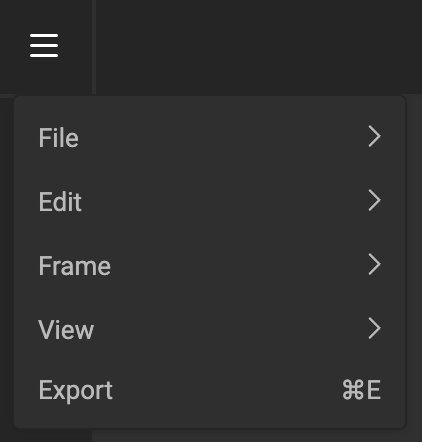

# Output to PDF (experimental)

!!! example "Experimental"
	To give you early access to the latest and greatest, we will release some features as "**Experimental**". This means you can start playing around with this functionality, but you should not use this in production. Functionality might change in the final implementation.

## Select the right Layout

In the tree of layouts, select the one you wish to output.

## The timeline

Since a PDF is a static file, the timeline does not have any effect on the PDF output. The output engine will disregard all animation information, and generate the PDF as if no animation was made.

## Output (to PDF)

Click "Hamburger menu" and choose PDF (experimental) in the dropdown.

When the export is ready, your browser will download the file into your downloads folder.