# Create Output Settings

[What are output settings?](/GraFx-Studio/concepts/output-settings/)

<iframe width="690" height="388" src="https://www.youtube.com/embed/OmQYHIwrqwE?controls=1&mute=0&showinfo=0&rel=0&autoplay=0&loop=0" title="Create output settings in GraFx Studio" frameborder="0" allow="accelerometer; autoplay; clipboard-write; encrypted-media; gyroscope; picture-in-picture; web-share" referrerpolicy="strict-origin-when-cross-origin" allowfullscreen></iframe>

[Getting Started with GraFx Studio — full course](https://www.youtube.com/playlist?list=PLOzpLl2aXHcM)

## Create output settings

In GraFx Studio, go to **Manage > Output settings** to view and configure output settings.

By default, each output format has one preconfigured setting.

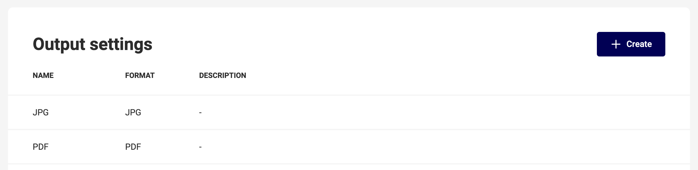{.screenshot-full}

To add a new setting, click the **+ Create** button.  
Give your setting a relevant name and choose an output file format.

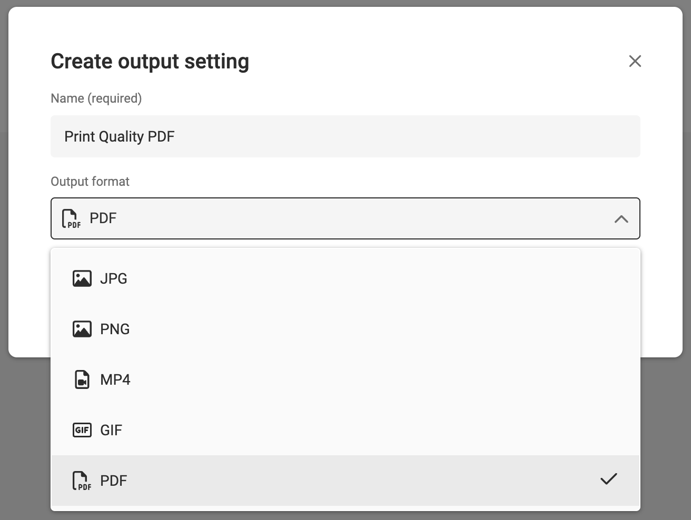{.screenshot}

The new setting will appear in the list.

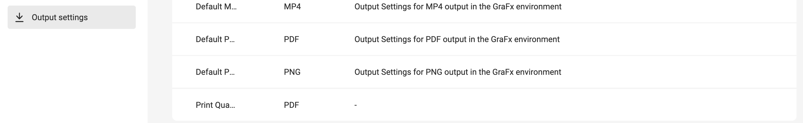{.screenshot-full}

To delete a setting, use the **...** menu at the right end of the row.

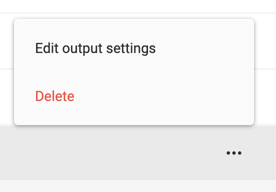{.screenshot}

If all settings are deleted, a placeholder will indicate no output settings exist.

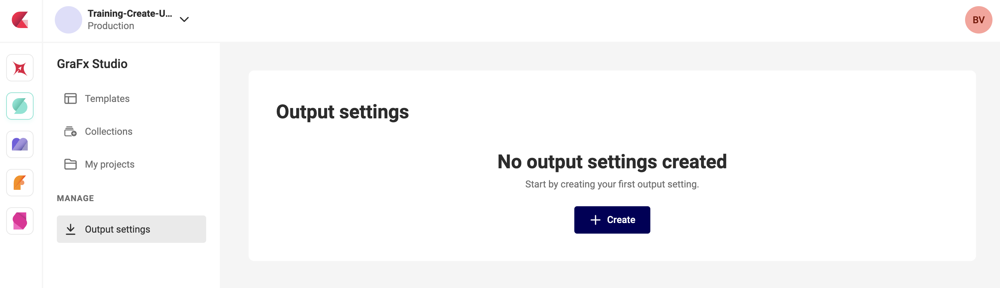{.screenshot-full}

---

Output settings vary depending on the file format.

## Generic Settings (all formats)

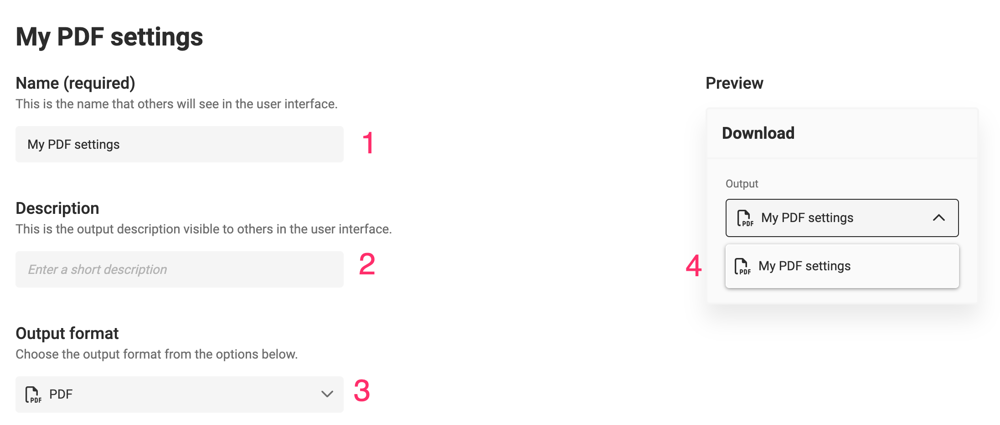{.screenshot-full}

### Name and description

- **Name** (1) appears in the [Studio UI](/GraFx-Studio/guides/create-projects/#customize-your-project)
- **Description** (2) appears as a subtitle in the export UI

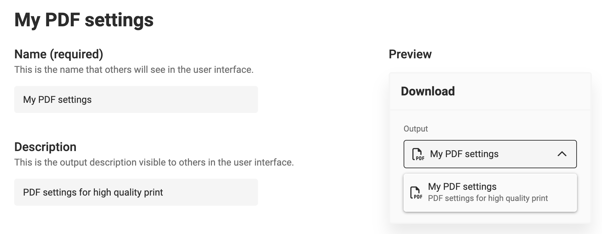{.screenshot-full}

### Output format

- Select the output format (3) — it can still be changed later.

### Watermark

- Enable this to apply a watermark to your output.
- Renders with watermark **do not** count as billable.
- Enter a non-empty watermark text.

---

## PDF Output Settings

See [Generic Settings](#generic-settings-all-formats)

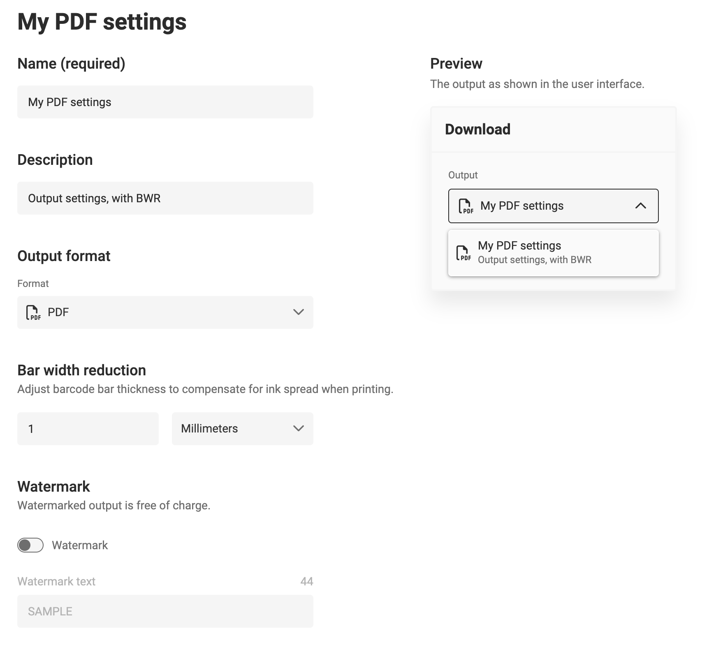{.screenshot-full}

### Bar Width Reduction

Compensates for ink spread during printing (dot gain).  
Use positive values to make bars thinner, negative to make them wider.

### Outline Text

Outputs text as vector shapes instead of embedding fonts.  
This removes font dependencies in the resulting PDF.

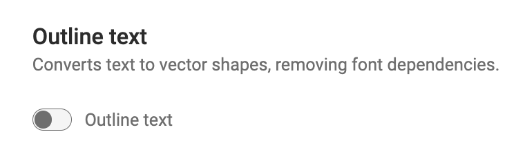{.screenshot}

### Data Source

When enabled, includes all records from the data source in the output.

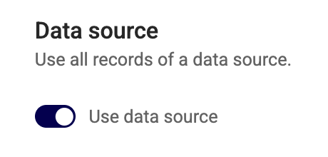{.screenshot}

### Error Handling

Enable **Continue batch output after failure** to skip failed rows.  
A report is available in [Output Tasks](../tasks/).

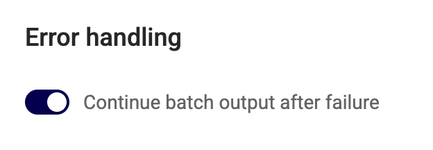{.screenshot}

### Crop Marks

See [Crop Marks](/GraFx-Studio/concepts/crop-marks/).  
Define offset and weight (thickness).

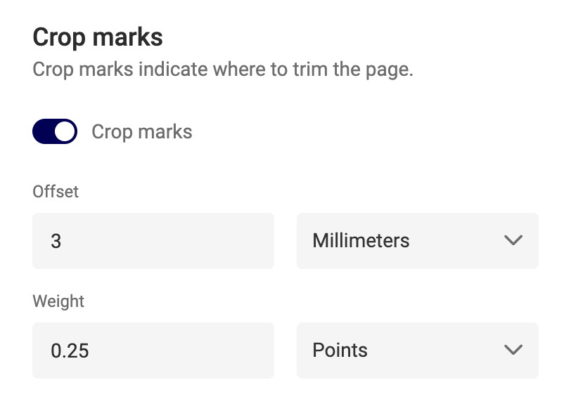{.screenshot}

### PDF Output Conversion

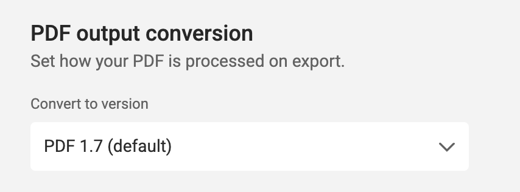{.screenshot}

In **Convert to version**, choose the required PDF version.

Example:
- PDF 1.4, 1.5, 1.6 or 1.7 (default)

Select the version required by your production partner.

### Color Management

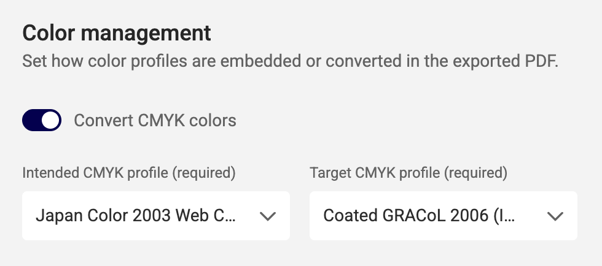{.screenshot}

Enable **Convert CMYK colors** to activate color transformation during export.

When enabled, you must define:

- **Intended CMYK profile** (required)  
- **Target CMYK profile** (required)

#### Intended CMYK profile (required, if "Convert CMYK colors" is checked)

Defines the original print condition the document is assumed to be prepared for.

This setting tells the system how existing CMYK values should be interpreted.

#### Target CMYK profile (required, if "Convert CMYK colors" is checked)

Defines the destination print condition to which colors are converted.

!!! warning
    If the intended and target profiles do not reflect the actual production workflow, visible color shifts may occur.

#### Convert RGB colors to CMYK colors

Enable **Convert RGB colors to CMYK colors** to also convert RGB content — such as photos and colors defined in RGB — to the target CMYK profile during export.

RGB conversion is a complementary step to CMYK conversion:

- The switch becomes available once both the **Intended CMYK profile** and **Target CMYK profile** are set. Until then, it is visible but disabled, with a tooltip explaining why.
- RGB colors with an embedded profile are converted using that embedded profile.
- For unmanaged RGB colors (no embedded profile), select the assumed source profile in the **RGB source profile** dropdown that appears when the switch is on.

Available RGB source profiles:

- Adobe RGB (1998)
- Apple RGB
- Color Match RGB
- HDTV (Rec. 709)
- PAL/SECAM
- SDTV NTSC
- SDTV PAL
- SMPTE-C
- sRGB IEC61966-2.1

For a deeper explanation of color management concepts, see:

- [Color Management in CHILI GraFx](/GraFx-Studio/concepts/color-management/)

---

## HTML Output Settings

See [Generic Settings](#generic-settings-all-formats)

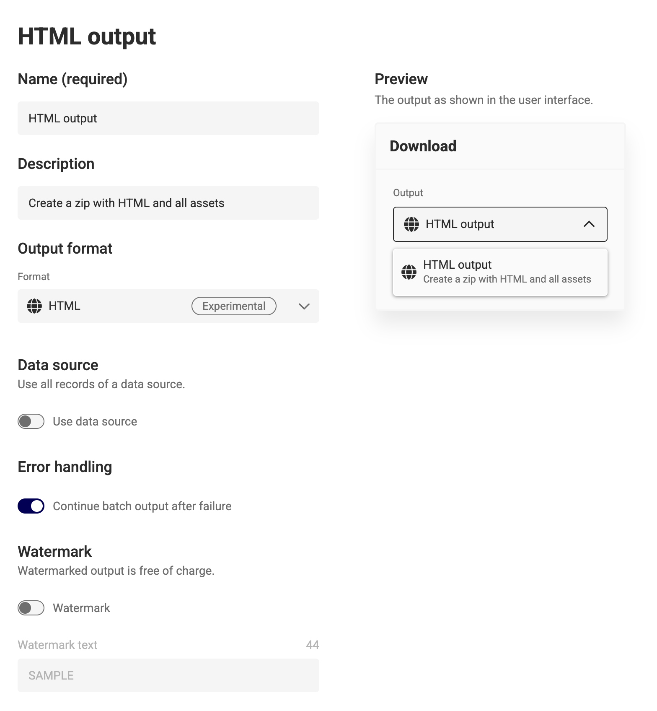{.screenshot-full}

### Data Source

When enabled, includes all records from the data source in the output.

{.screenshot}

### Error Handling

Enable **Continue batch output after failure** to skip failed rows.  
A report is available in [Output Tasks](../tasks/).

{.screenshot}

---

## JPG Output Settings

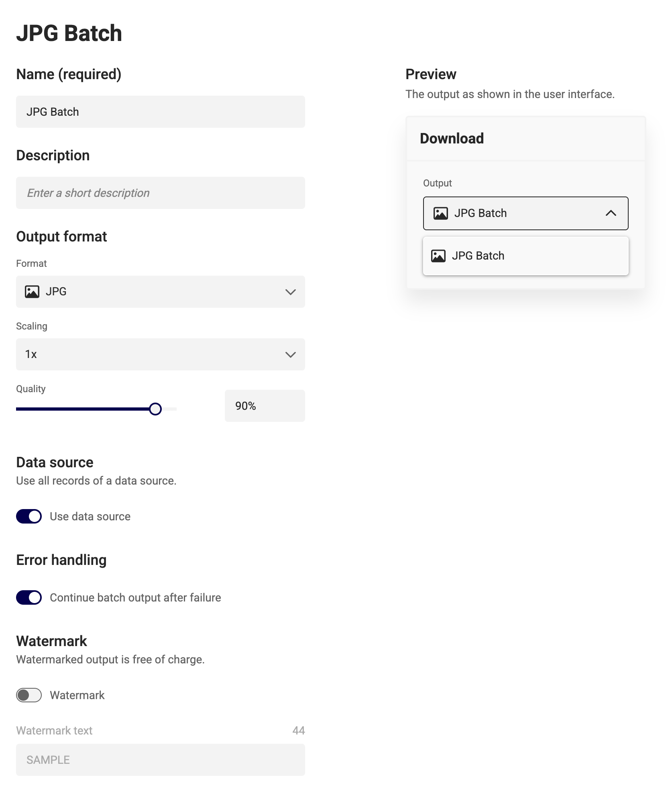{.screenshot-full}

### Scaling

Adjusts output resolution.  
Higher resolution assets (if available) are used automatically.

### Quality

Set compression quality (1% to 100%).  
Higher values mean larger file size but better image fidelity.

### Data Source

Exports all data source records as individual JPG files in a ZIP.

{.screenshot}

### Error Handling

Enable **Continue batch output after failure** to skip failed rows.  
A report is available in [Output Tasks](../tasks/).

{.screenshot}

---

## PNG Output Settings

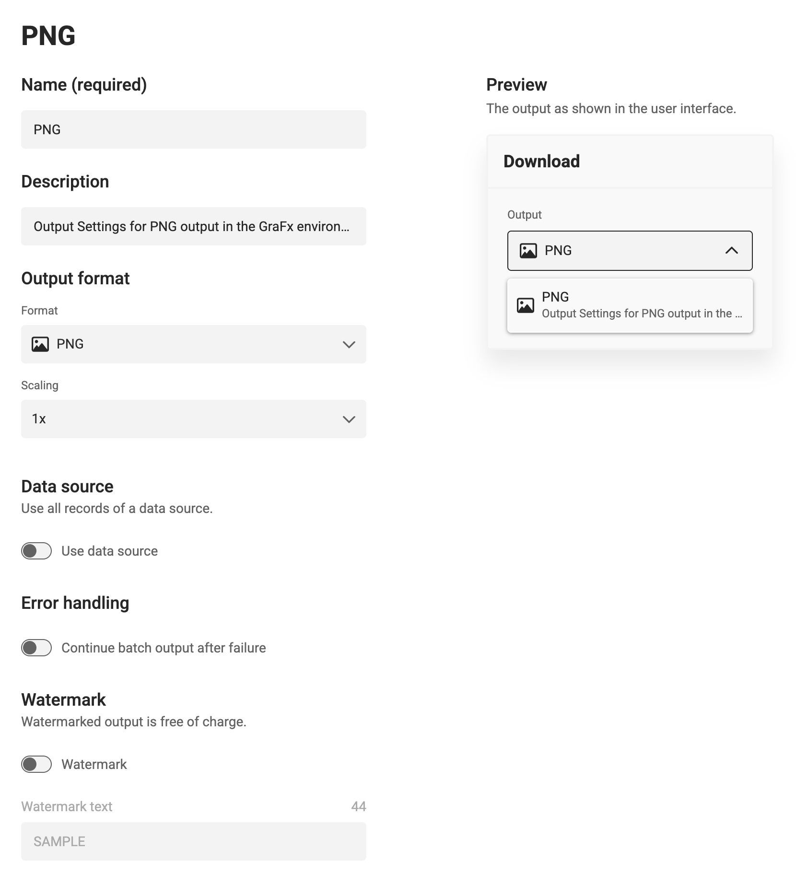{.screenshot-full}

### Scaling

Same behavior as in JPG output.

### Data Source

Exports all records as individual PNG files in a ZIP.

{.screenshot}

### Error Handling

Enable **Continue batch output after failure** to skip failed rows.  
A report is available in [Output Tasks](../tasks/).

{.screenshot}

---

## GIF Output Settings

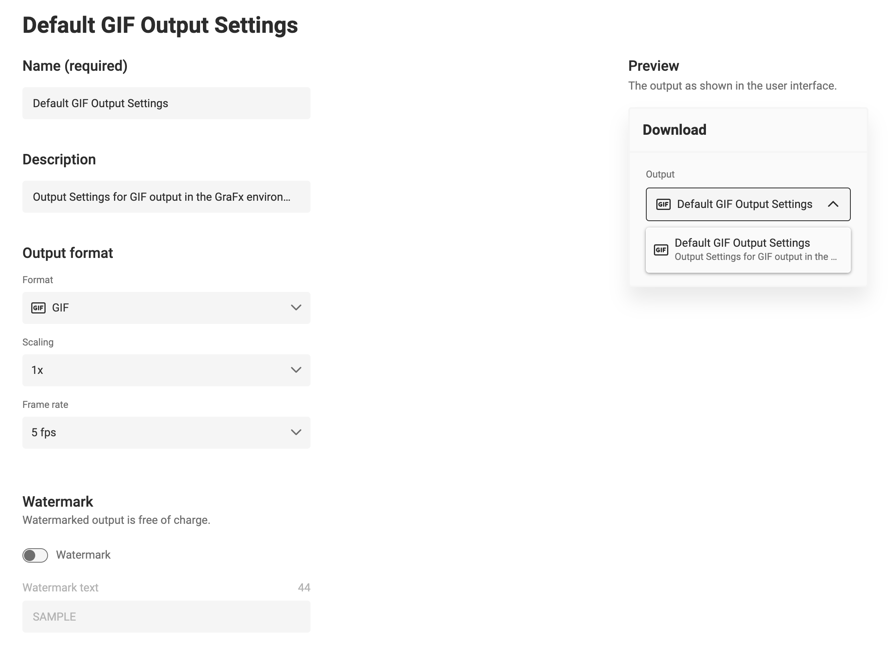{.screenshot-full}

### Scaling

Same behavior as in JPG and PNG output.

### Frame Rate

Set the number of animation frames per second.

### Data Source

Exports all records as individual GIFs in a ZIP.

{.screenshot}

### Error Handling

Enable **Continue batch output after failure** to skip failed rows.  
A report is available in [Output Tasks](../tasks/).

{.screenshot}

---

## MP4 Output Settings

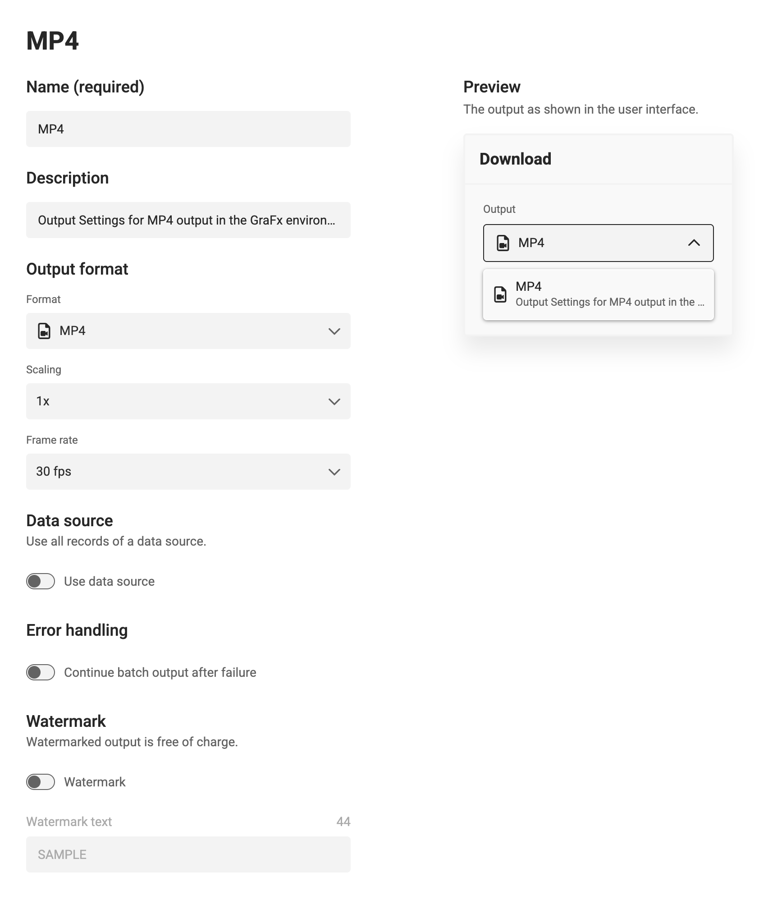{.screenshot-full}

### Scaling

Same as other image/video formats.

### Frame Rate

Set the number of animation frames per second.

### Data Source

Exports all records as MP4s in a ZIP.

{.screenshot}

### Error Handling

Enable **Continue batch output after failure** to skip failed rows.  
A report is available in [Output Tasks](../tasks/).

{.screenshot}