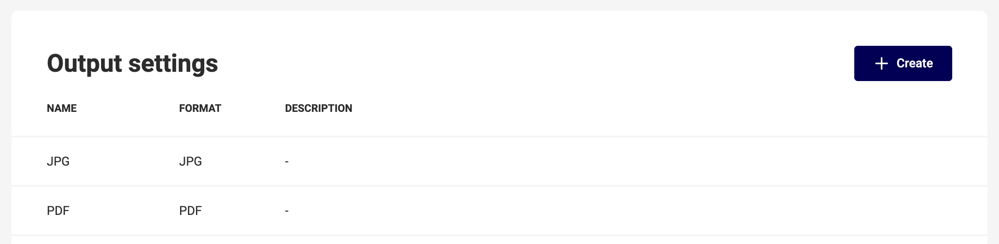

# Create Output Settings

[What are output settings?](/GraFx-Studio/concepts/output-settings/)

## Create output settings

In the GraFx Studio application, under manage, you can manage "Output settings"

By default, there will be output settings for each output format. 

To add a setting click the "+ create" button.

Give your setting a relevant name, and choose the output file format.

The created setting will appear in the list.

You can delete a setting, at the "..." menu at the right of the list.

When you delete all of the (default) settings, "No output settings created" placeholder will be visible.

---

Depending on the chosen output file type, there are different settings available.

## Generic settings for all file types

### Name and description

The name of your setting (1), is the name that will be shown in the [Studio UI](/GraFx-Studio/guides/create-projects/#customize-your-project).

The description (2) will be shown as a second line in the export.

### Output format

The output format (3) is the chosen file type. You can still change it in the settings detail.

### Watermark

When checked, your output will have a visual watermark, and the output will not count as a render.

Add a word that will be used as the visual watermark. The word cannot be empty.

## PDF output settings

See [generic settings](#generic-settings-for-all-file-types)

Next to the generic settings, you can set the "Bar width reduction"

## JPG output settings

### Scaling

Can be used to scale the output if your target channel requires a bigger or smaller image size.
Higher-resolution images will be used (if available in your media) to produce higher-resolution output.

### Quality

Can be used to set the quality of the output. 100% will produce the highest quality but also the largest file size. 1% will produce the lowest quality but smallest file size.

## PNG output settings

### Scaling

Can be used to scale the output if your target channel requires a bigger or smaller image size.
Higher-resolution images will be used (if available in your media) to produce higher-resolution output.

## GIF output settings

### Scaling

Can be used to scale the output if your target channel requires a bigger or smaller image size.
Higher-resolution images will be used (if available in your media) to produce higher-resolution output.

### Frame rate

For animations, defines how many frames will be played per second.

## MP4 output settings

### Scaling

Can be used to scale the output if your target channel requires a bigger or smaller image size.
Higher-resolution images will be used (if available in your media) to produce higher-resolution output.

### Frame rate

For animations, defines how many frames will be played per second.
