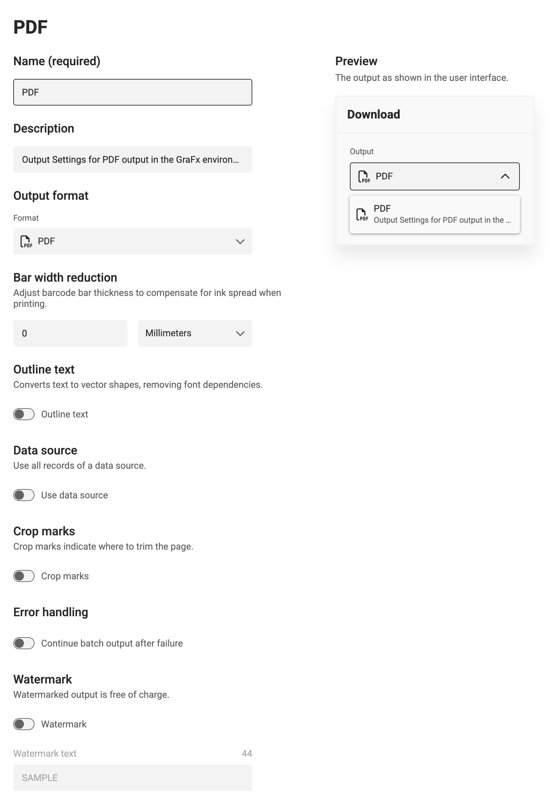
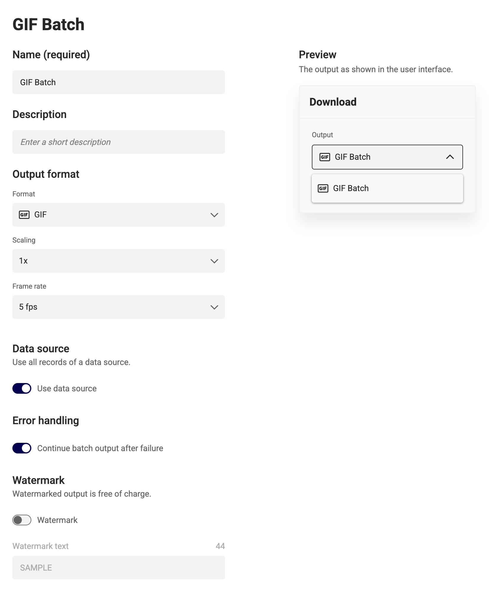

# Create Output Settings

[What are output settings?](/GraFx-Studio/concepts/output-settings/)

## Create output settings

In GraFx Studio, go to **Manage > Output settings** to view and configure output settings.

By default, each output format has one preconfigured setting.

To add a new setting, click the **+ Create** button.  
Give your setting a relevant name and choose an output file format.

The new setting will appear in the list.

To delete a setting, use the **...** menu at the right end of the row.

If all settings are deleted, a placeholder will indicate no output settings exist.

---

Output settings vary depending on the file format.

## Generic Settings (all formats)

### Name and description

- **Name** (1) appears in the [Studio UI](/GraFx-Studio/guides/create-projects/#customize-your-project)
- **Description** (2) appears as a subtitle in the export UI

### Output format

- Select the output format (3) — it can still be changed later.

### Watermark

- Enable this to apply a watermark to your output.
- Renders with watermark **do not** count as billable.
- Enter a non-empty watermark text.

---

## PDF Output Settings

See [Generic Settings](#generic-settings-all-formats)

### Bar Width Reduction

Compensates for ink spread during printing (dot gain).  
Use positive values to make bars thinner, negative to make them wider.

### Outline Text

Outputs text as vector shapes instead of embedding fonts.  
This removes font dependencies in the resulting PDF.

### Data Source

When enabled, includes all records from the data source in the output.

### Error Handling

Enable **Continue batch output after failure** to skip failed rows.  
A report is available in [Output Tasks](../tasks/).

### Crop Marks

See [Crop Marks](/GraFx-Studio/concepts/crop-marks/).  
Define offset and weight (thickness).

---

## JPG Output Settings

### Scaling

Adjusts output resolution.  
Higher resolution assets (if available) are used automatically.

### Quality

Set compression quality (1% to 100%).  
Higher values mean larger file size but better image fidelity.

### Data Source

Exports all data source records as individual JPG files in a ZIP.

### Error Handling

Enable **Continue batch output after failure** to skip failed rows.  
A report is available in [Output Tasks](../tasks/).

---

## PNG Output Settings

### Scaling

Same behavior as in JPG output.

### Data Source

Exports all records as individual PNG files in a ZIP.

### Error Handling

Enable **Continue batch output after failure** to skip failed rows.  
A report is available in [Output Tasks](../tasks/).

---

## GIF Output Settings

### Scaling

Same behavior as in JPG and PNG output.

### Frame Rate

Set the number of animation frames per second.

### Data Source

Exports all records as individual GIFs in a ZIP.

### Error Handling

Enable **Continue batch output after failure** to skip failed rows.  
A report is available in [Output Tasks](../tasks/).

---

## MP4 Output Settings

### Scaling

Same as other image/video formats.

### Frame Rate

Set the number of animation frames per second.

### Data Source

Exports all records as MP4s in a ZIP.

### Error Handling

Enable **Continue batch output after failure** to skip failed rows.  
A report is available in [Output Tasks](../tasks/).

