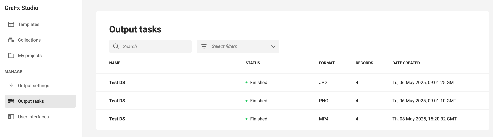
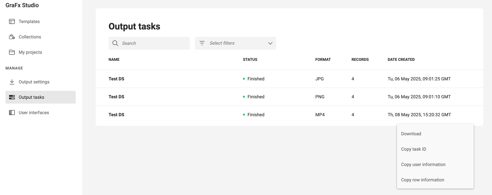

# Output Tasks

The **Output Tasks** page in **GraFx Studio** gives you a detailed overview of all recent output jobs created from your templates.

## Overview

Each output task lists the following details:

- **Name**: Name of the task
- **Status**: Shows whether the task has finished, failed, or is in progress
- **Format**: The output format (e.g., JPG, PNG, MP4, PDF, etc.)
- **Records**: Number of records processed
- **Date Created**: The date and time the task was created



Use the **Search** bar or **Select filters** to narrow down the list of tasks.

## Output Task Actions

Click the **three dots** at the end of any row to open the actions menu.



### Available Actions

- **Download**  
  Download the generated output files.

- **Copy task ID**  
  Copies the unique task ID to your clipboard.

- **Copy user information**  
  Copies the user who initiated the task.

- **Copy row information**  
  Copies a JSON structure with metadata about the output.  
  Example:

```json
  {
    "id": "24c973df-e25a-4b9a-8e0d-123456789",
    "name": "Template Name",
    "dateCreated": "2028-05-08T15:20:32.22025",
    "dateProcessed": "2029-05-08T15:20:32.22027",
    "format": "MP4",
    "totalRecords": 4,
    "totalSuccessfulRecords": 4,
    "status": "Finished",
    "source": "Template",
    "owner": "samlp|chili-publish-prd|ABC123",
    "outputAvailable": true
  }
```