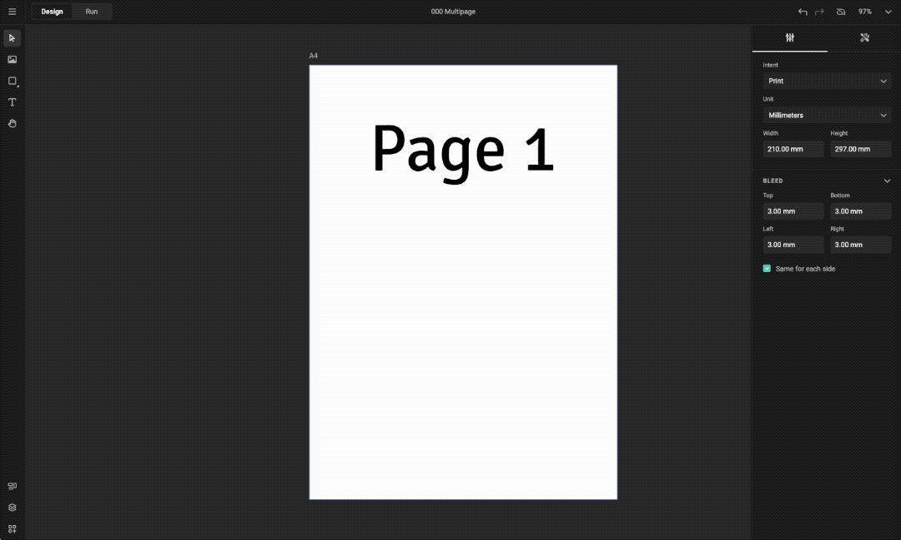
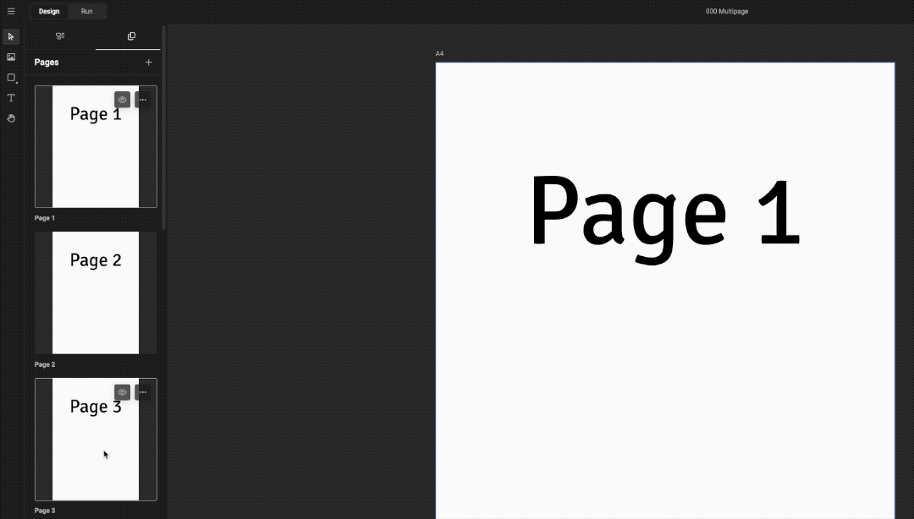
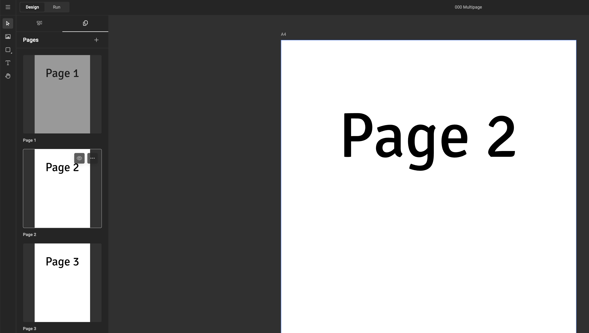
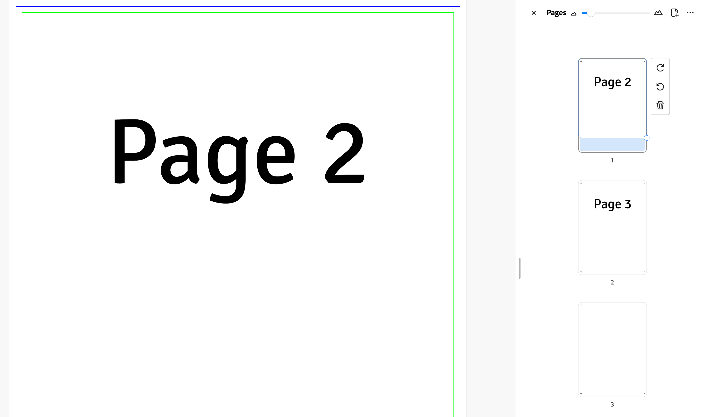
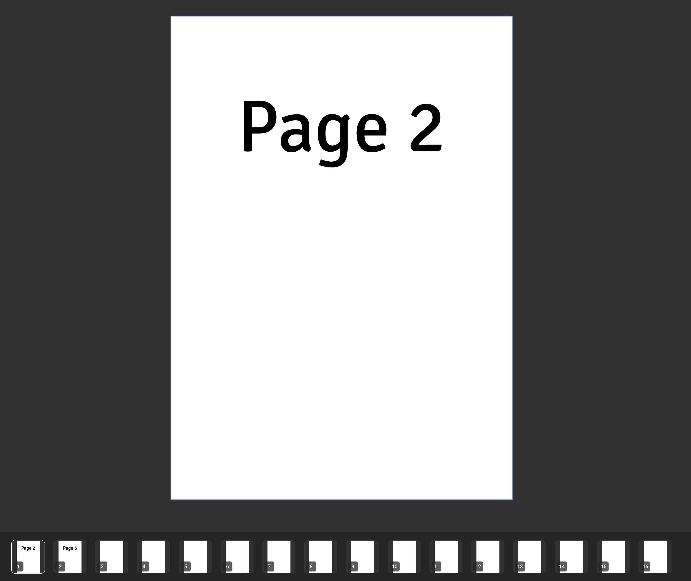

# Multiple Pages

See also: [Pages & Layout Intents](/GraFx-Studio/concepts/pages/)

## Add Pages

Choose **Layouts** > **Pages** > **Add Page**

## (Re-)Arrange Pages

Drag a page before or after another page.

## Hide Pages

Click the **Eye** icon on the page, or **"..."** > **Hide Page**

### Good to Know!

- When only one page is visible, it cannot be hidden.  
  The **Show/Hide** option is disabled, and the Eye icon/toggle is hidden.
- Hidden pages can still be selected and edited.
- Hidden pages do not output.

    
  

- Visibility applies to all [layouts](/GraFx-Studio/concepts/layouts/).  
  It is not possible to hide different pages in different layouts.
- When a document is loaded, the first visible page is selected.

  

!!! info "[Studio UI](/GraFx-Studio/concepts/template-management/) Considerations"

    - Hidden pages are ignored.  
      The page navigation panel only shows snapshots of visible pages.  
      When only one page is visible, the panel is hidden.  
      In the example below, page 1 is hidden, so it is not shown in the panel:

      

    - Page numbers only reflect visible pages (the end-user doesn’t need to know about hidden pages).
    - Upon loading, the first visible page is selected.

!!! warning "Digital"

    - Layouts with a **digital intent** use the first **visible page** instead of always using page 1.  
      If you hide page 1, it affects all digital layouts.

## Delete Pages

Click **"..."** > **Delete Page**

Confirm the deletion (or cancel).

!!! info "Delete Last Page"

    When only one page is visible, it cannot be deleted.  
    The **Delete** option is disabled.