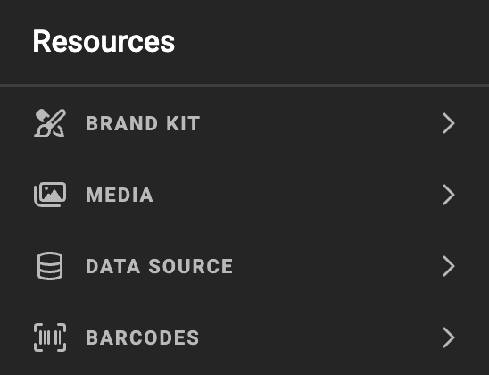
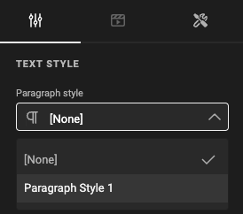

# How to work with paragraph styles

<iframe width="690" height="388" src="https://www.youtube.com/embed/XwD_IKRewGs?si=HqPdk-nUkrde7NzR&controls=1&mute=1&showinfo=0&rel=0&autoplay=1&loop=1" title="YouTube video player" frameborder="0" allow="accelerometer; autoplay; clipboard-write; encrypted-media; gyroscope; picture-in-picture; web-share" referrerpolicy="strict-origin-when-cross-origin" allowfullscreen></iframe>

[All feature videos](https://www.youtube.com/playlist?list=PLLHtQ1R6R-B_m7XAVySM9OjbbUscsgBOH)

## Define a paragraph style

Open the **Resource Panel** > **Brand Kit panel**.

Select the last tab to view paragraph- and character styles

Click on the "+" sign to ad a new paragraph style.
Each click on the "+" sign will add another (empty) paragraph style.

Click on the "..." menu next to the newly created paragraph style and choose edit or click the pencil to edit the style.

Set all properties you want for this paragraph. Saving happens automatically.

## Apply a paragraph style

Set the text-cursor anywhere in a paragraph. You can also select (part of) the paragraph.
A paragraph is defined between the start of a sentence, up to the end-of-line character.

In the properties panel on the right, select the paragraph style from the dropdown list.

