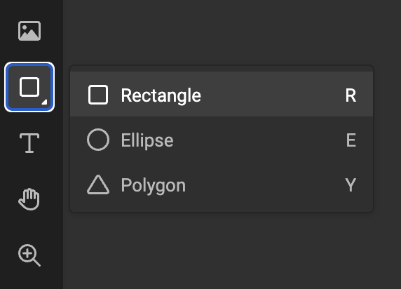
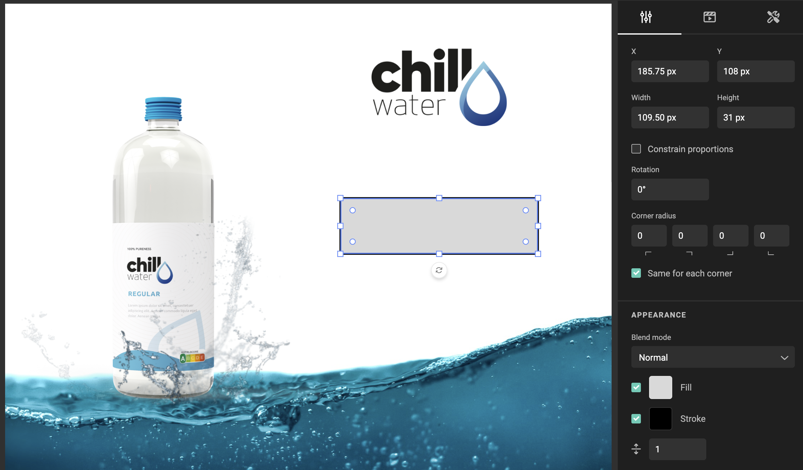
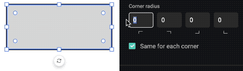
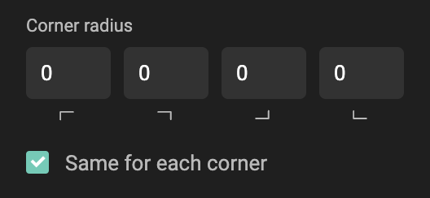
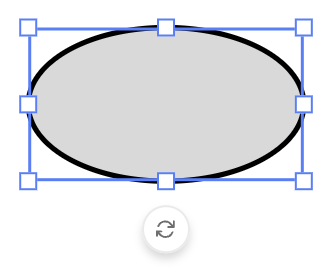
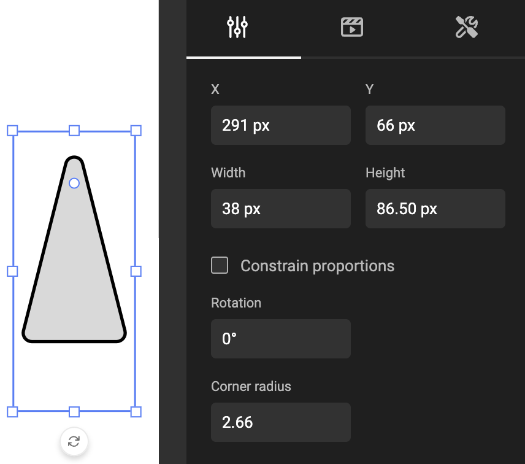
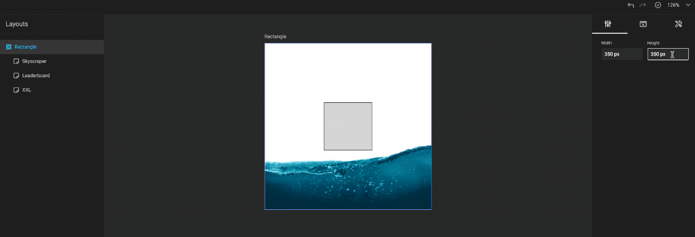

# Frame: Shape

See concept [Shape frames](/GraFx-Studio/concepts/frames/#shape-frame)

## Create shape frame

Select the shape tool in the sidebar and choose a shape. You can also use the shortcut for the shape you wish to draw.

Drag a rectangle on the canvas. The selected shape will be drawn inside the frame.

## Properties

Similar properties as with all frames. See [Basic properties](/GraFx-Studio/concepts/frames/#basic-properties).

### Corner radius

Some shapes can have a corner radius. (see below).

A corner radius can be entered in the property panel, or can be set through the corner radius handle.

### Rectangle

By default you can set the corder radius for all corners.

By deselecting the "Same for each corner", you can specify a corder radius for each corder individually.

### Ellipse

By design, an ellipse does not have a corder radius. An ellipse will fit an ellipsoide shape inside the rectangular frame.

### Polygon

Drawing a rectangular frame to fit a polyon will draw a triangle.

A triangle has 1 corner radius setting, and will apply that setting to all (3) corners.

## Maximum / minimum corner radius

A rectangular shape of 100 x 100 pixels, will have a max corner radius of 50. This will look like a (perfect) circle.

Dragging the corner radius handle, will set the value in the properties panel to maximum 50. Because you cannot drag it further, than the shape allows you to.

In the properties panel, you can now set the value above 50. Visually, this will not have any effect.

When you now make a different layout, that is much bigger in size, and the frame would be much bigger, then this corner radius would be visible again.

