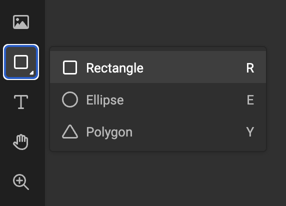
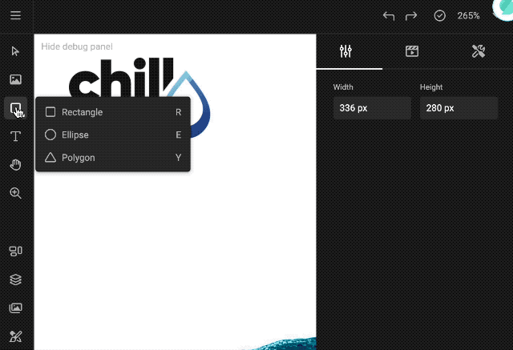
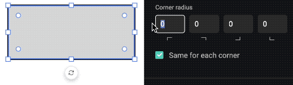
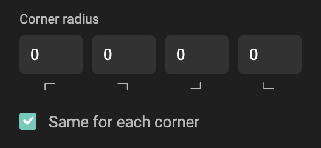
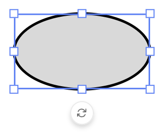
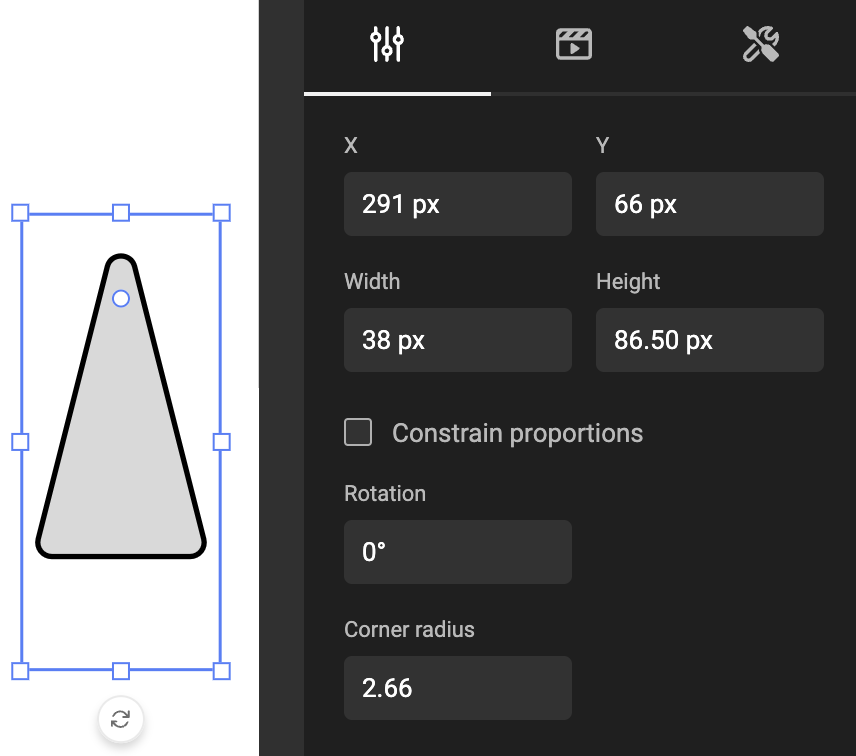
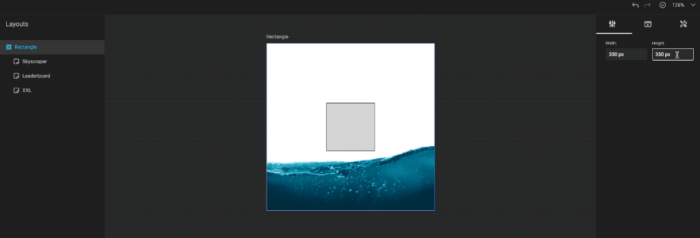

# Frame: Shape

See concept [Shape frames](/GraFx-Studio/concepts/frames/#shape-frame)

## Create shape frame

Select the shape tool in the sidebar and choose a shape. You can also use the shortcut for the shape you wish to draw.

{.screenshot}

Drag a rectangle on the canvas. The selected shape will be drawn inside the frame.

{.screenshot-full}

<iframe width="690" height="388" src="https://www.youtube.com/embed/7GTTI5Yfomk?si=vYznyBiq0POidTw-&controls=1&mute=1&showinfo=0&rel=0&autoplay=0&loop=1" title="YouTube video player" frameborder="0" allow="accelerometer; autoplay; clipboard-write; encrypted-media; gyroscope; picture-in-picture; web-share" referrerpolicy="strict-origin-when-cross-origin" allowfullscreen></iframe>

[All feature videos](https://www.youtube.com/playlist?list=PLLHtQ1R6R-B_m7XAVySM9OjbbUscsgBOH)

## User Constraints for Shape Frames

Shape frames support **user constraints** that control how end users can interact with the frame in Studio UI. These constraints are defined by the template designer and determine which actions are allowed.

All constraint options are **disabled by default**. You explicitly enable only the interactions you want to allow.

<video width="690" autoplay="true" loop="true" muted="true">
  <source src="shape-frame-user-constraints.mp4" type="video/mp4">
  Your browser does not support the video tag.
</video>

### Available Constraint Options

- **Allow horizontal move**  
  Enables movement along the X-axis.

- **Allow vertical move**  
  Enables movement along the Y-axis.

- **Allow rotation**  
  Allows the shape frame to be rotated by the end user.

- **Allow resize**  
  Allows the shape frame to be resized.

- **Constrain proportions**  
  Locks the aspect ratio during resize.

The same dependencies apply as for other frame types: enabling resize or rotation also enables horizontal and vertical movement, and *Constrain proportions* is only relevant when resize is enabled. See [Constraints](/GraFx-Studio/concepts/constraints/).

## Properties

Similar properties as with all frames. See [Basic properties](/GraFx-Studio/concepts/frames/#basic-properties).

The rotation and corner radius fields are collapsed by default. Click the **...** icon in the properties panel to show them.

### Corner radius

Some shapes can have a corner radius. (see below).

A corner radius can be entered in the property panel, or can be set through the corner radius handle.

Values are expressed in the unit of the layout — pixels, millimeters or inches, depending on the [layout intent](/GraFx-Studio/concepts/layout-intent/). The unit is shown inside the input field, and the corner icon highlights along with the field you are editing.

{.screenshot-full}

<iframe width="690" height="388" src="https://www.youtube.com/embed/sNTJv-RUyU0?si=lGmlMNKT5Uf-ZpKC&controls=1&mute=1&showinfo=0&rel=0&autoplay=0&loop=1" title="YouTube video player" frameborder="0" allow="accelerometer; autoplay; clipboard-write; encrypted-media; gyroscope; picture-in-picture; web-share" referrerpolicy="strict-origin-when-cross-origin" allowfullscreen></iframe>

[All feature videos](https://www.youtube.com/playlist?list=PLLHtQ1R6R-B_m7XAVySM9OjbbUscsgBOH)

### Rectangle

By default you can set the corner radius for all corners.

<!-- TODO screenshot (REL-69): retake — the restructured Corner radius section has two input fields instead of four, shows the layout unit inside each field, and highlights the corner icon together with its field -->
{.screenshot}

By deselecting the "Same for each corner", you can specify a corner radius for each corner individually.

### Ellipse

By design, an ellipse does not have a corner radius. This will fit an ellipse shape inside the rectangular frame.

{.screenshot}

### Polygon

Drawing a rectangular frame to fit a polygon will draw a triangle.

A triangle has 1 corner radius setting, and will apply that setting to all (3) corners.

{.screenshot}

## Overprint

On a layout with a **Print** intent, the properties panel offers two overprint toggles for the selected shape frame:

- **Overprint on fill** — the shape's fill prints on top of the inks underneath instead of knocking them out.
- **Overprint on stroke** — the same, for the shape's stroke.

Both are off by default, and each toggle is only selectable when the matching fill or stroke color is active. Removing a fill or stroke switches its overprint off.

<!-- TODO screenshot (REL-69): the Overprint section in the shape frame properties panel, both toggles visible. Save as shape-frame-overprint.png next to this page and uncomment:
{.screenshot}
-->

!!! warning "Only spot colors defined in CMYK"
    Overprint takes effect only when the fill or stroke uses a [spot color](/GraFx-Studio/guides/colors/#spot) whose secondary color is defined in CMYK. On process CMYK colors, RGB colors, and RGB-based spot colors the toggle can be switched on but changes nothing in the output.

The toggles are hidden on digital layouts. See [Overprint](/GraFx-Studio/concepts/overprint/).

## Maximum / minimum corner radius

A rectangular shape of 100 x 100 pixels, will have a max corner radius of 50. This will look like a (perfect) circle.

Dragging the corner radius handle, will set the value in the properties panel to maximum 50. Because you cannot drag it further, than the shape allows you to.

In the properties panel, you can now set the value above 50. Visually, this will not have any effect.

When you now make a different layout, that is much bigger in size, and the frame would be much bigger, then this corner radius would be visible again.

{.screenshot-full}
