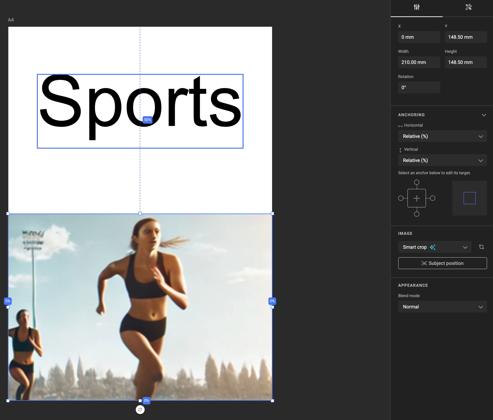
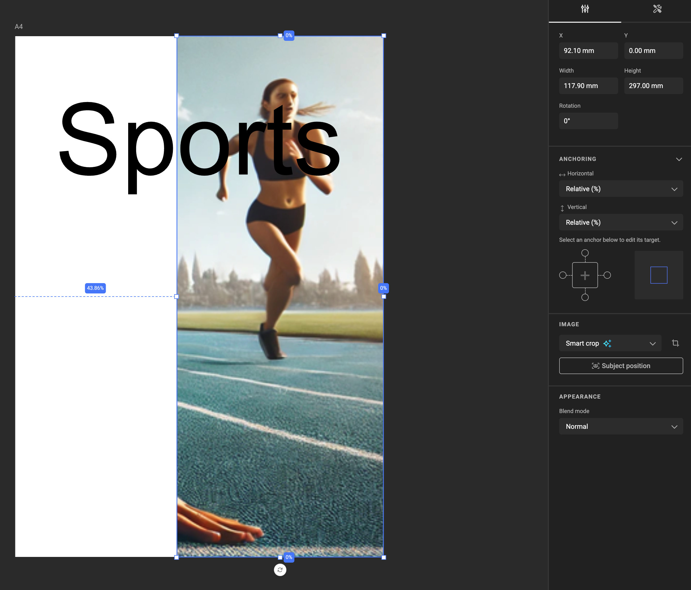
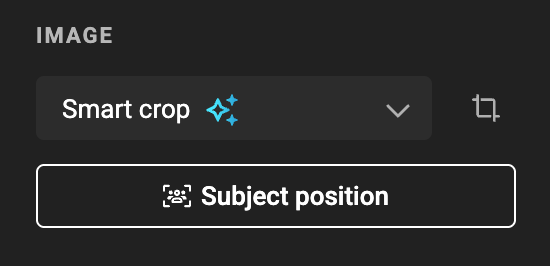
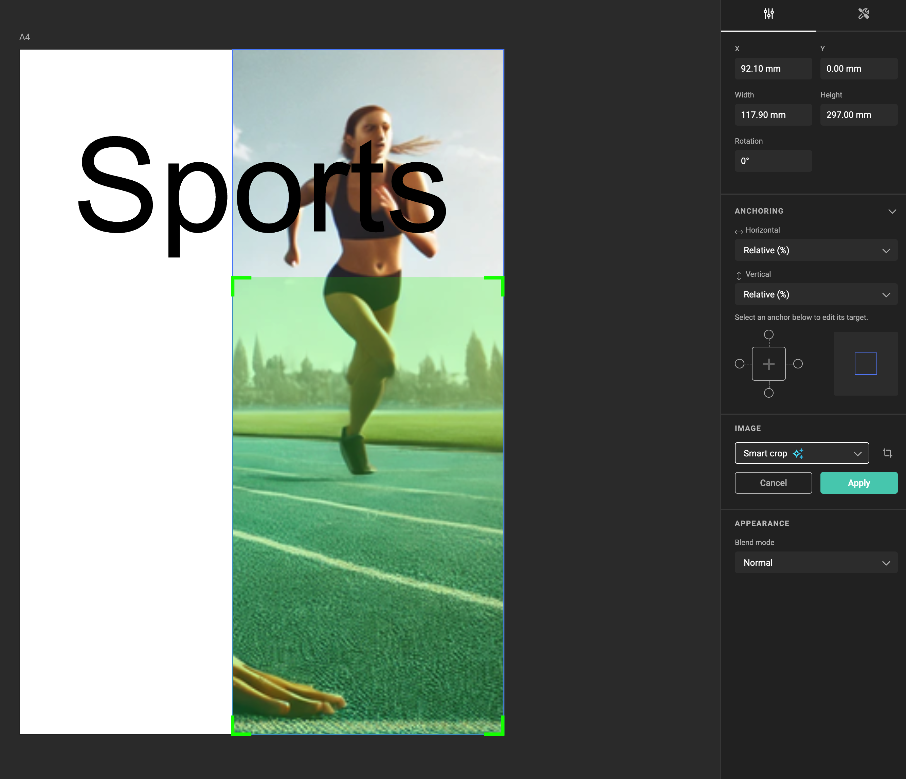
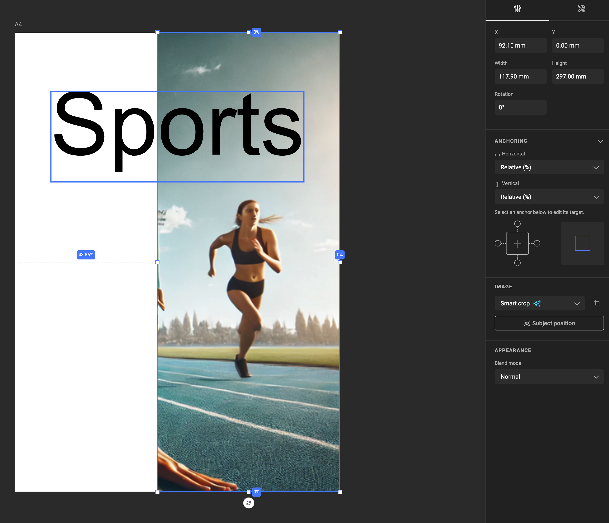

# Smart Crop

Also see the concept [Smart Crop](../../concepts/genie-smart-crop/).

<iframe width="690" height="388" src="https://www.youtube.com/embed/Wrw3i2lcCYI?si=58dg9pPCXT0TvZZO&controls=1&mute=1&showinfo=0&rel=0&autoplay=1&loop=1" title="YouTube video player" frameborder="0" allow="accelerometer; autoplay; clipboard-write; encrypted-media; gyroscope; picture-in-picture; web-share" referrerpolicy="strict-origin-when-cross-origin" allowfullscreen></iframe>

[All feature videos](https://www.youtube.com/playlist?list=PLLHtQ1R6R-B_m7XAVySM9OjbbUscsgBOH)

## How to use Smart Crop?

In your Smart Template, place an Image Frame and select a source image asset.

By default, the Fill property of an Image Frame is set to **Fill**.  
Change this to **Smart Crop** to enable the AI-driven cropping feature.

> **Note**:  
> Smart Crop requires the Subject Area to be defined in advance. See [how to set a Subject Area in GraFx Media](../../../GraFx-Media/guides/smart-crop-subject-area/).

After setting the Subject Area (e.g., the runner on the right side of the image below), GraFx Genie will automatically focus on this subject. (because it's defined in GraFx Media)

## Define Subject Position

If another object or text overlaps your image frame, define a specific area (Subject Position) within the frame for the subject to appear clearly.

To define the Subject Position, click the **Subject Position** button in the properties panel:

A box appears over your image frame. Adjust its size and position to specify exactly where your subject should appear. Click **Apply** to confirm.

Your subject will now fit within the defined Subject Position box.

## Feature Channel

<iframe width="690" height="388" src="https://www.youtube.com/embed/dTU9VX0Iqfo?si=phM0gg_adKHpX8Y1&controls=1&mute=1&showinfo=0&rel=0&autoplay=1&loop=1" title="YouTube video player" frameborder="0" allow="accelerometer; autoplay; clipboard-write; encrypted-media; gyroscope; picture-in-picture; web-share" referrerpolicy="strict-origin-when-cross-origin" allowfullscreen></iframe>

[All feature videos](https://www.youtube.com/playlist?list=PLLHtQ1R6R-B_m7XAVySM9OjbbUscsgBOH)

!!! warning "Important rules for Smart Crop"

    The appearance of your subject depends heavily on the defined Subject Area, the available space around the subject, and the frame’s dimensions. Experiment with different positions and sizes to achieve optimal results.
    
    For best results, ensure the subject has sufficient surrounding area to allow repositioning without causing whitespace or unwanted scaling.