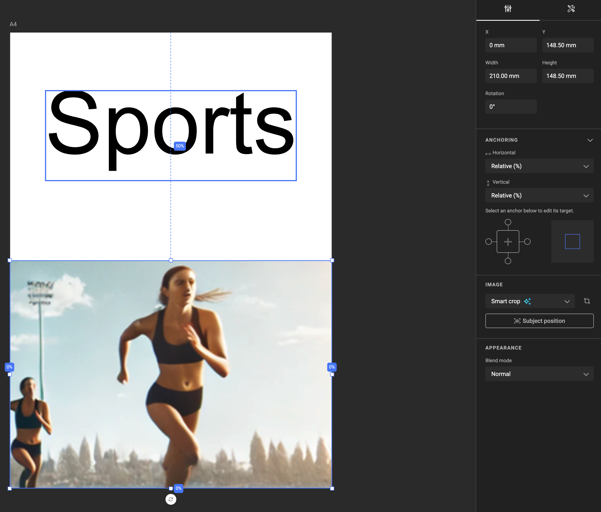
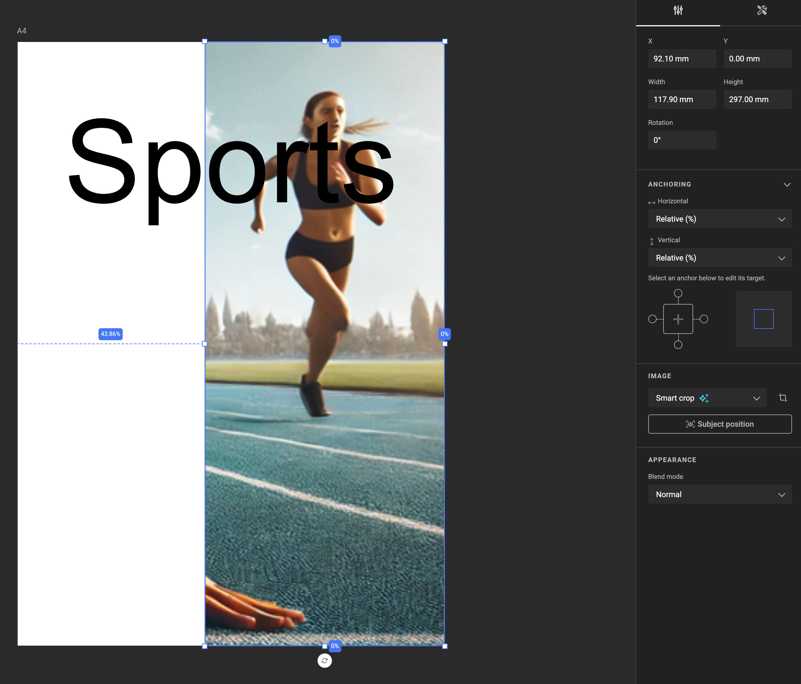
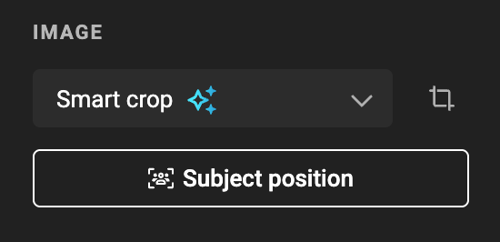
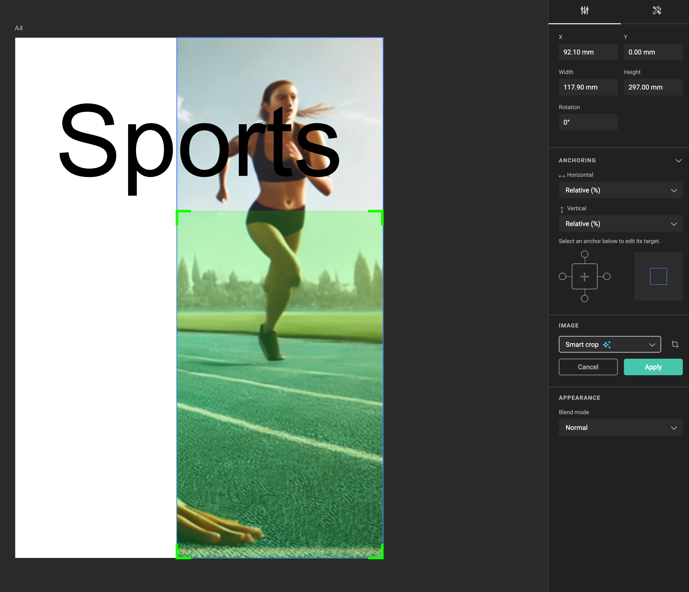
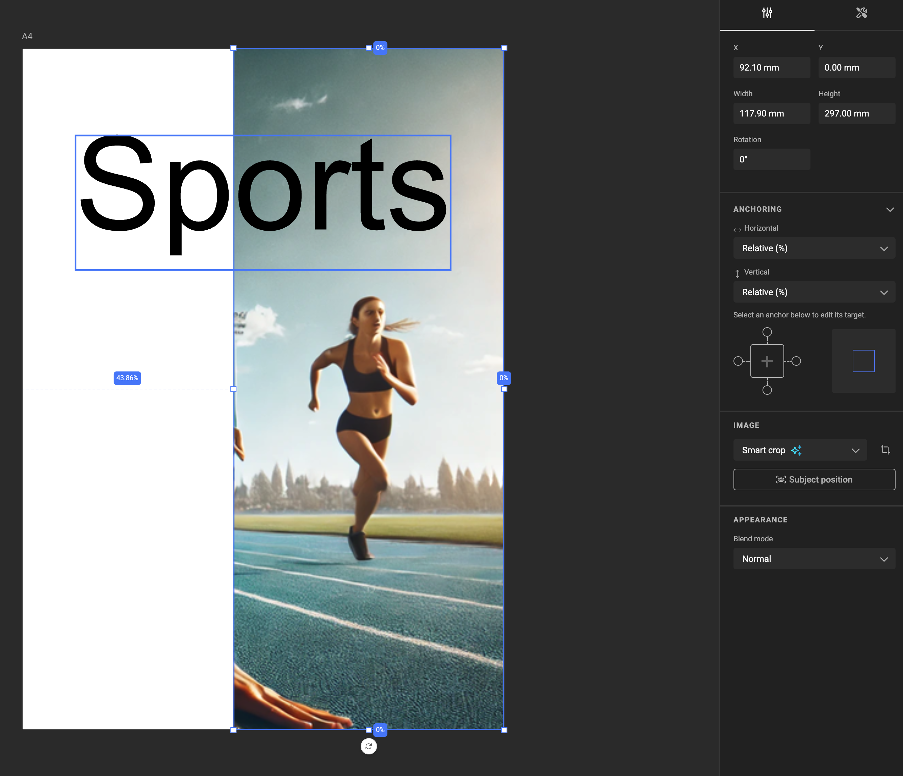

# Smart Crop

Also see the concept [Smart Crop](../../concepts/genie-smart-crop/).

<iframe width="690" height="388" src="https://www.youtube.com/embed/Wrw3i2lcCYI?si=58dg9pPCXT0TvZZO&controls=1&mute=1&showinfo=0&rel=0&autoplay=1&loop=1" title="YouTube video player" frameborder="0" allow="accelerometer; autoplay; clipboard-write; encrypted-media; gyroscope; picture-in-picture; web-share" referrerpolicy="strict-origin-when-cross-origin" allowfullscreen></iframe>

[All feature videos](https://www.youtube.com/playlist?list=PLLHtQ1R6R-B_m7XAVySM9OjbbUscsgBOH)

## How to use Smart Crop?

In your Smart Template, place an Image Frame and select a source image asset.

By default, the Fill property of an Image Frame is set to **Fill**.  
Change this to **Smart Crop** to enable the AI-driven cropping feature.

> **Note**:  
> Smart Crop requires the Subject Area to be defined in advance. See [how to set a Subject Area in GraFx Media](/GraFx-Media/guides/smart-crop-subject-area/).

After setting the Subject Area (e.g., the runner on the right side of the image below), GraFx Genie will automatically focus on this subject. (because it's defined in GraFx Media)

## Define Subject Position

If another object or text overlaps your image frame, define a specific area (Subject Position) within the frame for the subject to appear clearly.

To define the Subject Position, click the **Subject Position** button in the properties panel:

A box appears over your image frame. Adjust its size and position to specify exactly where your subject should appear. Click **Apply** to confirm.

Your subject will now fit within the defined Subject Position box.

## Subject alignment

When the image has room to move after Smart Crop has zoomed, you can nudge the subject toward a side inside the Subject Position instead of leaving it centered. With Smart Crop selected, use the **Subject alignment** control in the properties panel to set the horizontal alignment (left, center, or right) and the vertical alignment (top, middle, or bottom) independently.

This is useful when a subject should sit against a particular edge of the layout — for example, a product that should stay close to a headline — and keep that position across different frame sizes and aspect ratios.

The subject moves only as far as the image allows: once there is no more image to reveal on that side, it cannot shift further. Subject alignment is available on frames that use the latest Smart Crop version.

## Applying a new Smart Crop version

To keep existing templates stable, each image frame remembers the Smart Crop version it first used, so updates to the algorithm never change how your current projects look. When you select a frame that is still using an older version, the workspace shows a **New smart crop available — apply it** message with a button to update that frame to the latest version. The message does not appear when the frame already uses the latest version, or when it has a manual crop override.

## Select a Subject type

When Smart Crop is active on an image frame, a **Subject type** dropdown is available in the properties panel, below the Fit mode. It lets you pick which subject type to use when cropping the image.

The dropdown lists **Default** plus every subject type defined on the environment:

- **Default** uses the automatically detected Subject Area and POI from the asset.
- Selecting another subject type (for example *person* or *product*) tells Smart Crop to use the Subject Area and POI stored for that type on the asset, defined in the [media detail view](/GraFx-Media/guides/smart-crop-subject-area/#subject-type).

The dropdown is only active when an image is placed on the frame. If a previously selected subject type is no longer available on the environment, the frame falls back to **Default**.

See [Manage Subject Types](/CHILI-GraFx/guides/manage-subject-types/) for how the list is configured.

## Feature Channel

<iframe width="690" height="388" src="https://www.youtube.com/embed/dTU9VX0Iqfo?si=phM0gg_adKHpX8Y1&controls=1&mute=1&showinfo=0&rel=0&autoplay=1&loop=1" title="YouTube video player" frameborder="0" allow="accelerometer; autoplay; clipboard-write; encrypted-media; gyroscope; picture-in-picture; web-share" referrerpolicy="strict-origin-when-cross-origin" allowfullscreen></iframe>

[All feature videos](https://www.youtube.com/playlist?list=PLLHtQ1R6R-B_m7XAVySM9OjbbUscsgBOH)

!!! warning "Important rules for Smart Crop"

    The appearance of your subject depends heavily on the defined Subject Area, the available space around the subject, and the frame’s dimensions. Experiment with different positions and sizes to achieve optimal results.
    
    For best results, ensure the subject has sufficient surrounding area to allow repositioning without causing whitespace or unwanted scaling.