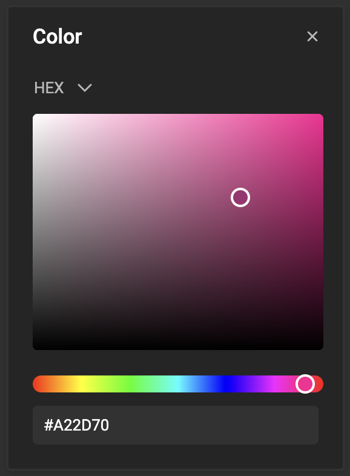
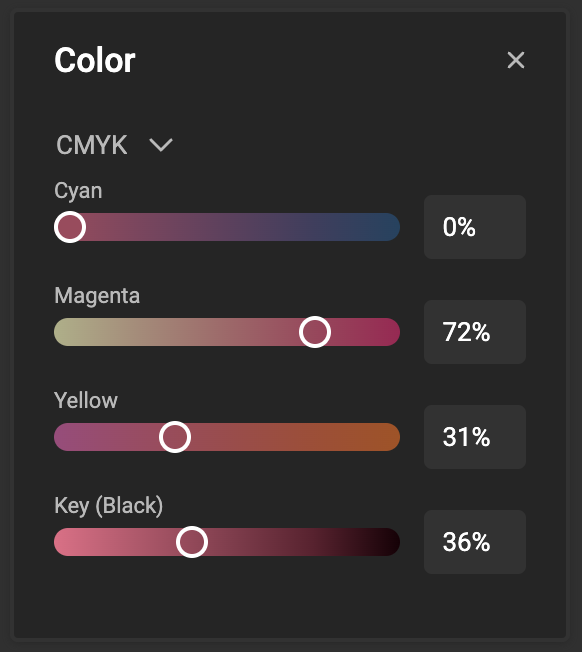

# How to work with swatches

## Define a swatch

Open the Stylekit panel.

Select the second tab to view swatches

Click on the "+" sign to add a new swatch.
Each click on the "+" sign will add another (white) swatch.

Click on the "..." menu next to the newly created swatch and choose edit or click the color to edit.

You can rename by clicking "Rename" in the "..." menu.

### Color picker

Define the color. Choose your type and set the values for the chosen color space.

#### Hex

The value is e hexadecimal representation of an RGB value.

Ranging from 00 (black) to FF (white).

[See how you can define your Hex color value](https://www.w3schools.com/colors/colors_hexadecimal.asp)

#### RGB

The 3 values represent a decimal value for each of the 3 RGB channels.

[See how to calculate RGB color values](https://www.w3schools.com/colors/colors_rgb.asp)

#### CMYK

Mostly used in print, but also available in CSS4, CMYK is a subtractive color system.

A subtractive color mixing model predicts the resultant spectral power distribution of light filtered through overlaid partially absorbing materials on a reflecting or transparent surface.[^1]

[^1]: Source: [Wikipedia](https://en.wikipedia.org/wiki/Subtractive_color#Process)

## Apply a swatch

Where you can choose a color (character style or paragraph style), you'll be able to click the color and choose the swatch.

Select "custom" to define a color ad-hoc.
