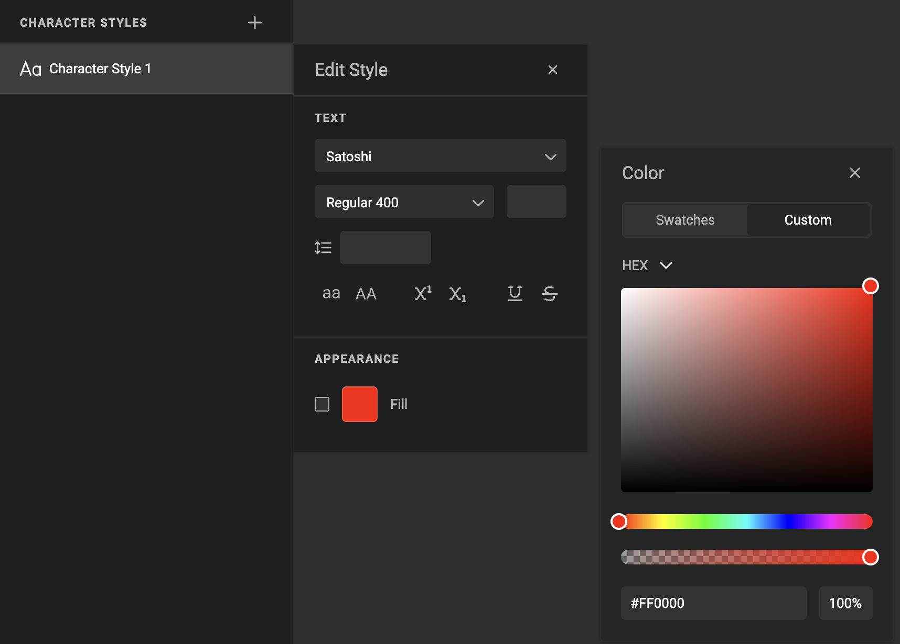

# How to work with swatches

## Define a swatch

Open the Stylekit panel.

Select the second tab to view swatches

Click on the "+" sign to add a new swatch.
Each click on the "+" sign will add another (white) swatch.

Click on the "..." menu next to the newly created swatch and choose edit or click the color to edit.

You can rename by clicking "Rename" in the "..." menu.

### Color picker

Define the color. Choose your type (Hex or RGB)

## Apply a swatch

Where you can choose a color (character style or paragraph style), you'll be able to click the color and choose the swatch.

Select "custom" to define a color ad-hoc.