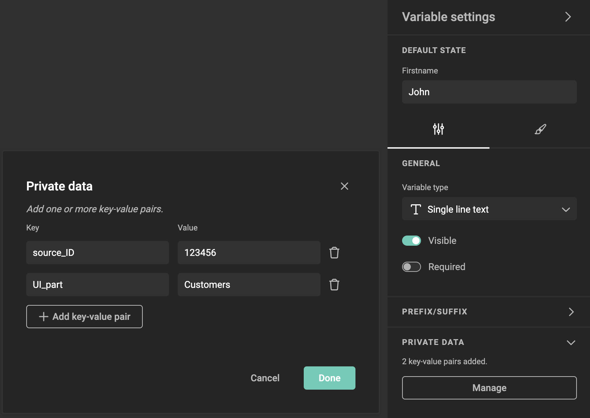

# How to Manage Private Data

You can manage [Private Data](/GraFx-Studio/concepts/private-data/) for variables in GraFx Studio. This allows you to attach custom key-value pairs to a variable, which can be used by your custom integrations, without affecting the Studio UI or end-user interface.

Private data can impact your custom end-user interface. Integrations can use the private data to add tags to variables to trigger specific UI workflows.

## Manage Private Data

### Access the Variable Settings

   - Navigate to the **Variable Settings** panel for the variable you want to manage.
   - You will see the **Private Data** section listed in the variable settings.

### Open the Private Data Section
   - In the **Private Data** section, click **Manage** to access the private data editor.

### Add Key-Value Pairs

   - Click the **Add key-value pair** button to create a new entry.
   - In the **Key** field, enter a custom identifier (e.g., `source_ID`).
   - In the **Value** field, input the corresponding value (e.g., `123456`).
   - You can add multiple key-value pairs to a variable, depending on your integration needs.

### Edit Existing Key-Value Pairs
   - To modify an existing key or value, simply click on the text in the field and make your changes.
   
!!! warning
    Be cautious when changing values. If you modify the **Key**, it may impact your integration. For example, changing `source_ID` to `SOURCEID` will require an update to your integration to recognize the new Key.

### Delete Key-Value Pairs
   - To remove a key-value pair, click the trash icon next to the entry you want to delete.

!!! warning
    Deleting a key-value pair may affect your integration.

### Save Your Changes
   - Once you’ve added, edited, or deleted key-value pairs, click **Done** to save your changes.
   - The key-value pairs will now be stored with the variable and can be used by your custom integration.

!!! info
    Known behavior: If you edit key-value pairs without saving and then modify the variable contents, any unsaved key-value pairs or updates will be lost.