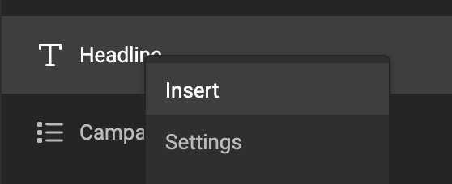
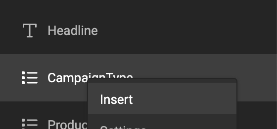

# How to work with template variables

!!! info "Template Variables"
	When referring to **variables** we can mean **[Template variables](/GraFx-Studio/concepts/variables/#template-variables)** or **[JavaScript variables](/GraFx-Studio/concepts/variables/#javascript-variables)**.
	In the context of this page, we are talking about Template variables, unless stated differently.

Be sure to also check the [concept page](/GraFx-Studio/concepts/variables/)

## Insert template variable in a text frame

Choose "Insert" from the variable "..." menu to insert it into a text frame

Insert the content of a text variable into a text frame.

Insert the content of list variable into a text frame.

In edit mode, the template variable name is shown in a gray box in the text.

If the frame is not wide enough to show the full name, the name will be truncated to avoid overflow.

## Assign template variable to image frame

Select the image frame you want to assign the template variable to.

In the variable tab, choose the image variable from the "Insert variable" drop-down menu.

## Un-assign a template variable from an image frame

To remove the template variable from the image frame, select the frame and choose "None" from the "Insert variable" drop-down menu.

