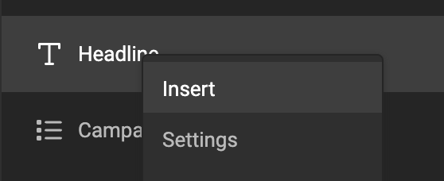
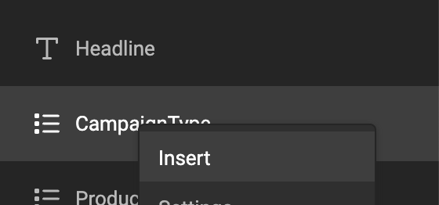
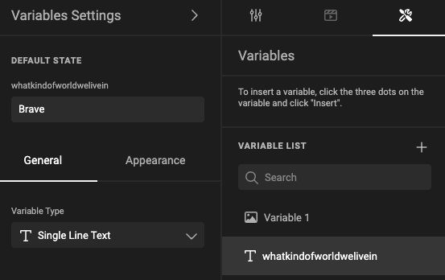
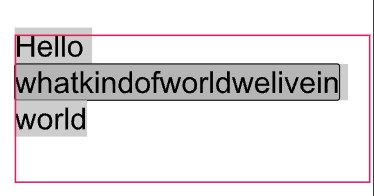
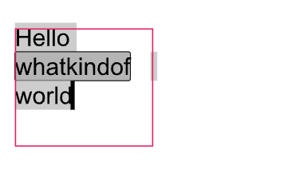
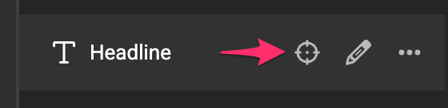
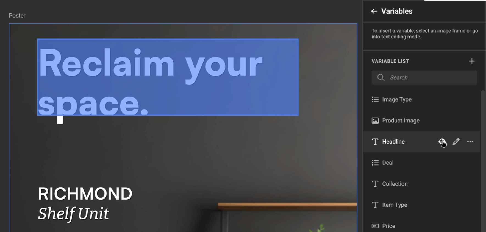
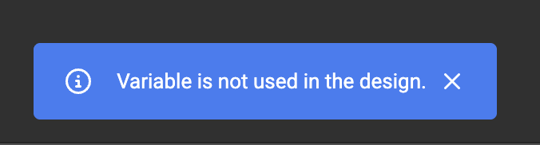

# How to work with template variables

## Feature Channel

<iframe width="690" height="388" src="https://www.youtube.com/embed/nLqE_XGqSyE?si=WAsooqyLLP6KdA2t&controls=1&mute=1&showinfo=0&rel=0&autoplay=1&loop=1" title="YouTube video player" frameborder="0" allow="accelerometer; autoplay; clipboard-write; encrypted-media; gyroscope; picture-in-picture; web-share" referrerpolicy="strict-origin-when-cross-origin" allowfullscreen></iframe>

<iframe width="690" height="388" src="https://www.youtube.com/embed/pP6_3Ej6x-U?si=yiwTweBam4j7zLRD&controls=1&mute=1&showinfo=0&rel=0&autoplay=0&loop=1" title="YouTube video player" frameborder="0" allow="accelerometer; autoplay; clipboard-write; encrypted-media; gyroscope; picture-in-picture; web-share" referrerpolicy="strict-origin-when-cross-origin" allowfullscreen></iframe>

[Go to Youtube to see all feature videos](https://www.youtube.com/playlist?list=PLLHtQ1R6R-B_m7XAVySM9OjbbUscsgBOH)

!!! info "Template Variables"
	When referring to **variables** we can mean **[Template variables](/GraFx-Studio/concepts/variables/#template-variables)** or **[JavaScript variables](/GraFx-Studio/concepts/variables/#javascript-variables)**.
	In the context of this page, we are talking about Template variables, unless stated differently.

Be sure to also check the [concept page](/GraFx-Studio/concepts/variables/)

## Insert template variable in a text frame

Choose "Insert" from the variable "..." menu to insert it into a text frame

Insert the content of a text variable into a text frame.

Insert the content of list variable into a text frame.

In edit mode, the template variable name is shown in a gray box in the text.

If the frame is not wide enough to show the full name, the name will be truncated to avoid overflow.

## Find and locate placed variables using the highlight tool

When working with complex templates, it can be difficult to see where a specific variable is used in the layout.  
The highlight tool allows you to instantly visualize every placement of a selected template variable on the canvas.

### How to highlight a variable

1. Open the **Variables panel**.
2. Locate the variable you want to inspect.
3. Click the **Highlight** icon next to the variable name.

All placements of that variable are temporarily highlighted directly on the document canvas.

{.screenshot-full}

### What gets highlighted

The tool highlights every place where the variable is applied, including:

- Text frames containing the variable  
- Image fields bound to the variable  

This works even if elements are grouped or positioned in different areas of the layout.

### When to use highlighting

Use variable highlighting when you:

- Want to safely rename a variable  
- Need to validate all placements before editing logic  
- Suspect a variable is placed multiple times  
- Want to confirm whether a variable is actually used  

If no elements are highlighted, the variable may not be placed on the canvas.

!!! tip
    Use the search field in the Variables panel to quickly filter variables before highlighting one.