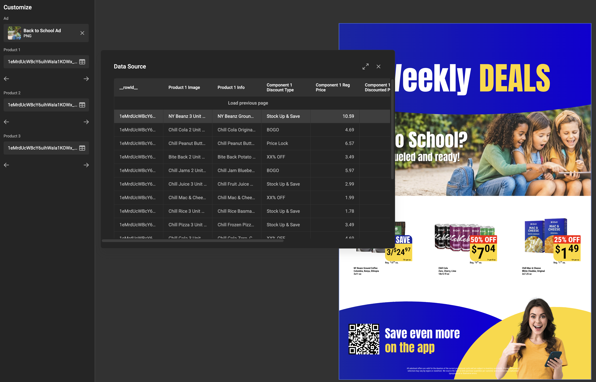
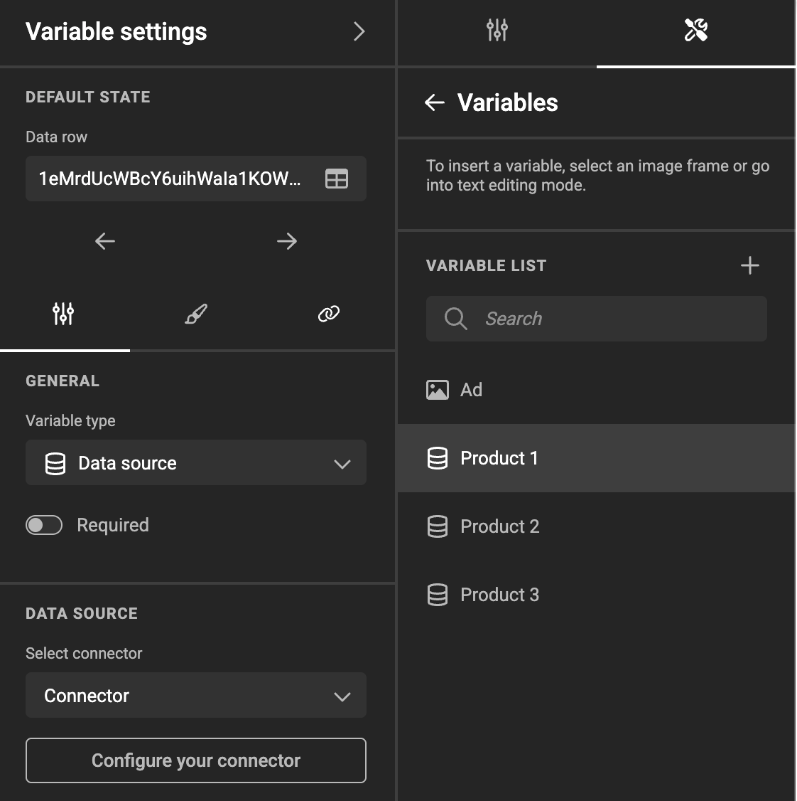
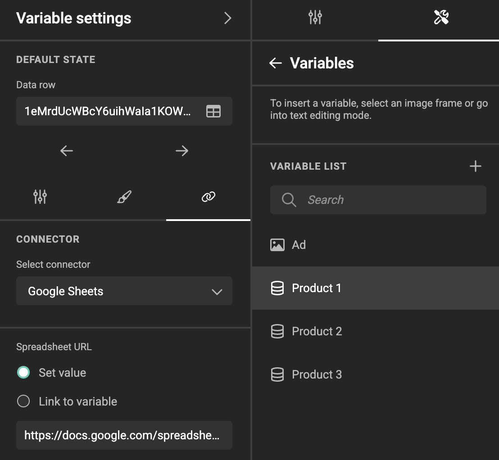
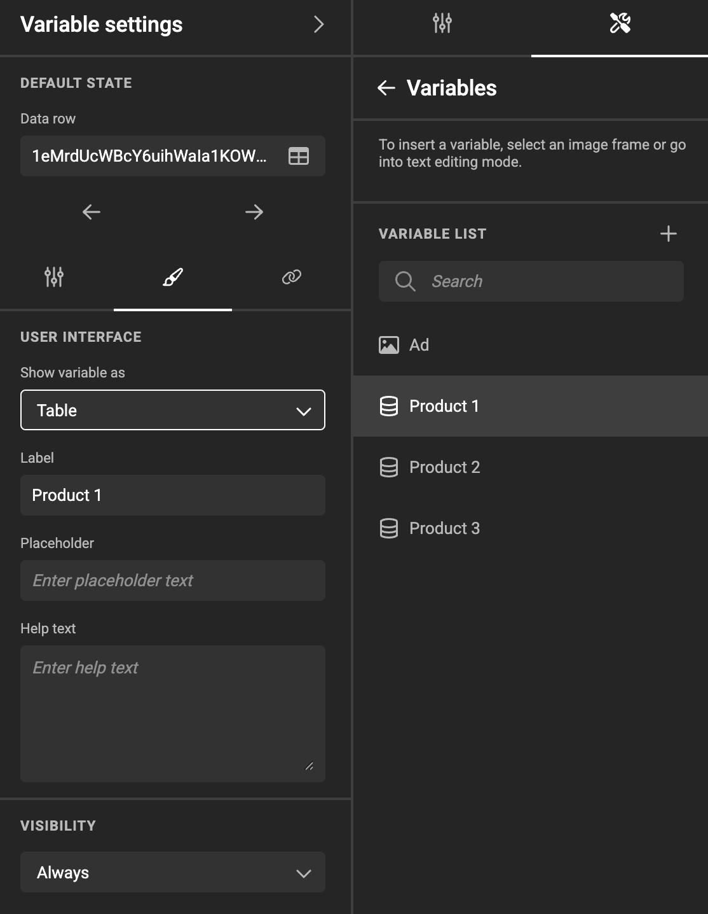
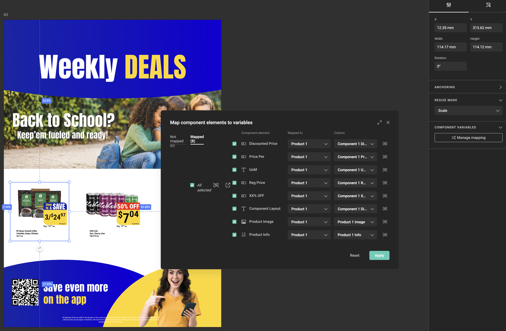

# Data source variables

Picture a local marketeer opening a template to customise a promotion. The document has three product slots to fill, each one a [component](/GraFx-Studio/guides/use-components/) with its own name, price and image. Filling those by hand means typing every field for every product — and getting each one exactly right.

{.screenshot-full}

A **data source variable** turns that into a single choice. The marketeer picks a row from a dataset — one product — and that product's name, price and image flow into the component the designer mapped it to. Three picks, three filled promotions, nothing typed by hand.

{.screenshot-full}

That is what a data source variable does: it links to a set of records, keeps a **reference to the one row the user selected**, and feeds that row's values into the template — in most cases through a [component](/GraFx-Studio/guides/use-components/).

The records come from an external system: pulled through a data connector, or pushed in by an integration. The variable stores only the reference to the selected row, not a copy of the data — which is what makes it the right tool for self-service work: pick your product, get your poster.

!!! info "Template Variables"
    When referring to **variables** we can mean **[Template variables](/GraFx-Studio/concepts/variables/#template-variables)** or **[JavaScript variables](/GraFx-Studio/concepts/variables/#javascript-variables)**. On this page we are talking about Template variables.

## Not the same as an output data source

A template can also have an **output data source**, which looks similar but does a different job. The distinction matters, because picking the wrong one leads to a template that produces one output when you wanted five hundred, or the reverse.

| | Output data source | Data source variable |
|---|---|---|
| **What it does** | Iterates over every row to drive a batch of outputs | Holds one selected row, used inside a single document |
| **Drives output** | Yes — one output per row | No |
| **Navigation** | Forward through all rows | Browse, and one row stays selected |
| **Typical use** | Variable data printing: 500 personalised mailers | Self-service: pick a product, get a poster |

A template can use both together. See [Data connectors](/GraFx-Studio/concepts/connectors-data/) for the output data source.

## Where the data comes from

A data source variable is populated in one of two ways, chosen per variable:

- **Connector** (default) — GraFx Studio *pulls* the data through a [data connector](/GraFx-Developers/connectors/data-connector/data-connector-introduction/). Use this when the data lives in a system you can reach: a PIM, a CRM, a spreadsheet, an API.
- **Data injection** — an integration *pushes* the data in via the SDK. Use this when the surrounding application already has the data in hand and routing it through a connector would be a detour.

Both end up in the same place: a table of rows with a selected row. Only the plumbing differs.

## Create a data source variable

Open the variables panel from the properties panel on the right (the wrench & screwdriver tool), then choose **Variables** — the same starting point as [defining any template variable](/GraFx-Studio/guides/template-variables/define/).

Add a variable and set its **Variable type** to **Data source**. The **General** tab then shows:

{.screenshot}

- **Required** — optional toggle. It stays **disabled** until the variable actually has a source: a connector is selected, or the source is set to Data injection with at least one field. Remove every field from a Data injection schema and Required switches back off and disables again.
- A **DATA SOURCE** section with a **Select connector** dropdown, set to **Connector** by default.

Until the source is configured, the **Default state** panel shows **"No preview available. Configure your data source"**.

<!-- TODO Bram: screenshots needed for the General tab in both modes (Connector + Data injection). Zeplin refs on PRODUCT-769. -->

### Connector

With **Connector** selected in the **DATA SOURCE** section, click **Configure your connector** to open the **Connector** tab, then:

{.screenshot}

1. Pick the connector from the dropdown.
2. Fill in the **configuration options**. These are dynamic — the connector declares them, so what you see depends on the connector. Commonly a search or query parameter, an endpoint, or a record type.

Each configuration field can be set to a **static value** or **linked to another variable** — the same pattern used for media connectors. Linking a field to a variable is what makes cascading selection possible: when the linked variable changes, the query re-runs and this variable's rows change with it.

!!! info "The connector must support this use case"
    Support for data source variables is an **opt-in extension** a data connector has to implement explicitly. A connector built only for batch output will not appear in the dropdown. If one is missing, check that it declares the capability and that it is enabled on your environment — see [Data Connector Fundamentals — Data Source Variable use case](/GraFx-Developers/connectors/data-connector/data-source-variable/data-source-variable-fundamentals/).

### Data injection

Set **Select connector** to **Data injection** and the Connector tab is hidden; a **Manage fields** button appears instead.

Because nothing is pulling data, GraFx Studio cannot discover the shape of it. You have to declare it. In the **Manage fields** modal, add one field per column with a **Name** and a **Type**:

- Single-line text
- Multi-line text
- Number
- Boolean
- Date

At least one field is needed before List mode can be configured.

Two rules govern what happens when the pushed data doesn't match the schema:

- Extra fields in the incoming data are **ignored**.
- A declared field that is missing from the incoming data is left **empty** for every row.

!!! tip "Testing an injection variable"
    There is no data to pull, so a template using data injection looks empty in the designer workspace until an integration pushes rows in — the variable shows **No data available**. Plan for how you will test; the values only appear once the surrounding application supplies them.

## Choose how the end user sees it

On the **User interface** tab, **Show variable as** controls the end-user presentation:

{.screenshot}

- **Table** (default) — the end user opens a table of all rows and clicks one, much like the output data source table, but with navigation both **forwards and backwards**. Nothing else to configure.
- **List** — the end user picks from a simple dropdown that loads more rows as they scroll. Because a list shows one line per row, you must choose which column supplies that line.

{.screenshot-full}

When you select **List**, a **Display column** dropdown appears. Pick the column to use as the visible label.

If the data source is not configured yet, that dropdown is **disabled** with a tooltip — configure the connector or declare your injection fields first, then come back.

!!! note "If the data model changes"
    Change the source and GraFx Studio tries to keep your choice. If the new data model still contains the column you picked, the selection is preserved. If it doesn't, the display column is *not* silently reassigned — the dropdown returns to its placeholder state and you choose again.

The tab also carries the usual presentation fields, which work as they do for every other variable type: **Label**, **Placeholder**, **Help text**, and **Visibility** (default **Always**). See [Variable settings](/GraFx-Studio/guides/template-variables/define/#variable-settings).

<!-- TODO Bram: screenshots for Table mode, List mode, and the disabled Display column tooltip. -->

## Default state

The **Default state** section is where you set which row is selected when someone opens the template.

In the designer workspace, GraFx Studio does **not** fetch data automatically. You open the input, browse the rows with the **previous** and **next** controls (or scroll, in List mode), and the row you land on becomes the default row stored in the template.

From then on:

- Opening a project **with** a default row selects that row.
- Opening a project **without** one fetches and selects the first row.

## Use a record to fill a component

The most direct payoff of a data source variable is filling a [component](/GraFx-Studio/guides/use-components/) from one record. A component exposes its own variables; instead of mapping each to a template variable and populating those one by one, you map them straight to the **columns of the data source variable**. Select one record, and the whole component updates — a product card taking its name, price, and image from the row the end user picked.

Select the component frame, then click **Manage mapping** in the **Component** section of the properties panel. The button is disabled — with the tooltip *"Select a component to enable mapping."* — until a component is selected.

The **Map component to variables** modal has two tabs, **Not mapped** and **Mapped**. For each component variable, choose what it maps to:

- **Data source column** — pick a data source variable, then one of its columns
- **Variable** — an existing template variable
- **New variable** — a template variable created for you

Select the checkbox on the rows you want to change, then click **Apply**. **Reset** clears the mappings.

Type compatibility is enforced: a number variable maps only to a numeric column, a date variable only to a date column, and so on. Component **image** variables can be mapped to a text column, which is how imagery is driven from a record — the column holds the image reference.

!!! note "Components cannot own a data source variable"
    **Data source** is not offered as a variable type inside the component editor. A component receives record data through mapping from the template that places it, which keeps the component reusable across templates that use different data sources.

### Keep internal component variables out of the mapping list

Not every variable in a component is meant to be mapped — an intermediate value assembled by an action, or a flag driving a visibility condition, only clutters the mapping list.

In a component variable's general settings, the **Available for mapping** toggle controls this. It is on by default, so existing components are unaffected. Switch it off and the variable no longer appears in the parent template's mapping list; any mapping configured earlier is no longer applied.

## How it behaves

<!-- TODO Bram / Product review: the behaviour in this section (live refresh on every open, selection matched by stable row ID and falling back to position, retry-on-fetch-failure) is not spelled out in the REL-61 tickets. Confirm with the product team before publishing. -->

### The data is live, not a snapshot

This is the behaviour most likely to surprise people, so it's worth being explicit about.

!!! warning "Data refreshes on every open"
    A data source variable stores a reference to the selected **row**, not a copy of its values. The data is refreshed **every time the template or project is opened**, and again whenever a query parameter or a variable linked to one changes.

    So if a price is 0.56 when a project is saved and 0.60 in the source system two days later, reopening that project shows **0.60**. There is no snapshot mode. If you need values frozen at a point in time, that has to be handled on the data supply side — by publishing a stable, versioned dataset rather than a live one.

### The selected row survives a refresh

Refreshing the data would be disruptive if it reset the user's choice, so GraFx Studio tries to hold onto it. This happens per project as well as in the template, so two projects from the same template keep their own selections.

Behaviour on refresh:

- The selected row is looked up again and stays selected — even if it has moved to a different position in the table.
- If it can no longer be found, the selection falls back to the **first row**.
- If the source returns no data at all, there is **no** selected row.

How the row is identified depends on the source. Connectors that expose a stable row ID are matched on that ID. Sources without one fall back to position, which means a refresh that reorders rows can land the user on different data.

### When the data fetch fails

The variable shows an error and offers a retry. It does not silently fall back to previously loaded values — an error state is better than a design that looks correct but is showing yesterday's prices.

### Empty and invalid values

Values that arrive empty or invalid follow the standard data exception rules, the same ones that apply to an output data source: text, list, image and date variables are cleared, while number and boolean variables fall back to their default with a toast message. See [Handling data exceptions](/GraFx-Studio/concepts/connectors-data/#handling-data-exceptions).

### In output

A data source variable does **not** turn one document into a batch. One selected row produces one output, rendering exactly what was on screen. For batch production across many rows, use an output data source.

If a required data source variable has no selection at output time, the output fails and the reason appears in the error report on the output task page. See [Output tasks](/GraFx-Studio/concepts/output-tasks/).

## Example: cascading selection

Three dropdowns, each backed by its own data source variable in List mode.

The first lists regions. Its selected row feeds a query parameter on the second variable, which lists the stores in that region. The second feeds the third, which lists the products stocked by that store. Each selection narrows the next, because the query parameter on each variable is linked to the one before it rather than set statically.

This works precisely because data refreshes when a linked variable changes — the second and third lists re-query themselves rather than going stale.

## Related

- [Data connectors](/GraFx-Studio/concepts/connectors-data/) — how data reaches a template, and the output data source
- [Defining template variables](/GraFx-Studio/guides/template-variables/define/) — all variable types and their settings
- [Use components in a template](/GraFx-Studio/guides/use-components/) — placing components and mapping their variables
- [Data Connector Fundamentals — Data Source Variable use case](/GraFx-Developers/connectors/data-connector/data-source-variable/data-source-variable-fundamentals/) — the developer side
- [Build a Data Connector — Data Source Variable use case](/GraFx-Developers/connectors/data-connector/data-source-variable/build-a-data-source-variable-connector/) — adding the capability to an existing connector
