# Date Variables

## Create a Date Variable

Under the Automate icon, click Variables, and add a variable with the "+" sign.

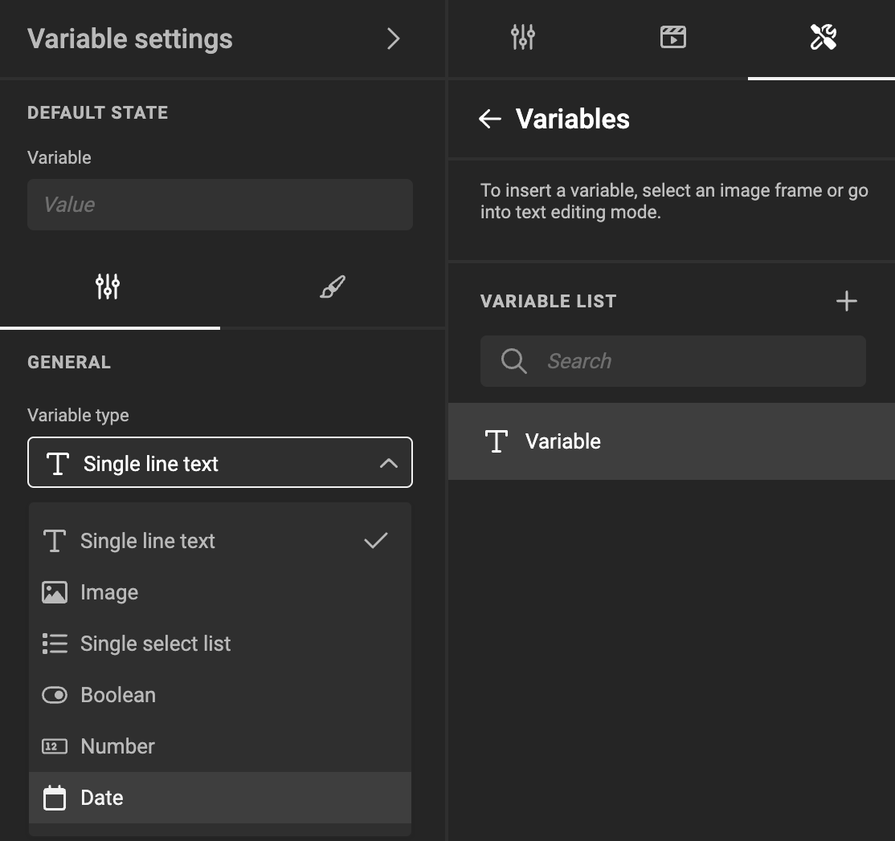

Choose "Date" as the Variable Type.

## Set the Variable Name

Double-click the name, or choose "Rename" under the "..." menu.

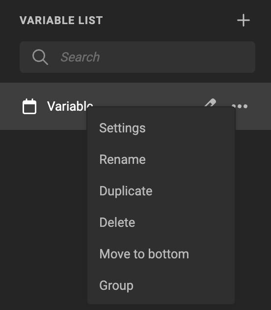

## Set General Properties

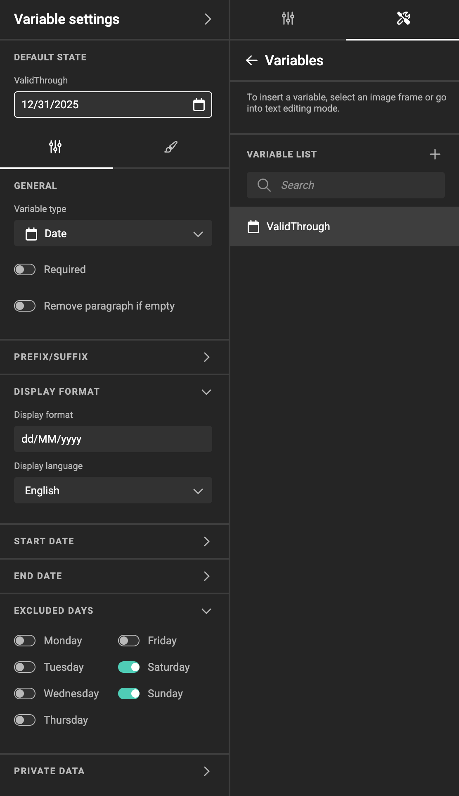

### Display Format

A date can be displayed in several formats, depending on the local preferences. You can set a formatting string, how to display the date.

You can experiment by entering different combinations of characters to define the Display Format you want in your template.

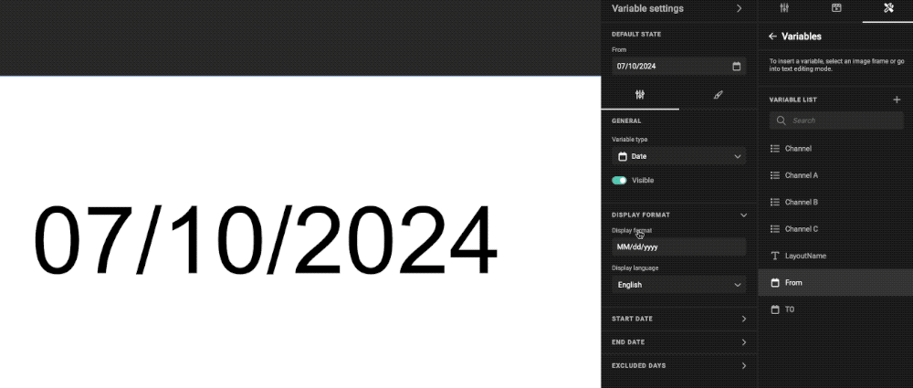

The initial value (upon creation) for the formatting is "dd/MM/yyyy"

Leaving the field empty will result in an empty display of the date.

#### Format

Supported Date patterns to specify the date format.

- Day -> `d`, `dd`
- Month -> `M`, `MM`, `MMM`, `MMMM`
- Year -> `yy`, `yyyy`
- Day of week -> `ccc`, `cccc`

[See ICU formatting overview](https://unicode-org.github.io/icu/userguide/format_parse/datetime/#date-field-symbol-table) (Only the above formats are supported)

Examples for an input date of `04-01-1815`

- Format `dd/MM/yyyy` will display `01/04/1815`
- Format `d.M.yy` will display `1.4.15`
- Format `dd.M.yy` will display `01.4.15`
- Format `dd.MM.yy` will display `01.04.15`
- Format `d MMM yyyy` will display `1 Apr 1815` for the `en_US` language
- Format `MMMM d, yyyy` will display `April 1, 1815` for the `en_US` language
- Format `ccc, MMM d, yyyy` will display `Mon, Apr 1, 1815` for the `en_US` language
- Format `cccc, MMMM d, yyyy` will display `Monday, April 1, 1815` for the `en_US` language
- Format `cccc, MMMM d, yyyy` will display `maandag, april 1, 1815` for the `nl` language
	
#### Language

Will display the name of the month or day in the chosen language

Will work for patterns which output words such as `MMM`, `MMMM`, `cc` and `ccc`. Default is `en_US`.

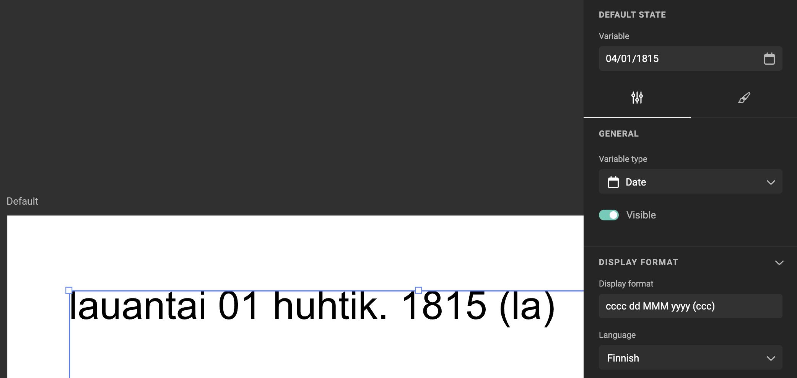

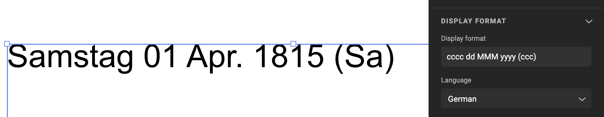

### Start & End Date

Setting a start and / or end date, will limit the choice for end users, to pick a date in that range.

A start and end date can be

- None
- Specific Date
- Relative Date

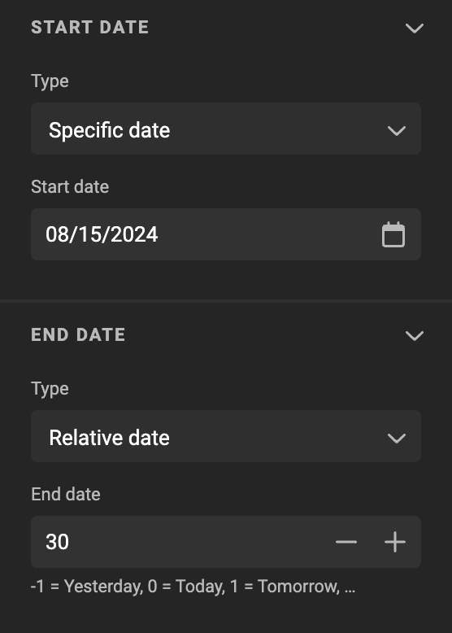

#### Specific Date

The possible earliest date, or possible latest date can be made specific. E.g. Headquarters defined that a campaign can be valid within a larger period, but local marketeers can choose the exact start- and end date.

#### Relative Date

Setting a number relative to the current date (current = when you open the document), enables a template designer to set a date prior to the current, or x days after the current date.

As an example, setting 0 in the "Start date" (Type Relative Date), prevents the end user to pick a date in the past.

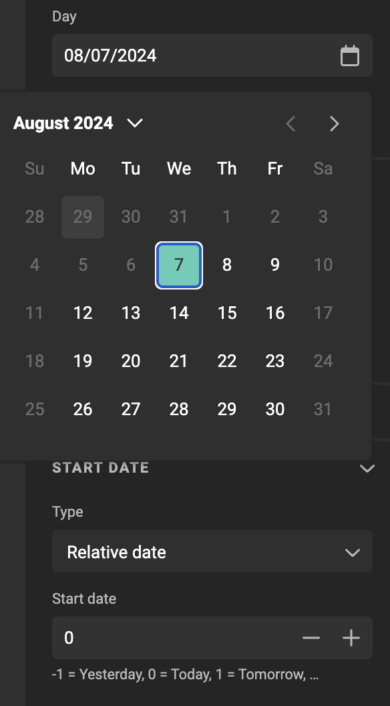


### Excluded days

Choose what days of the week should be excluded from the selection available for the end user.

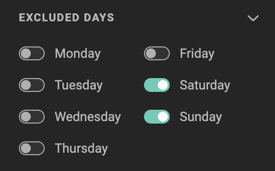

### The result

Your settings will define how the date picker is displayed.

In the Template Designer Workspace you'll see a preview

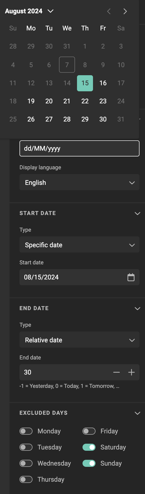

In Studio UI (My Projects), you will see what an end user can see.

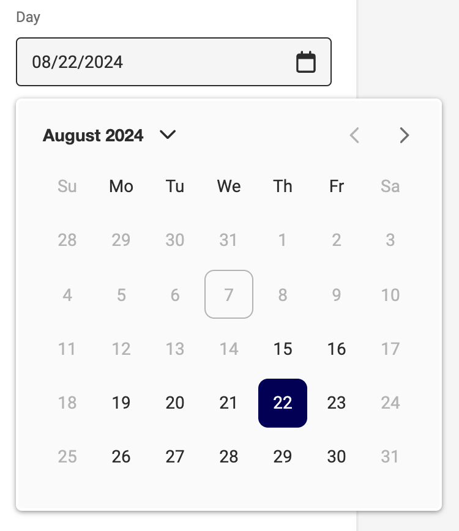

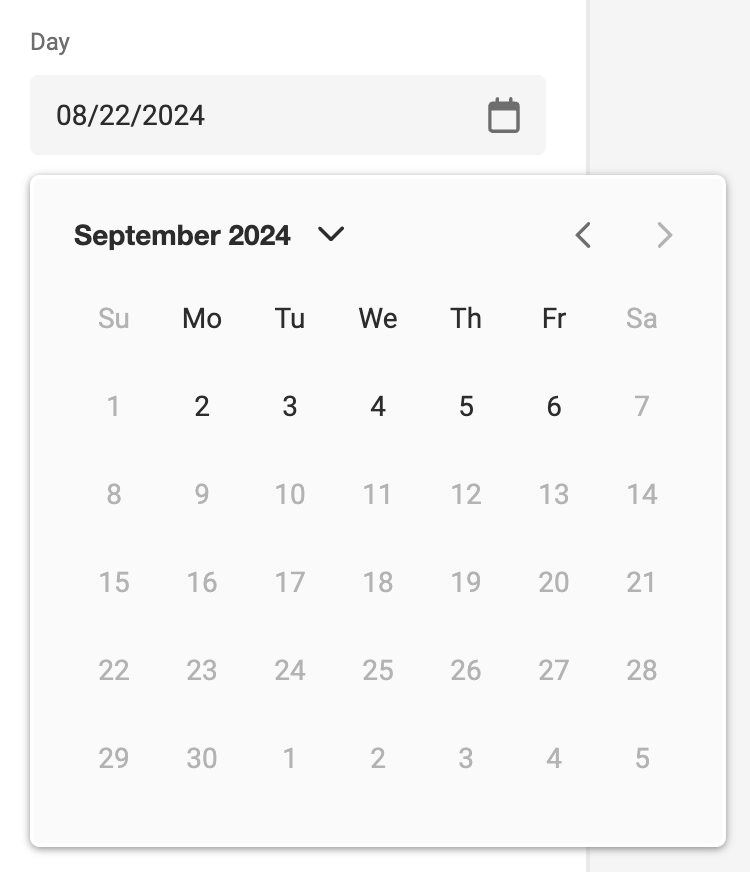

Current date is Aug 7, 2024. First possible date to select is Aug 15. Last possible date is 30 days after today: Sept 6. Saturdays and Sundays are excluded.

## User Interface

See [User Interface](../../template-variables/define/#user-interface) and [Visibility Conditions](../../template-variables/visibility/)

## Use in Actions

Different [helper functions](/GraFx-Studio/concepts/helper-functions/) are available in Actions related to Date variables.

In Actions, you can use JavaScript to address the value and/or properties for date variables.

- getDateVariableValue
- setDateVariableValue
- setDateVariableDisplayFormat (see Display Format above)
- setDateVariableLanguage

## Use in the API

Using the API, you can pass data in the form of JSON to populate the variables.

E.g. With the PDF Output endpoint, you can pass 1 set (or a full array) of variables. Dates can be passed as strings.

``` js
	# Format to be used: yyyy-MM-dd
	{
		"var_date": "2024-07-15"
	}
```

Example to pass 1 set of variables:

``` js
"variables": [
    {
        "var_text": "Single line of text",
        "var_image": "CHILI care soap",
        "var_date": "2024-07-15"
    }
```
Example to pass multiple sets of variables (for VDP output):

``` js
"variables": [
    {
        "var_text": "Single line of text",
        "var_image": "CHILI care soap",
        "var_date": "2024-07-15"
    },
    {
        "var_text": "Second line of text",
        "var_image": "CHILI care shampoo",
        "var_date": "2024-07-19"
    }
]
```

!!! Remark
    Only pass a date, no time
