# Defining template variables

!!! info "Template Variables"
	When referring to **variables** we can mean **[Template variables](/GraFx-Studio/concepts/variables/#template-variables)** or **[JavaScript variables](/GraFx-Studio/concepts/variables/#javascript-variables)**.
	In the context of this page, we are talking about Template variables, unless stated differently.

In the properties panel (right), choose the wrench & screwdriver tool.

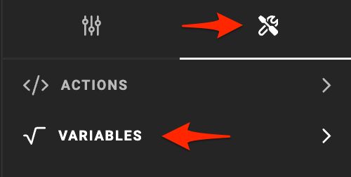{.screenshot}

Then choose **Variables**

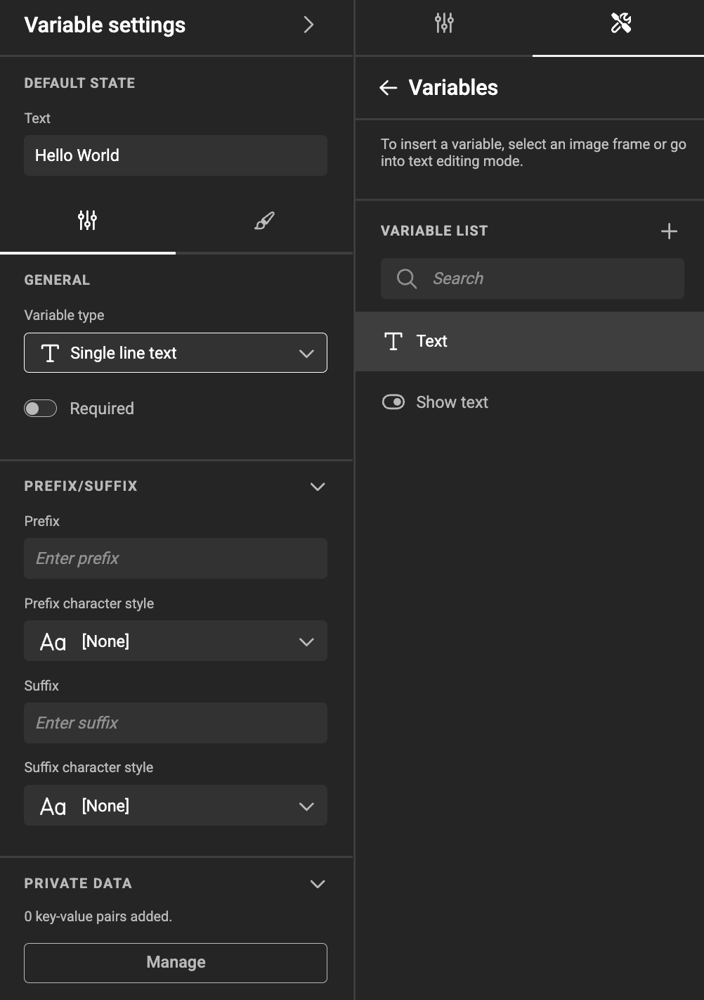{.screenshot}

A panel will appear, where you can define your template variables.

A list of all template variables that are available in the document shows

- Variable type
- Variable name
- Pencil icon (when hovering over the variable)
- "..." menu (when hovering over the variable)

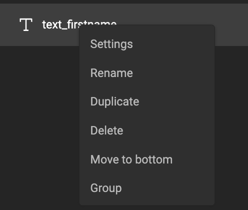{.screenshot}

## Create variables from a linked datasource

If your document already has a linked datasource, you can automatically create template variables based on its field names. This speeds up Smart Template setup by generating variables in one step.

In the **Data source** panel, choose the option to "**Create variables**" from the linked datasource. GraFx Studio will create a template variable for each **unique** field name it finds.

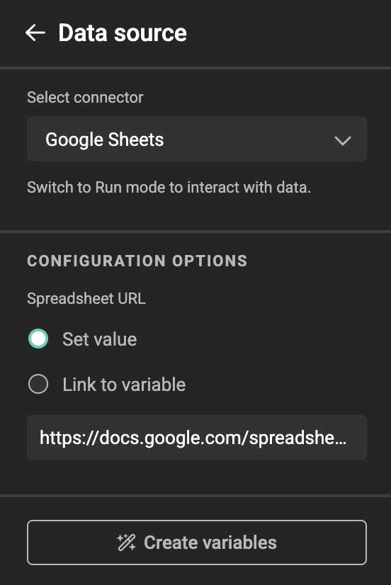{.screenshot}

!!! tip "After creation"
    Review each new variable’s [type](#types) and [settings](#variable-settings) (Label, Placeholder, Help text). Organize them with **Group** to keep complex templates manageable.

!!! warning "Duplicate field names"
    If the datasource contains duplicate field names, variables for those duplicates are **not** created. A toast message will show the error. Make the field names unique in your datasource and run the action again.  

    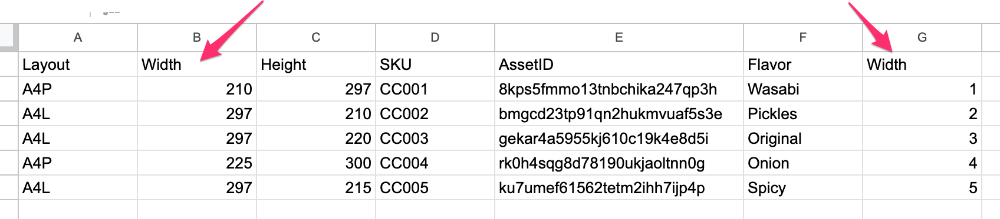{.screenshot-full}

    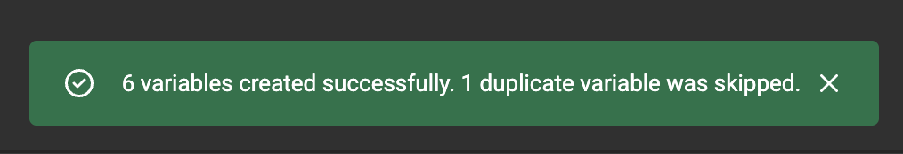{.screenshot-full}  

## Options

Each template variable has a pencil icon, and three dots.
The pencil icon will bring up the "Settings" panel.

The three dots will provide you below options:

### Settings

Opens the settings panel

### Rename

The template variable name goes into inline rename modus.
You can also double click/tap on the name.

### Duplicate

Creates a copy of the template variable and all its properties.
Since the name must be unique, the name is appended with an incrementing number.

### Delete

A confirmation dialog is shown before it's deleted.

### Move to Top

Will move the template variable to the top of the list

You can also drag the template variable in the list to where you want to position it.

This location does not have any effect on the working of your document. It will only help to guide the end-user to see them in a logical order.

### Move to Bottom

Will move the template variable to the bottom of the list

You can also drag it in the list to where you want to position it.

This location does not have any effect on the working of your document. It will only help to guide the end-user to see them in a logical order.

### Group

You can group variables in a group or folder. This allows you to stay organised in more complex templates.

Shift-select multiple variables, and group them. After grouping, you can rename the group.

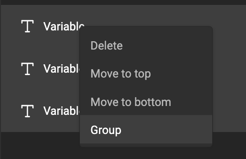{.screenshot}

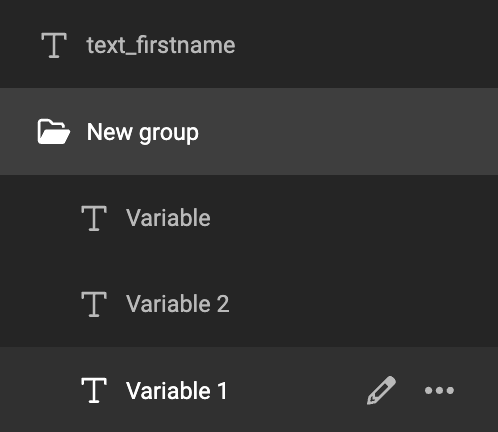{.screenshot}

## Types

Create a variable. Then, in the properties panel, choose the variable type. Different use cases demand different variable types.

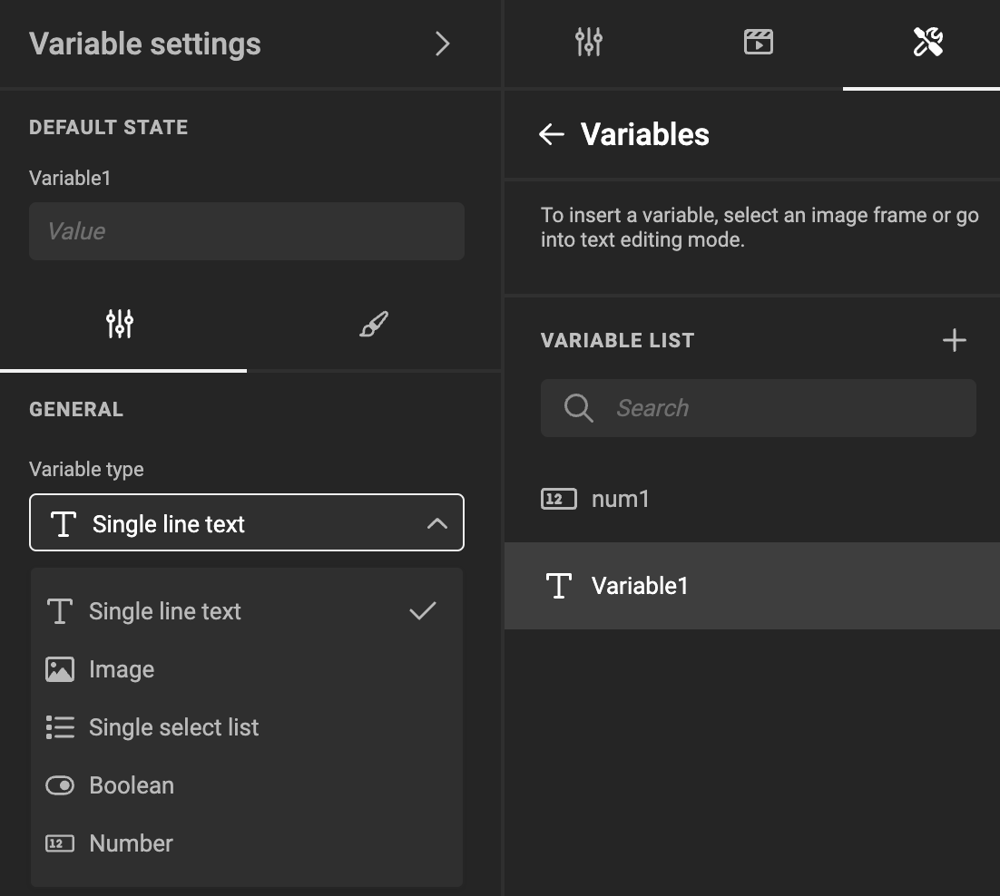{.screenshot}

### Single-line Text

A placeholder for text.

<iframe width="690" height="388" src="https://www.youtube.com/embed/nLqE_XGqSyE?si=19bArigpUEZeRa5t&controls=1&mute=1&showinfo=0&rel=0&autoplay=0&loop=1" title="YouTube video player" frameborder="0" allow="accelerometer; autoplay; clipboard-write; encrypted-media; gyroscope; picture-in-picture; web-share" referrerpolicy="strict-origin-when-cross-origin" allowfullscreen></iframe>

[All feature videos](https://www.youtube.com/playlist?list=PLLHtQ1R6R-B_m7XAVySM9OjbbUscsgBOH)

See also: [Text Direction](/GraFx-Studio/concepts/text-direction/)

### Multi-line Text

A placeholder for multi-line text.

### Image

A placeholder for a reference to an image in the (GraFx) Media pool, or other sources through **Connectors**

<iframe width="690" height="388" src="https://www.youtube.com/embed/pP6_3Ej6x-U?si=HqEr0xf11Ka1oVN7&controls=1&mute=1&showinfo=0&rel=0&autoplay=0&loop=1" title="YouTube video player" frameborder="0" allow="accelerometer; autoplay; clipboard-write; encrypted-media; gyroscope; picture-in-picture; web-share" referrerpolicy="strict-origin-when-cross-origin" allowfullscreen></iframe>

[All feature videos](https://www.youtube.com/playlist?list=PLLHtQ1R6R-B_m7XAVySM9OjbbUscsgBOH)

### Single-select list

A placeholder with a predefined list of values.

A potential use case: define a list of colors to choose from.

<iframe width="690" height="388" src="https://www.youtube.com/embed/iahktXHDu6k?si=UBn6AysRLhP15ylV&controls=1&mute=1&showinfo=0&rel=0&autoplay=0&loop=1" title="YouTube video player" frameborder="0" allow="accelerometer; autoplay; clipboard-write; encrypted-media; gyroscope; picture-in-picture; web-share" referrerpolicy="strict-origin-when-cross-origin" allowfullscreen></iframe>

[All feature videos](https://www.youtube.com/playlist?list=PLLHtQ1R6R-B_m7XAVySM9OjbbUscsgBOH)

### Boolean

A placeholder that can hold "True" or "False".

<iframe width="690" height="388" src="https://www.youtube.com/embed/l418kpravX0?si=DqSxbg2LhsUy12CM&controls=1&mute=1&showinfo=0&rel=0&autoplay=0&loop=1" title="YouTube video player" frameborder="0" allow="accelerometer; autoplay; clipboard-write; encrypted-media; gyroscope; picture-in-picture; web-share" referrerpolicy="strict-origin-when-cross-origin" allowfullscreen></iframe>

[All feature videos](https://www.youtube.com/playlist?list=PLLHtQ1R6R-B_m7XAVySM9OjbbUscsgBOH)

### Number

A Placeholder to hold a numeric value. Different than a text variable, you can set specific elements related to numbers.

### Date

A Placeholder to hold a date value. Different than a text variable, you can [set specific elements](../date/) related to dates.

### Data source

A table of records with one row selected. Instead of holding a single value, it lets the end user pick a row — a product, a store, a customer — which components in the template can then read from.

Data comes either from a [data connector](/GraFx-Studio/concepts/connectors-data/) or is pushed in by an integration. See [Data source variables](../data-source/).

## Variable settings

### Variable name

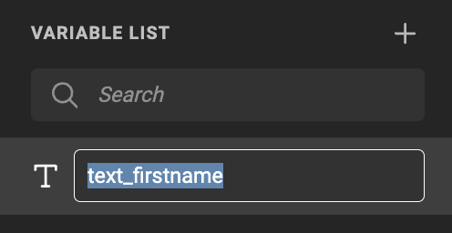{.screenshot}

In the list of variables, you can double click or "Rename" the variable Name.

!!! important "Variable name vs Display Label"

    The variable name is the technical name, that will be used for further automation.
    In the appearance tab you can set the (display) label, that will be shown in the [Studio UI interface](/GraFx-Studio/concepts/template-management/?h=studio#studio-ui).

### Default state

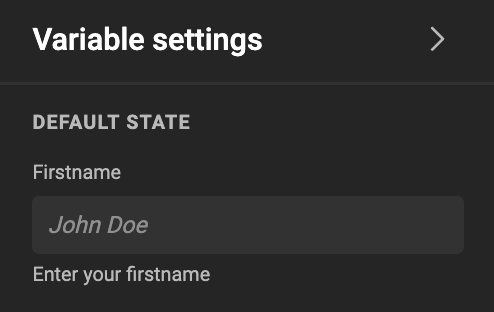{.screenshot}

The default value your template variable will have.

### General properties

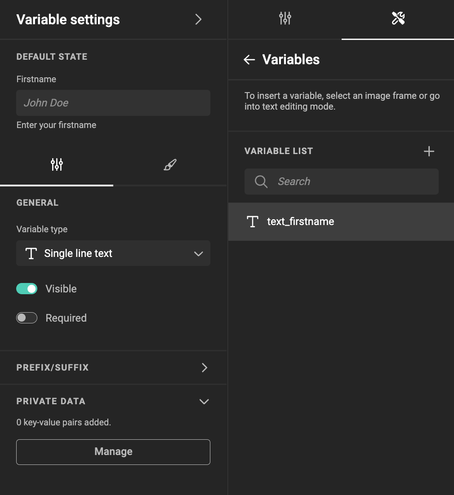{.screenshot}

- Type: See [types](#types) above
- Required: Disabled by default
- Remove paragraph if empty: Disabled by default  
Check to remove the full paragraph this variable is used on.  
Available on (Single-line text, Multi-line text, Single-select list, Date)
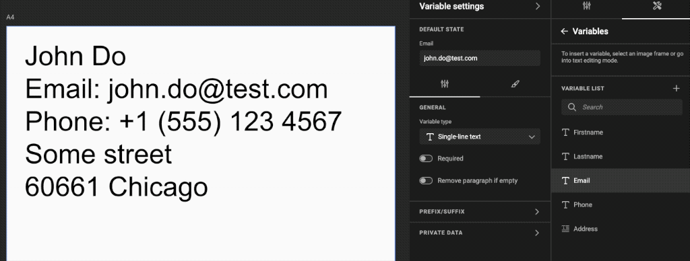{.screenshot-full}
- [Private data](/GraFx-Studio/concepts/private-data/?h=private)  
A set of key-value pairs to assist you with automation.

### User Interface

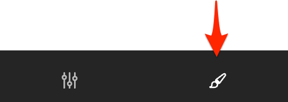{.screenshot}

{.screenshot}

These settings define how the template variable is presented:

- Label: Can be empty, must not be unique, by default it has the same value as the name (When the name is changed, the label is updated, unless if the label already has a different value)
- Placeholder: Default text, to help nudge the end user to fill in something
- Help text: Text that will appear below the variable to add more info what to do with the variable.

#### Visibility

Choose how visibility is set

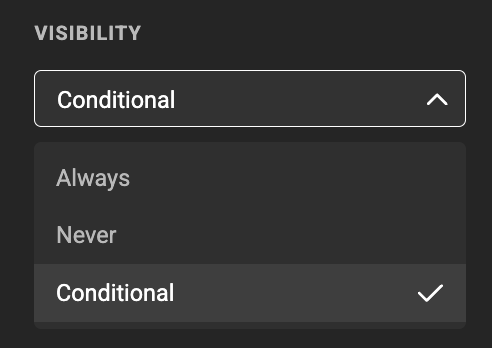{.screenshot}

- Always (default)
- Never
- Conditional

Conditional: See [Visibility Conditions](../visibility/)