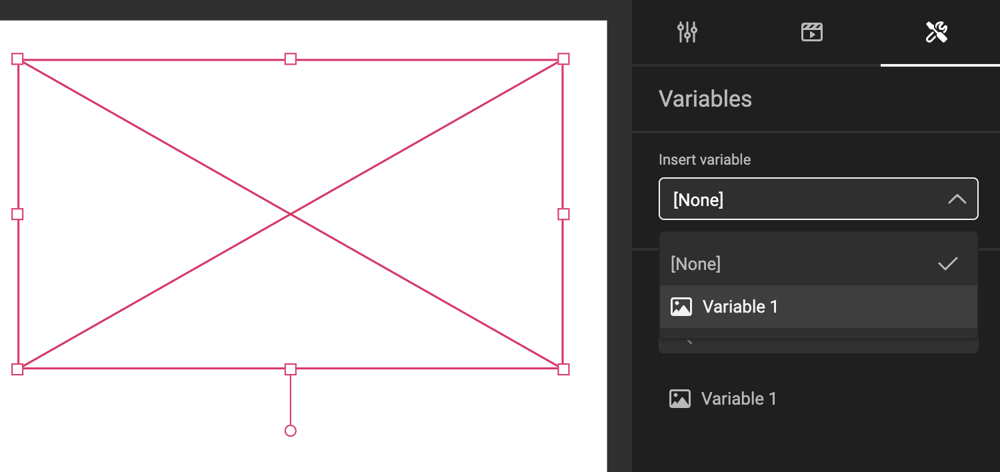

# How to work with image variables

## Feature Channel

<iframe width="690" height="388" src="https://www.youtube.com/embed/pP6_3Ej6x-U?si=yiwTweBam4j7zLRD&controls=1&mute=1&showinfo=0&rel=0&autoplay=0&loop=1" title="YouTube video player" frameborder="0" allow="accelerometer; autoplay; clipboard-write; encrypted-media; gyroscope; picture-in-picture; web-share" referrerpolicy="strict-origin-when-cross-origin" allowfullscreen></iframe>

[Go to YouTube to see all feature videos](https://www.youtube.com/playlist?list=PLLHtQ1R6R-B_m7XAVySM9OjbbUscsgBOH)

## Create an Image Variable

### The Basics

Create a variable, and change the type to "Image" (default will be Single-line text)

Optional: Choose a default image.

Optional: set the variable to be required and add [private data](/GraFx-Studio/guides/template-variables-private-data/).

### User Interface Settings

In the **User Interface** settings, define the **Label**, **Placeholder**, **Help text** and [Visibility](/GraFx-Studio/guides/template-variables/visibility/).  

### Connector Settings

!!! warning "GraFx Media"
    The information below works for the (default) GraFx Media connector.
    For settings specific to another Media Connector, please consult the documentation page for this connector.
    
    GraFx Media uses the concept of folders, other Media Connectors might use different terminology.

Set the path, where the end-user can browse for images.

The path can be fixed: **Set Value** or fed through a (text / list) variable having a path.

Choose "Allow Upload" and set a path, to allow end-users to upload assets.

For uploads, you can define a minimum width and height in pixels.

Once enabled, each uploaded file is stored in the "Upload/" folder (for the GraFx Media connector), or in a custom path you specify.  
Uploaded assets become available just like any other image variable source.

## Assign image variable to image frame

Select the image frame you want to assign the template variable to.

In the variable tab, choose the image variable from the "Insert variable" drop-down menu.

You can also open the action menu of a variable (the 3 dots) and use the "Insert" option.

## Un-assign a template variable from an image frame

To remove the template variable from the image frame, select the frame and choose "None" from the "Insert variable" drop-down menu.

