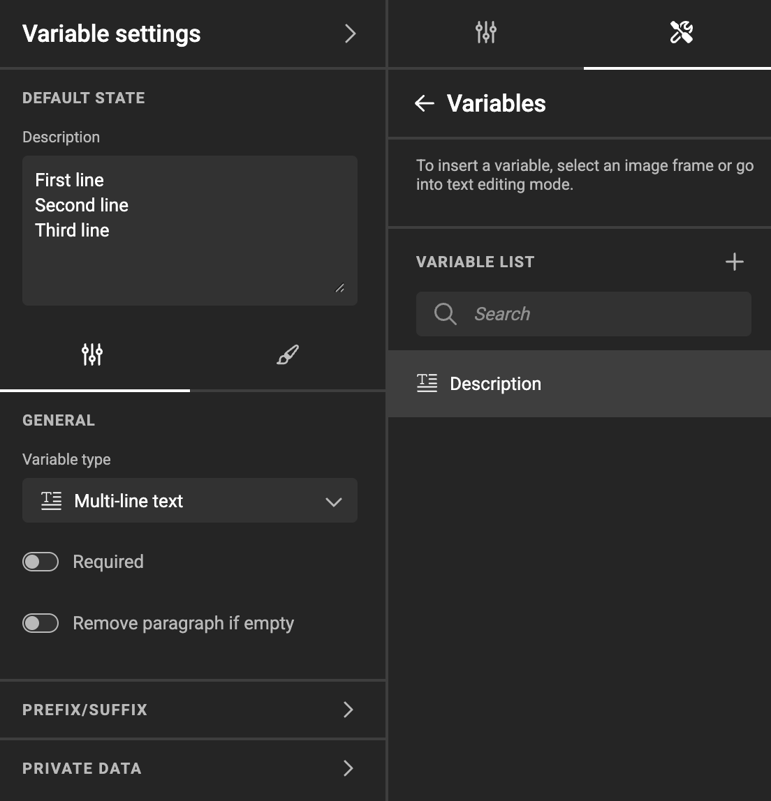
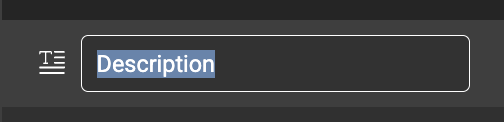
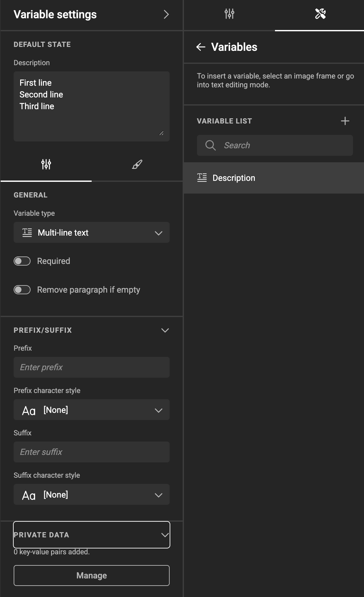
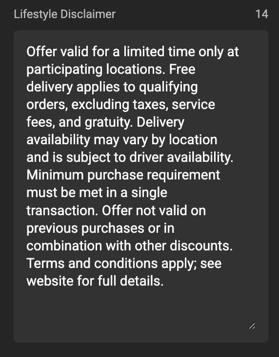
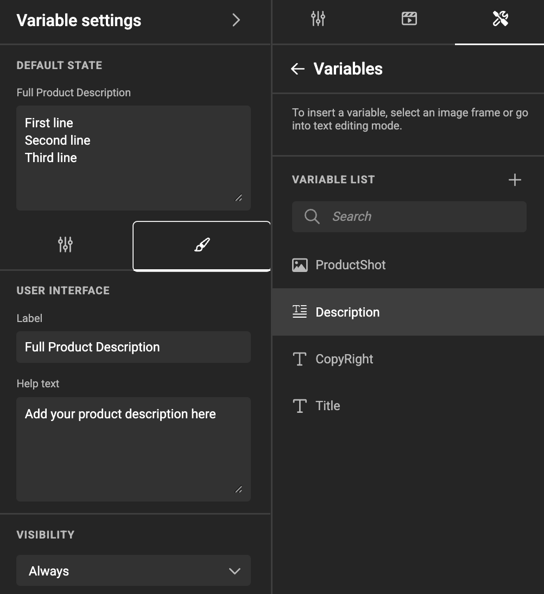

# Multi-line text Variables

## Create a Multi-line text Variable

Under the Automate icon, click Variables, and add a variable with the "+" sign.

Choose "Multi-line text" as the type.

Multi-line text variables allow entering text with multiple lines or paragraphs, unlike single-line text variables which restrict content to a single line.

## Set the Variable Name

Double-click the name, or choose "Rename" under the "..." menu.

## Set General Properties

- You can switch between single-line and multi-line text variable types at any time.
- When switching types, the value of the variable will be cleared.
- Prefix and suffix settings are also available for multi-line text variables.

## Input and Formatting Behavior

- The input field is a resizable text area.
- **Enter** creates a new paragraph (hard line break).
- **Shift + Enter** inserts a soft line break (new line, no new paragraph).
- Line breaks are only allowed in multi-line text variables, single-line text variables with line breaks are invalid.

!!! info "Unicode"
    The following characters are supported for external input (e.g., copy/paste or data sources):  
    `U+2028`, `\n`, `\r\n` → soft line break  
    `U+2029`, `\n\n`, `\r\n\r\n` → hard line break

## Usage

- Multi-line text variables can be inserted into text frames
- They are compatible with:
    - Barcodes (e.g., QR codes, Vcard)
    - Metadata mapping via media connectors
    - Data sources

## Maximum Length

You can cap the total number of characters a multi-line text variable accepts. This is useful for keeping descriptions, addresses, or any layout-critical copy within bounds — both at design time and when end users fill in templates.

Set the limit in the variable's settings panel. When the limit is left empty, no cap is enforced.

{.screenshot}

The limit is enforced everywhere the variable can be edited:

- **Template Designer (Studio Workspace)** and **Studio UI** both show a counter on the input indicating how many characters remain.
- Once the limit is reached, no further input is accepted.
- Pasting text longer than the limit truncates the pasted text to fit.

{.screenshot}

Line-break characters (soft and hard) count towards the limit, the same way visible characters do. The same limit is applied when the value comes in from a data source, ensuring consistent enforcement across manual and automated workflows.

## User Interface

See [User Interface](../../template-variables/define/#user-interface) and [Visibility Conditions](../../template-variables/visibility/)