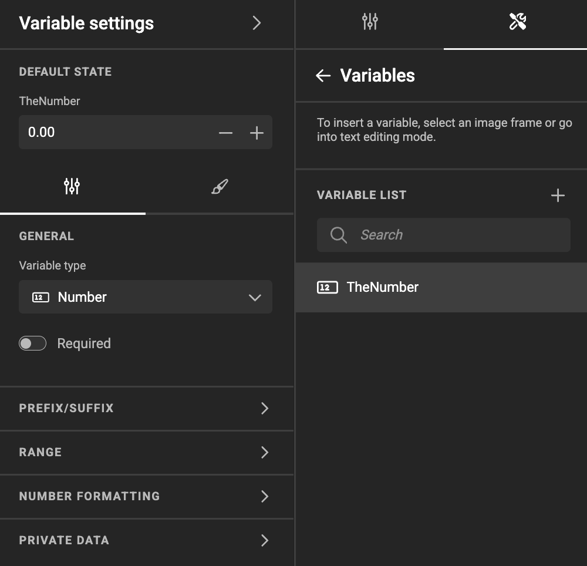
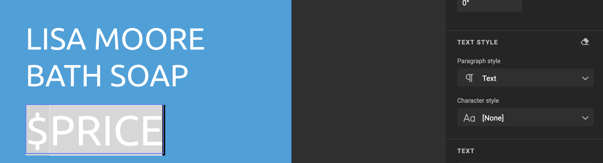
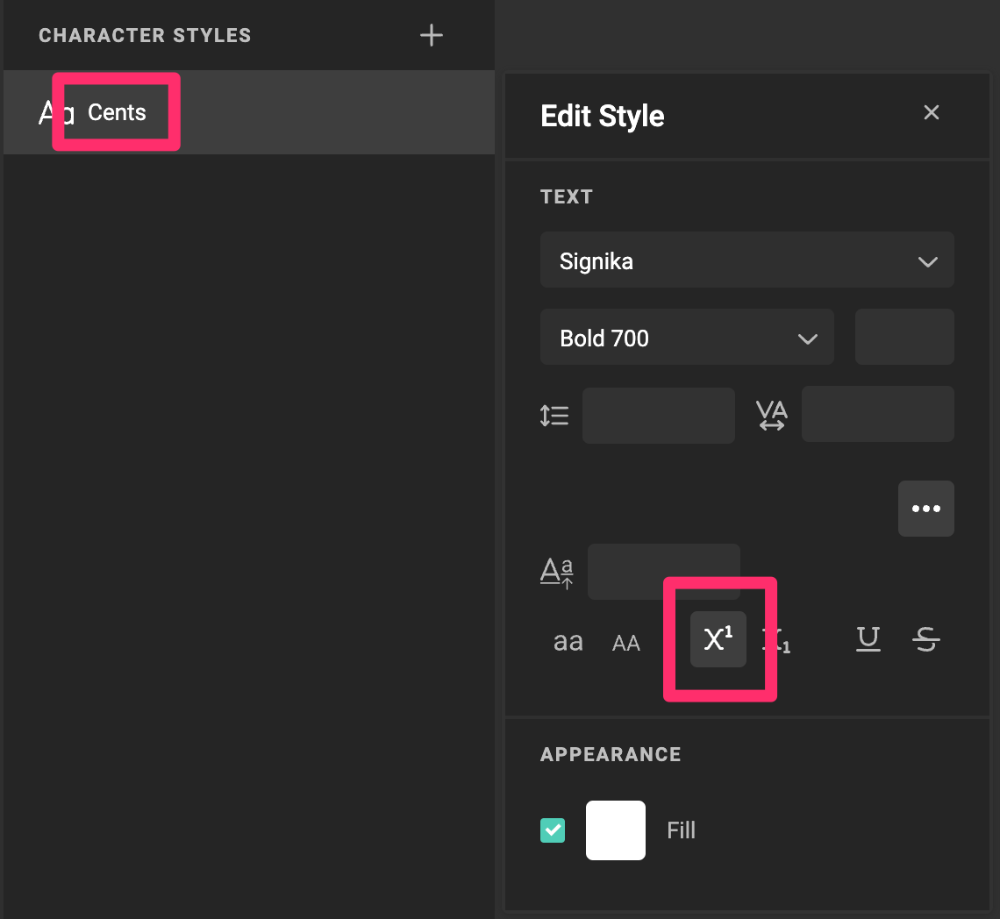
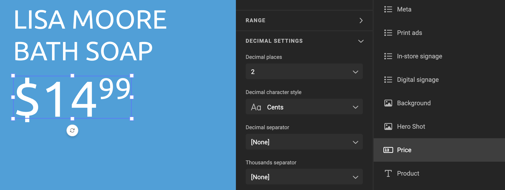
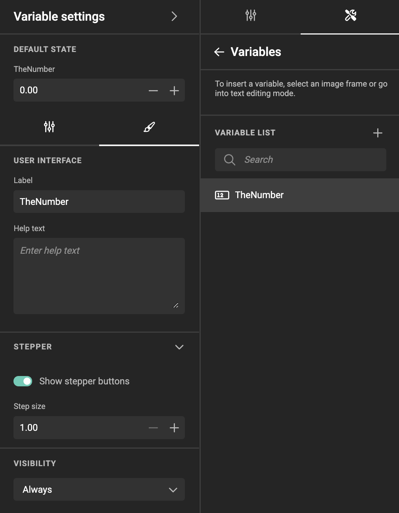

# Number Variables

Example: Price

<iframe width="690" height="388" src="https://www.youtube.com/embed/u6sHNdyIfj0?si=CXy3y0H2-RRPdsf_&controls=1&mute=1&showinfo=0&rel=0&autoplay=0&loop=1" title="YouTube video player" frameborder="0" allow="accelerometer; autoplay; clipboard-write; encrypted-media; gyroscope; picture-in-picture; web-share" referrerpolicy="strict-origin-when-cross-origin" allowfullscreen></iframe>

Example: Discount

<iframe width="690" height="388" src="https://www.youtube.com/embed/pmwwd4RSzAk?si=pdc1NQMStOIn0XzR&controls=1&mute=1&showinfo=0&rel=0&autoplay=0&loop=1" title="YouTube video player" frameborder="0" allow="accelerometer; autoplay; clipboard-write; encrypted-media; gyroscope; picture-in-picture; web-share" referrerpolicy="strict-origin-when-cross-origin" allowfullscreen></iframe>

[All feature videos](https://www.youtube.com/playlist?list=PLLHtQ1R6R-B_m7XAVySM9OjbbUscsgBOH)


## General Properties

{.screenshot-full}

### Range

Defines the acceptable range of values to be accepted by the variable placeholder.

### Decimal Settings

#### Decimal Places

Set the number of decimal places that will be displayed.

#### Decimal Character Style

{.screenshot-full}

Specify a character style specific for the decimal part of a number.

**Example**

The chosen Paragraph style for the frame is "Text".

{.screenshot-full}

A specific character style is defined and has the property to show as "Superscript".

{.screenshot-full}

The 'decimal' character style "Cents" is set to "Superscript" to use it as character style for the decimal part.

{.screenshot-full}

If you want to use the decimal character style, you need to make sure that there are no style overrides on the number variable (you can use the "Clear style overrides" button in the text properties panel to remove the style overrides)

If a character style is already applied, it is locally replaced by the decimal character style


#### Decimal Separator

The symbol used to separate the integer part and the decimal part.

#### Thousands Separator

The “thousands separator” symbol is used to group digits into sets of three for easier readability of large numbers, commonly represented by a comma (,), period (.), or other symbols depending on regional conventions.

## User Interface

{.screenshot-full}

See [User Interface](../../template-variables/define/#user-interface)

### Stepper

Enable or disable the visibility of a stepper button to increase or decrease the number with a value defined in the Step size.

### Visibility

See [Visibility Conditions](../../template-variables/visibility/)

## Use in Actions

Different helper functions are available in Actions related to Number variables.

In Actions, you can use JavaScript to address the value and/or properties for number variables.

- getNumberVariableValue
- setNumberVariableValue
- setNumberVariableDecimalSeparator
- setNumberVariableThousandsSeparator

## Use in the API

Using the API, you can pass data in the form of JSON to populate the variables.

E.g. With the PDF Output endpoint, you can pass 1 set (or a full array) of variables. Numbers can be passed as strings or native numbers, always using a "." as the decimal separator.

Example to pass 1 set of variables:

``` js
"variables": [
    {
        "var_text": "Single line of text",
        "var_image": "CHILI care soap",
        "var_number1": "45.674",
        "var_number2": 45.674
    }
```
Example to pass multiple sets of variables (for VDP output):

``` js
"variables": [
    {
        "var_text": "Single line of text",
        "var_image": "CHILI care soap",
        "var_number1": "45.674",
        "var_number2": 45.674
    },
    {
        "var_text": "Second line of text",
        "var_image": "CHILI care shampoo",
        "var_number1": "12.345",
        "var_number2": 12.345
    }
]
```

!!! Remark
    Don't pass thousand separators using JSON, only pass the actual numeric value.
