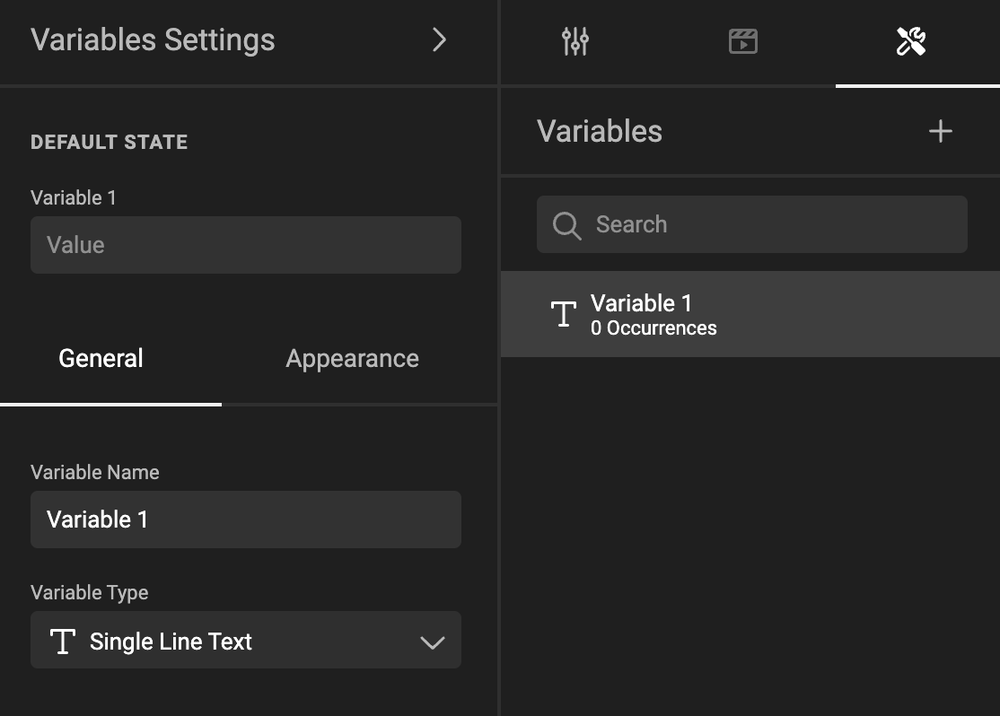

# Organize template variables

!!! info "Template Variables"
	When referring to **variables** we can mean **[Template variables](/GraFx-Studio/concepts/variables/#template-variables)** or **[JavaScript variables](/GraFx-Studio/concepts/variables/#javascript-variables)**.
	In the context of this page, we are talking about Template variables, unless stated differently.

In the properties panel, click the tool wrench.

A panel will appear, where you can define/organize your template variables.

## Selecting

You can click to select / unselect a template variable.

With several template variables selected, you can [group](#group-variables) them.

See [Define template variables](/GraFx-Studio/guides/template-variables/define/) for the other options.

## Group template variables

You can put template variables into groups.

These groups can be used as a filter in the input form for the end-user. E.g. they can be presented as different steps the end-user needs to go through, with different input panels, each showing the template variables from a specific group.

It is possible to drag and drop one or more template variables in and out of groups and from one group to another.

## Ordering

You can drag and drop template variables in the list to change the order.

This is also the order in which they will be presented to the end-user.

It is possible to select multiple template variables and move them together in a group.

## Search

This will search on name and label.

Doing a search does not impact the list of template variables that is presented to the end-user. It's just a tool to make it easier to find your template variables.