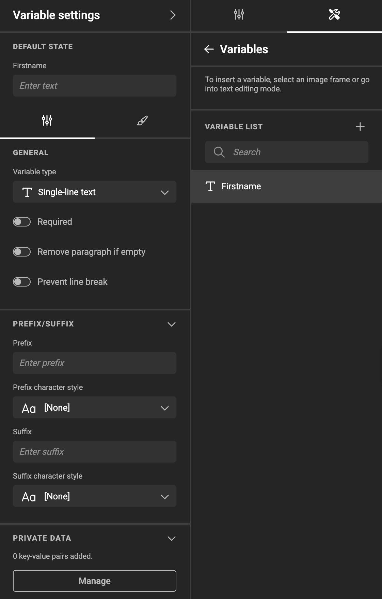
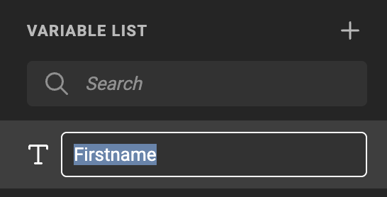
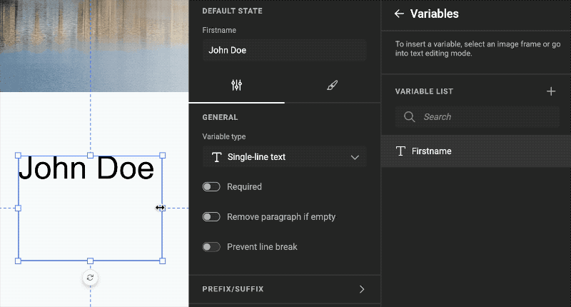

# Single-line text Variables

## Create a Single-line text Variable

Under the Automate icon, click Variables, and add a variable with the "+" sign.

Choose "Single-line text" as the type.

Single-line text variables allow entering text in a single line.

## Set the Variable Name

Double-click the name, or choose "Rename" under the "..." menu.

## Maximum Length Constraints

If a text variable has a defined maximum length:
- Users cannot type beyond that limit in Studio UI.
- The template will enforce the limit in exports, preventing overflow or layout breakage.

This limit applies to all single-line text variables.

## Set General Properties

- You can switch between single-line and multi-line text variable types at any time.
- When switching types, the value of the variable will be cleared.
- Prefix and suffix settings are also available for multi-line text variables.
- "Prevent line break" will prevent text wrap in the text frame.  
This means an overflow warning will show.

{.screenshot-full}

## User Interface

See [User Interface](../../template-variables/define/#user-interface) and [Visibility Conditions](../../template-variables/visibility/)