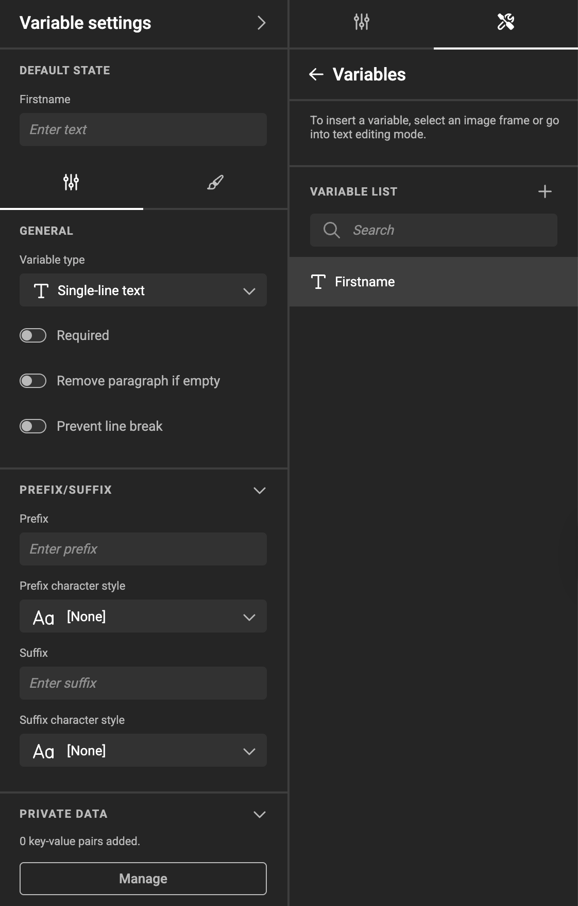
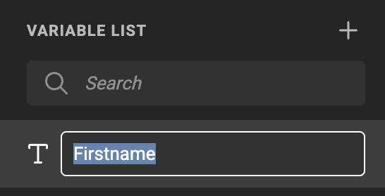
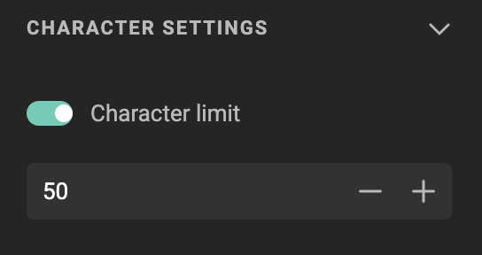
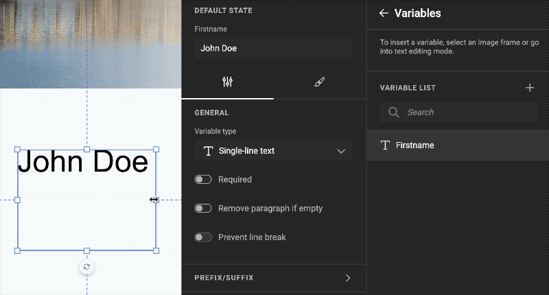

# Single-line text Variables

## Create a Single-line text Variable

Under the Automate icon, click Variables, and add a variable with the "+" sign.

Choose "Single-line text" as the type.

Single-line text variables allow entering text in a single line.

## Set the Variable Name

Double-click the name, or choose "Rename" under the "..." menu.

## Maximum Length

You can cap the number of characters a single-line text variable accepts. This is useful for keeping headlines, product names, or any layout-critical copy within bounds — both at design time and when end users fill in templates.

Set the limit in the variable's settings panel. When the limit is left empty, no cap is enforced.

{.screenshot}

The limit is enforced everywhere the variable can be edited:

- **Template Designer (Studio Workspace)** and **Studio UI** both show a counter on the input indicating how many characters remain.
- Once the limit is reached, no further input is accepted.
- Pasting text longer than the limit truncates the pasted text to fit.

{.screenshot}

{.screenshot}

The same limit is applied when the value comes in from a data source, ensuring consistent enforcement across manual and automated workflows.

## Set General Properties

- You can switch between single-line and multi-line text variable types at any time.
- When switching types, the value of the variable will be cleared.
- Prefix and suffix settings are also available for multi-line text variables.
- "Prevent line break" will prevent text wrap in the text frame.  
This means an overflow warning will show.

{.screenshot-full}

## User Interface

See [User Interface](../../template-variables/define/#user-interface) and [Visibility Conditions](../../template-variables/visibility/)