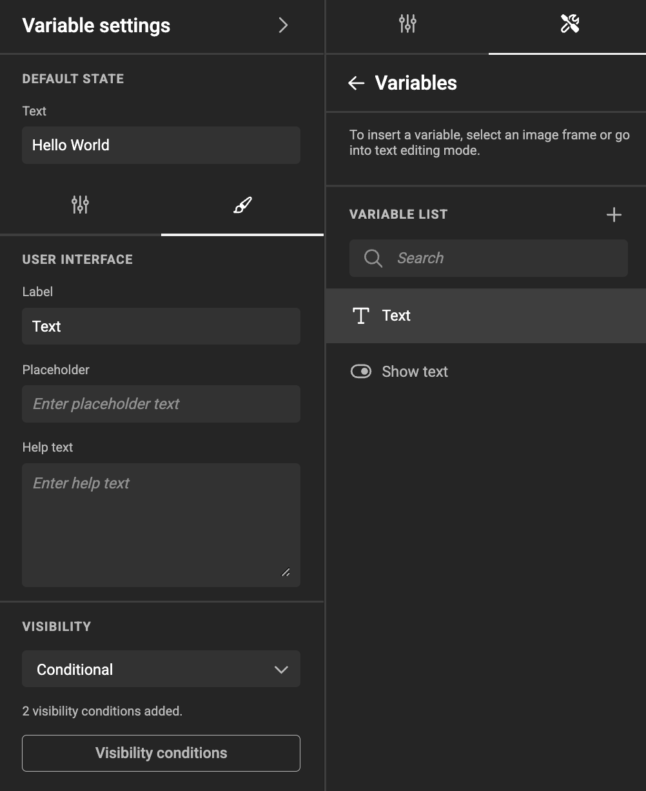
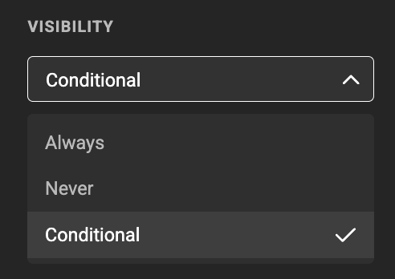
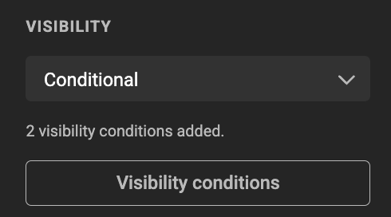
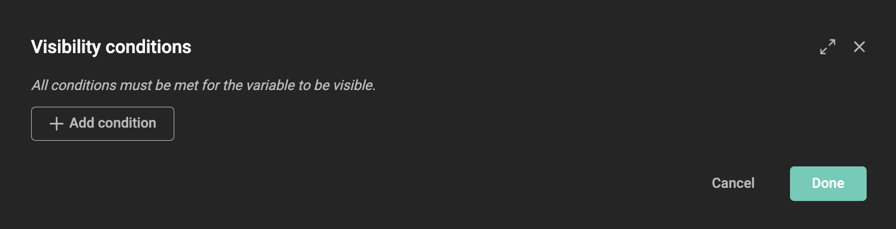
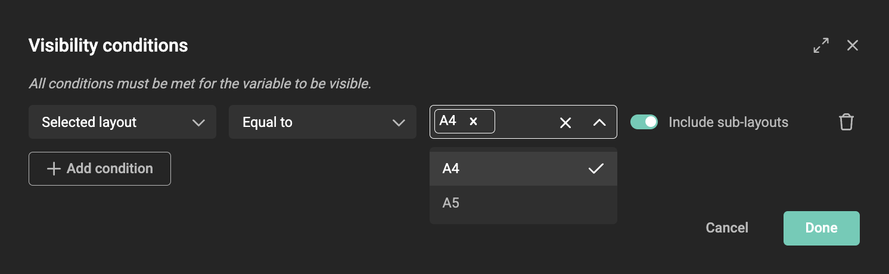
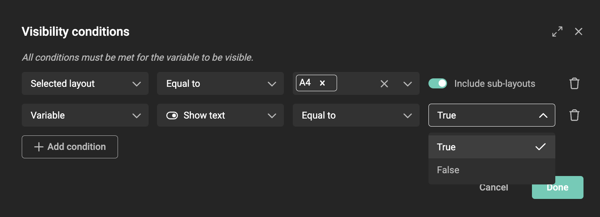
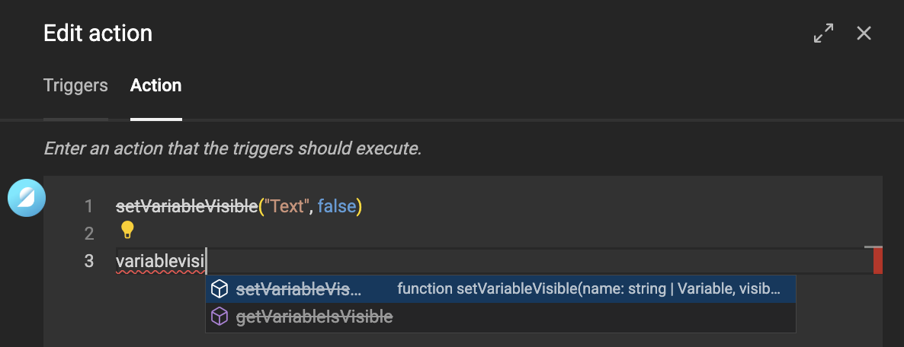

# Variable Visibility Conditions

A variable is always visible in [Design mode](../../../concepts/design-run/#design-mode). However, in [Run mode](../../../concepts/design-run/#run-mode) or the [Studio UI](../../../../GraFx-Studio/concepts/template-management/#studio-ui) (end-user interface), variables can be hidden from the end user.

In some cases, you may want to show or hide a variable dynamically based on the document state or the values of other variables. This helps create a cleaner user experience by ensuring users only see relevant information.

This is where **Visibility Conditions** come into play.

In the **User Interface** tab of a variable, you can define its visibility settings.

Three options are available:

- **Always** (default)
- **Never**
- **Conditional**

### Conditional Visibility

If you select **Conditional**, you can define the conditions under which the variable will be shown in the end-user interface.

You can add one or more conditions. **All conditions must be met** for the variable to be displayed.

Click **Visibility Conditions**.

Click **+ Add Condition** and define the criteria that must be met for the variable to be visible.

## Deprecated in Actions

!!! warning "Deprecated Action"
    Visibility can also be controlled via Actions (with or without GraFx Genie).  
    However, **visibility conditions are not compatible with Actions**.

    If you use **SetVisible** in an Action, it will ❌ override and remove ❌ the visibility conditions.

    Before making the document available to end users, ensure that:
    
    - **You do not use `SetVisible` in Actions** if you want to maintain visibility conditions.
    - **You only use Actions or Visibility Conditions**, but not both.

The Action Editor will display **SetVisible** as ~~strikethrough~~ to indicate that it is deprecated. Hovering over the function will also display a **deprecated** warning.