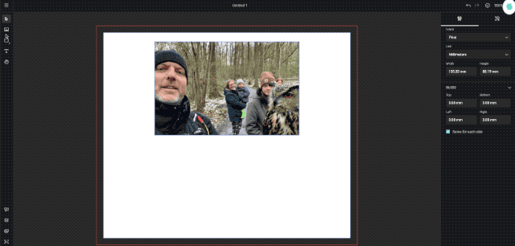
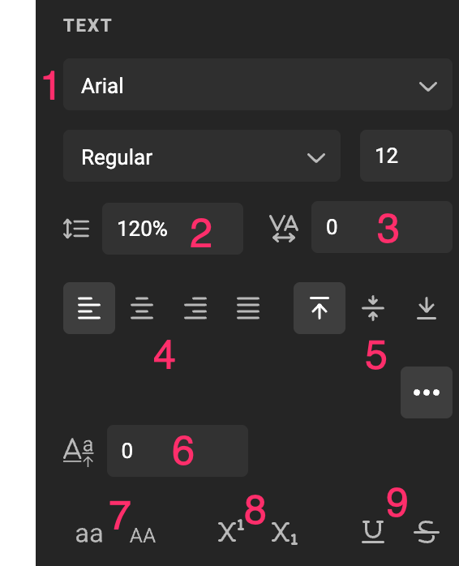
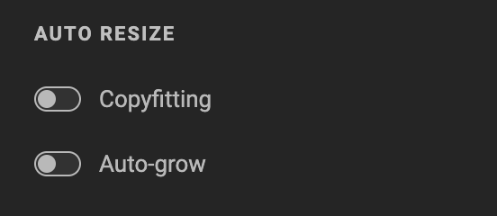
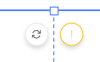
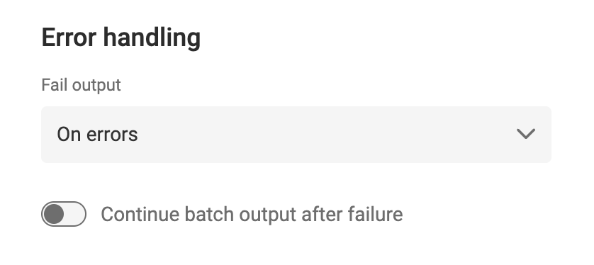
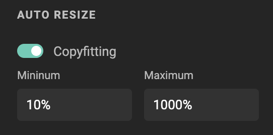
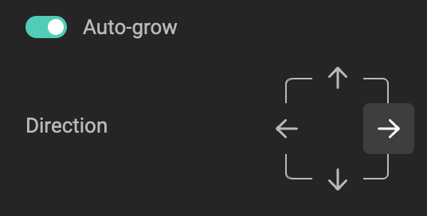
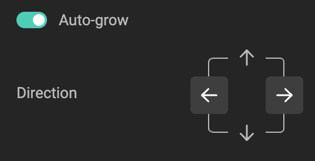
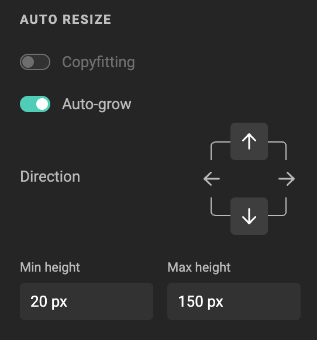
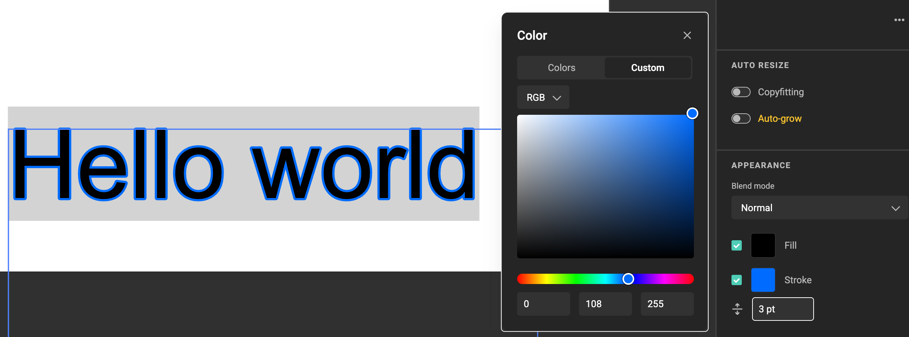

# Text Frame

## Create a Text Frame

Click the Text tool in the [sidebar](/GraFx-Studio/overview/sidebar/). Drag a frame on the document.

<iframe width="690" height="388" src="https://www.youtube.com/embed/QLiOtG2CULo?si=v3bbEqajZyIEr8_0&controls=1&mute=1&showinfo=0&rel=0&autoplay=1&loop=1" title="YouTube video player" frameborder="0" allow="accelerometer; autoplay; clipboard-write; encrypted-media; gyroscope; picture-in-picture; web-share" referrerpolicy="strict-origin-when-cross-origin" allowfullscreen></iframe>

[All feature videos](https://www.youtube.com/playlist?list=PLLHtQ1R6R-B_m7XAVySM9OjbbUscsgBOH)

## Add Text to a Text Frame

Double-click inside the text frame and start typing.

## Add Variable Text to a Text Frame

See [Work with variables](/GraFx-Studio/guides/template-variables/assign/).

## Frame Properties

See [Frame properties](/GraFx-Studio/concepts/frames/).

## Text Properties

### Text Style

Choose a predefined [paragraph style](/GraFx-Studio/guides/paragraphstyles/) or [character style](/GraFx-Studio/guides/characterstyles/) for the selected text.

### Typographic Properties

If you prefer not to use predefined styles (recommended for consistency), you can manually set typographic properties for the selected text.

1. Select a font family, weight, and size.
2. Adjust vertical spacing between characters.
3. Adjust horizontal spacing between characters.
4. Align text: left, center, right, or justified.
5. Align text vertically to the top (default), center, or bottom of the frame.
6. Shift the baseline of the selected text.
7. Override capitalization by choosing "lowercase" or "uppercase."
8. Apply superscript or subscript formatting.
9. Add underline or strikethrough to text.

!!! info "Text direction"
    GraFx Studio automatically applies the correct text direction based on the script (left-to-right or right-to-left).  
    See [Text direction](/GraFx-Studio/concepts/text-direction/) for details.

### Auto Resize

For creative automation, text frames often need to handle datasets with varying text lengths. Set how the frame should respond to different content lengths:

- Text Overflow
- Copyfitting
- Auto-grow

#### Text Overflow

With no resizing option selected, text that exceeds the frame will trigger a yellow Text overflow indicator below the frame.

See also [Output Settings](/GraFx-Studio/guides/output/settings/) to define how Batch output should handle text overflow.

#### Copyfitting

<iframe width="690" height="388" src="https://www.youtube.com/embed/ErhWlgQ74X4?si=lRBPLD4IAwQsN92N&controls=1&mute=1&showinfo=0&rel=0&autoplay=1&loop=1" title="YouTube video player" frameborder="0" allow="accelerometer; autoplay; clipboard-write; encrypted-media; gyroscope; picture-in-picture; web-share" referrerpolicy="strict-origin-when-cross-origin" allowfullscreen></iframe>

[Go to Youtube to see all feature videos](https://www.youtube.com/playlist?list=PLLHtQ1R6R-B_m7XAVySM9OjbbUscsgBOH)

Select the text frame and enable "Copyfitting" to adjust font size to fit the frame by allowing slight reduction or growth.

Set the minimum and maximum percentages for font size adjustments.

> Note: When Copyfitting is enabled, Auto-grow is disabled.

#### Auto-grow

<iframe width="690" height="388" src="https://www.youtube.com/embed/Z_GAnwZQXWg?si=Z0fXY0xl2KlTeGpp&controls=1&mute=1&showinfo=0&rel=0&autoplay=1&loop=1" title="YouTube video player" frameborder="0" allow="accelerometer; autoplay; clipboard-write; encrypted-media; gyroscope; picture-in-picture; web-share" referrerpolicy="strict-origin-when-cross-origin" allowfullscreen></iframe>

[All feature videos](https://www.youtube.com/playlist?list=PLLHtQ1R6R-B_m7XAVySM9OjbbUscsgBOH)

Enable "Auto-grow" to allow the frame to expand as needed to fit content of varying lengths. For instance, records in a dataset might contain differing character counts.

> Note: When Auto-grow is enabled, Copyfitting is disabled.

Choose one or two growth directions (e.g., left, right, up, down). 

When selecting "Left" or "Right," you can also add the opposite direction for bidirectional growth.

When "Up" is selected, you can also add "Down."

To enable Auto-grow, select at least one growth direction, or uncheck "Auto-grow" to disable it.

Define the minimum and maximum frame size if needed.

> Note: When the maximum height is reached, the text will overflow.

!!! info "Rotation"
    Auto-grow does not work for rotated frames. If auto-grow is enabled, anchoring for that direction is automatically set to a compatible mode.

### Appearance

Adjust how the frame blends with its background.

See [Blend Modes](/GraFx-Studio/guides/blendmodes/).

### Text Color and Stroke

You can style text with **fill color** and **stroke**:

{.screenshot-full}

- **Fill color**: pick any color for the inside of the glyphs.  
- **Stroke**: add an outline around the text and choose its color and thickness.  

This allows text to stand out against complex backgrounds or follow brand guidelines precisely.