# Text Frame

## Create a Text Frame

Click the Text tool in the [sidebar](/GraFx-Studio/overview/sidebar/). Drag a frame on the document.

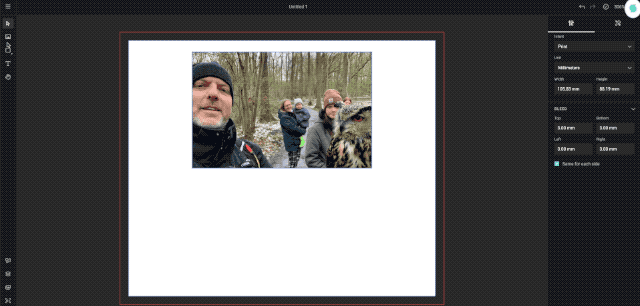

<iframe width="690" height="388" src="https://www.youtube.com/embed/QLiOtG2CULo?si=v3bbEqajZyIEr8_0&controls=1&mute=1&showinfo=0&rel=0&autoplay=1&loop=1" title="YouTube video player" frameborder="0" allow="accelerometer; autoplay; clipboard-write; encrypted-media; gyroscope; picture-in-picture; web-share" referrerpolicy="strict-origin-when-cross-origin" allowfullscreen></iframe>

[All feature videos](https://www.youtube.com/playlist?list=PLLHtQ1R6R-B_m7XAVySM9OjbbUscsgBOH)

## Add Text to a Text Frame

Double-click inside the text frame and start typing.

## Add Variable Text to a Text Frame

See [Work with variables](/GraFx-Studio/guides/template-variables/assign/).

## Frame Properties

See [Frame properties](/GraFx-Studio/concepts/frames/).

## User Constraints for Text Frames

Text frames support **user constraints** that control how end users can interact with the frame and its content in Studio UI. These constraints are defined by the template designer.

All constraint options are **disabled by default**. You explicitly enable only the interactions you want to allow.

{.screenshot-full}

### Frame Constraints

The following constraints control how the frame itself can be manipulated:

- **Allow horizontal move** — Enables movement along the X-axis.
- **Allow vertical move** — Enables movement along the Y-axis.
- **Allow rotation** — Allows the frame to be rotated. Not available on layouts where Auto-grow is active for the selected frame.
- **Allow resize** — Allows the frame to be resized.

### Allow Inline Text Editing

When **Allow inline text editing** is enabled, end users can edit the text content of the frame directly — selecting text and applying styles within the frame.

!!! note
    Inline text editing is only available on text frames that do not use variables. Frames with variables continue to use the standard variable editing experience.

When inline text editing is enabled, a set of sub-options becomes available to define exactly which styling actions the end user can take.

{.screenshot-full}

#### Paragraph style

Enable **Allow paragraph style selection** to let end users apply paragraph styles within the frame.

Click **Manage** to choose which paragraph styles from your Brand Kit are available. The display shows how many styles are currently permitted out of the total (e.g. "1 of 2 paragraph styles allowed").

{.screenshot-full}

#### Character style

Enable **Allow character style selection** to let end users apply character styles within the frame.

Click **Manage** to choose which character styles are available.

{.screenshot-full}

#### Color

Enable **Allow color selection** to let end users change the text color.

Click **Manage** to choose which Brand Kit colors are available.

{.screenshot-full}

#### Font size

Enable **Allow font size editing** to let end users change the font size. When enabled, set a **Min font size** and **Max font size** to constrain the permitted range.

{.screenshot}

### What End Users Experience

When inline text editing is allowed, the end user can double-click the text frame to enter edit mode. A toolbar appears at the top of the canvas with controls for the options the template designer has permitted.

{.screenshot-full}

The toolbar only shows the controls that have been enabled:

- **Paragraph style dropdown** — only the permitted paragraph styles appear in the list.

{.screenshot-full}

- **Character style dropdown** — only the permitted character styles appear in the list.

{.screenshot-full}

- **Font size stepper** — the + and − buttons adjust the font size, constrained to the Min and Max range set by the template designer.

- **Color picker** — only the permitted Brand Kit colors are shown.

{.screenshot-full}

Controls for options that are not enabled are not shown — the end user only sees what they are allowed to use.

### Constraint Dependencies

The same movement dependencies that apply to image frames apply here:

- **Resize requires movement** — When *Allow resize* is enabled, horizontal and vertical movement are enabled automatically.
- **Rotate requires movement** — When *Allow rotation* is enabled, horizontal and vertical movement are enabled automatically.
- **Movement can be enabled independently** — Horizontal and vertical movement can be enabled without allowing resize.

See [Constraints](/GraFx-Studio/concepts/constraints/) for a conceptual overview.

## Text Properties

### Text Style

Choose a predefined [paragraph style](/GraFx-Studio/guides/paragraphstyles/) or [character style](/GraFx-Studio/guides/characterstyles/) for the selected text.

### Typographic Properties

If you prefer not to use predefined styles (recommended for consistency), you can manually set typographic properties for the selected text.

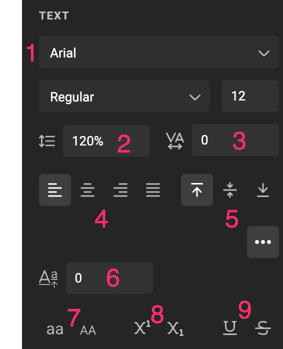

1. Select a font family, weight, and size.
2. Adjust vertical spacing between characters.
3. Adjust horizontal spacing between characters.
4. Align text: left, center, right, or justified.
5. Align text vertically to the top (default), center, or bottom of the frame.
6. Shift the baseline of the selected text.
7. Override capitalization by choosing "lowercase" or "uppercase."
8. Apply superscript or subscript formatting.
9. Add underline or strikethrough to text.

!!! info "Text direction"
    GraFx Studio automatically applies the correct text direction based on the script (left-to-right or right-to-left).  
    See [Text direction](/GraFx-Studio/concepts/text-direction/) for details.

### Text Columns

Text frames can be divided into multiple columns. This allows you to flow text across columns within a single frame—useful for editorial layouts, descriptions, or dense content blocks.

When a text frame is selected, configure columns in the **Text columns** section:

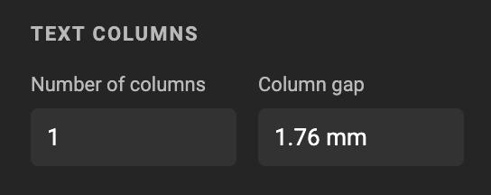{.screenshot}

- **Number of columns**  
  Defines how many columns the text is split into. You can set **1 up to 10 columns** per text frame.
  
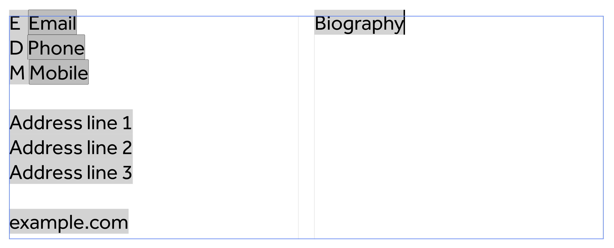{.screenshot-full}

- **Column gap**  
  Sets the spacing between columns, using document units (for example, mm).

Text flows automatically from one column to the next, respecting the frame size, alignment, and auto-resize behavior.

!!! info "Interaction with auto-resize"
    Column settings apply to the text layout inside the frame. Copyfitting, Auto-grow, and overflow rules still determine how the frame reacts when content exceeds available space.

### Auto Resize

For creative automation, text frames often need to handle datasets with varying text lengths. Set how the frame should respond to different content lengths:

- Text Overflow
- Copyfitting
- Auto-grow

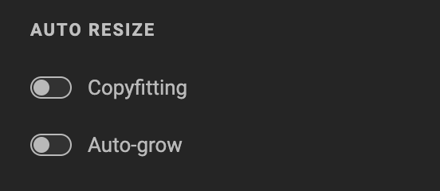

#### Text Overflow

With no resizing option selected, text that exceeds the frame will trigger a yellow Text overflow indicator below the frame.

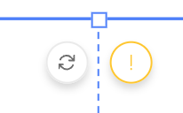

See also [Output Settings](/GraFx-Studio/guides/output/settings/) to define how Batch output should handle text overflow.

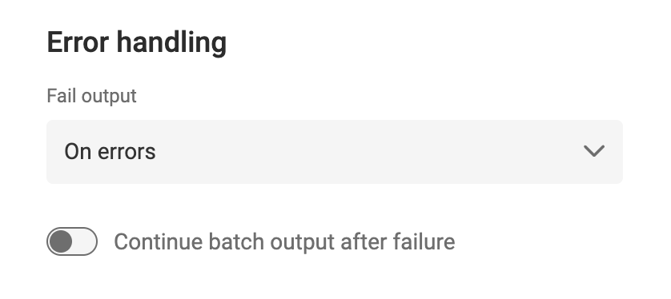

#### Copyfitting

<iframe width="690" height="388" src="https://www.youtube.com/embed/ErhWlgQ74X4?si=lRBPLD4IAwQsN92N&controls=1&mute=1&showinfo=0&rel=0&autoplay=1&loop=1" title="YouTube video player" frameborder="0" allow="accelerometer; autoplay; clipboard-write; encrypted-media; gyroscope; picture-in-picture; web-share" referrerpolicy="strict-origin-when-cross-origin" allowfullscreen></iframe>

[Go to Youtube to see all feature videos](https://www.youtube.com/playlist?list=PLLHtQ1R6R-B_m7XAVySM9OjbbUscsgBOH)

Select the text frame and enable "Copyfitting" to adjust font size to fit the frame by allowing slight reduction or growth.

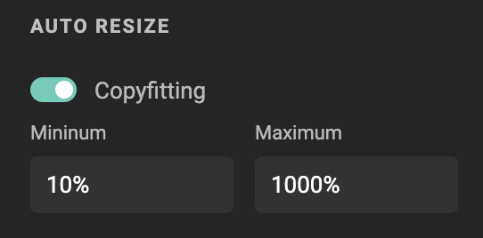

Set the minimum and maximum percentages for font size adjustments.

> Note: When Copyfitting is enabled, Auto-grow is disabled.

#### Auto-grow

<iframe width="690" height="388" src="https://www.youtube.com/embed/Z_GAnwZQXWg?si=Z0fXY0xl2KlTeGpp&controls=1&mute=1&showinfo=0&rel=0&autoplay=1&loop=1" title="YouTube video player" frameborder="0" allow="accelerometer; autoplay; clipboard-write; encrypted-media; gyroscope; picture-in-picture; web-share" referrerpolicy="strict-origin-when-cross-origin" allowfullscreen></iframe>

[All feature videos](https://www.youtube.com/playlist?list=PLLHtQ1R6R-B_m7XAVySM9OjbbUscsgBOH)

Enable "Auto-grow" to allow the frame to expand as needed to fit content of varying lengths. For instance, records in a dataset might contain differing character counts.

> Note: When Auto-grow is enabled, Copyfitting is disabled.

Choose one or two growth directions (e.g., left, right, up, down). 

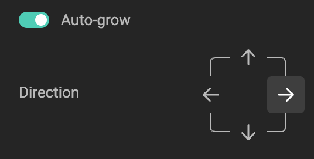

When selecting "Left" or "Right," you can also add the opposite direction for bidirectional growth.

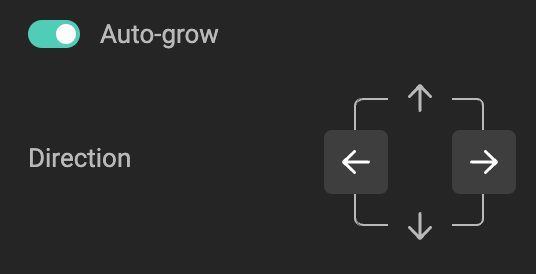

When "Up" is selected, you can also add "Down."

To enable Auto-grow, select at least one growth direction, or uncheck "Auto-grow" to disable it.

Define the minimum and maximum frame size if needed.

> Note: When the maximum height is reached, the text will overflow.

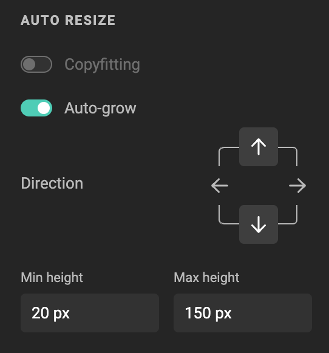

!!! info "Rotation"
    Auto-grow does not work for rotated frames. If auto-grow is enabled, anchoring for that direction is automatically set to a compatible mode.

### Appearance

Adjust how the frame blends with its background.

See [Blend Modes](/GraFx-Studio/guides/blendmodes/).

### Text Color and Stroke

You can style text with **fill color** and **stroke**:

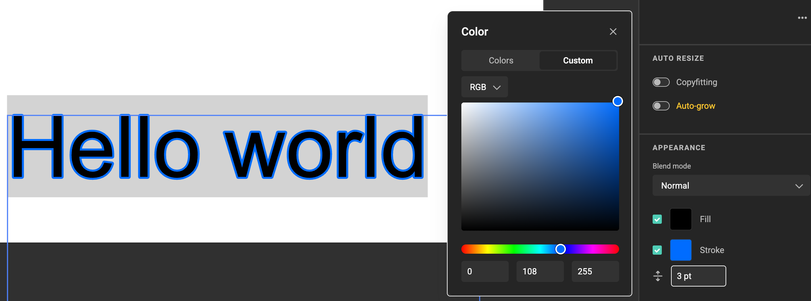{.screenshot-full}

- **Fill color**: pick any color for the inside of the glyphs.  
- **Stroke**: add an outline around the text and choose its color and thickness.  

This allows text to stand out against complex backgrounds or follow brand guidelines precisely.

<iframe width="690" height="388" src="https://www.youtube.com/embed/psgJRxl1-2o?si=i810EETsSSalgcfM&controls=1&mute=1&showinfo=0&rel=0&autoplay=0&loop=1" title="YouTube video player" frameborder="0" allow="accelerometer; autoplay; clipboard-write; encrypted-media; gyroscope; picture-in-picture; web-share" referrerpolicy="strict-origin-when-cross-origin" allowfullscreen></iframe>

[All feature videos](https://www.youtube.com/playlist?list=PLLHtQ1R6R-B_m7XAVySM9OjbbUscsgBOH)
