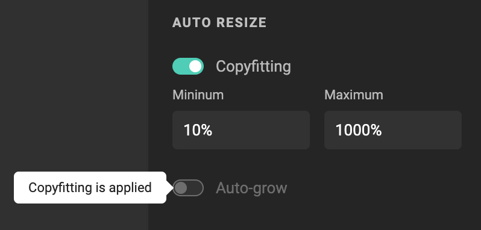

# Text frame

## Create a text frame

Click the Text tool in the [sidebar](/GraFx-Studio/overview/sidebar/). Drag a frame on the document.

## Add text to a text frame

Double-click inside the text frame, and start typing.

## Add variable text to a text frame

See [Work with variables](/GraFx-Studio/guides/template-variables/assign/)

## Frame properties

See [Frame properties](/GraFx-Studio/concepts/frames/)

## Text properties

### Text style

Choose a predefined [paragraph -](/GraFx-Studio/guides/paragraphstyles/) or [character style](/GraFx-Studio/guides/characterstyles/) for the (selected) text.

### Typographic properties

If you don't want to work with predefined styles (highly recommended) you can set the typographic properties for the (selected) text.

1. Choose a font family, weight, and size
2. Vertical spacing for the characters
3. Horizontal spacing for the characters
4. Align the text: left, center, right, and justified
5. Align text vertically to the top (default), center, and bottom of the frame
6. Shift the baseline of the (selected) text
7. Override capitalization by selecting "lowercase" or "uppercase"
8. Make your text superscript or subscript
9. Underline text, Strike-through

### Auto resize

In creative automation, your text frame needs to handle datasets, with varying lengths of text. To accommodate different lengths, you can make the copy fit the frame by allowing reduction or growth of the font size.

Choose the minimum and maximum percentage a font size can vary.

### Appearance

Make the frame blend with its background.

See [blend modes](/GraFx-Studio/guides/blendmodes/)
