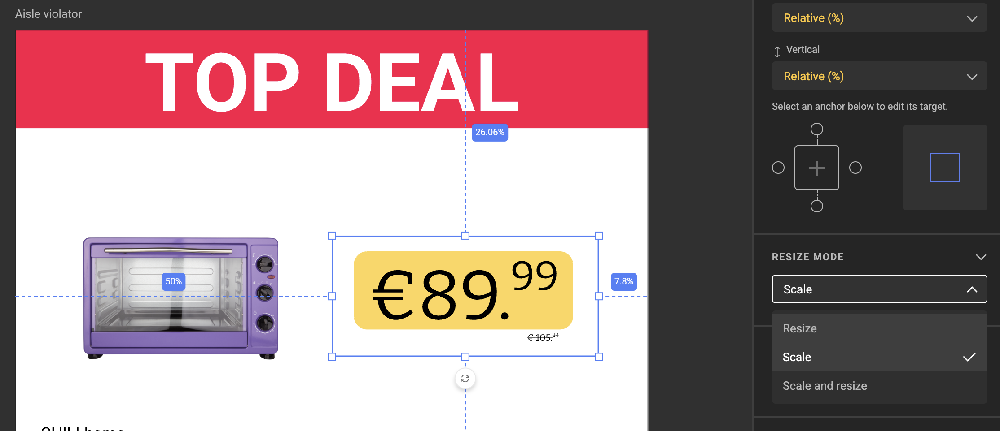
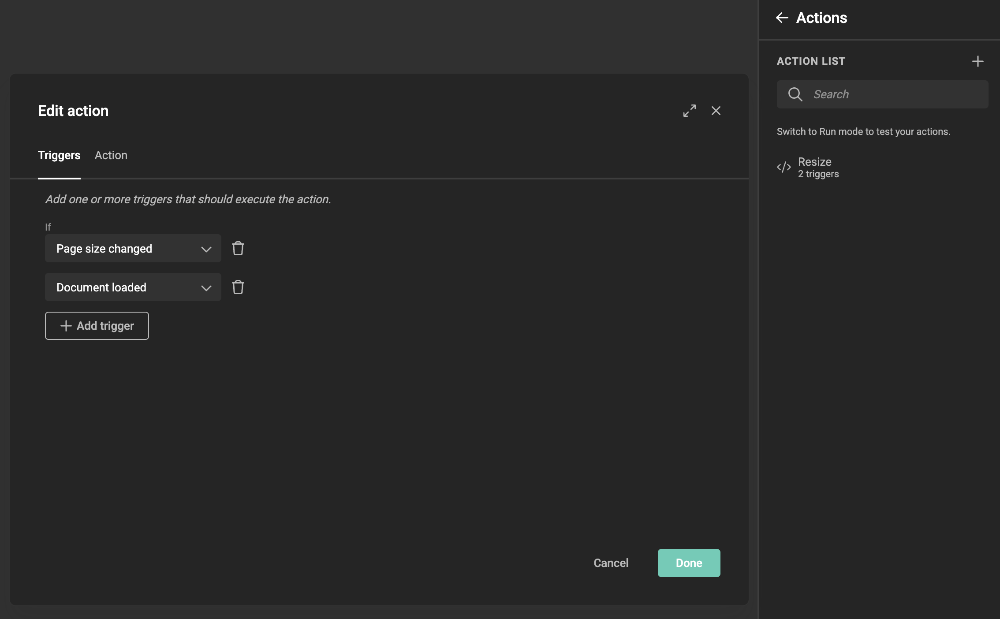
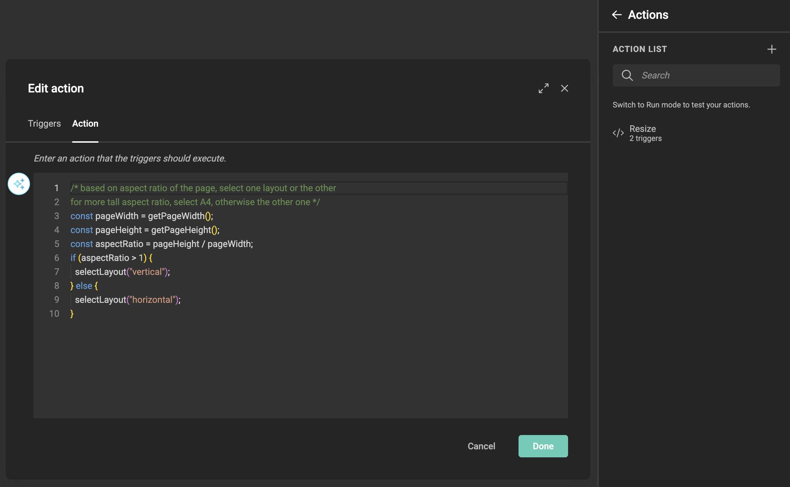
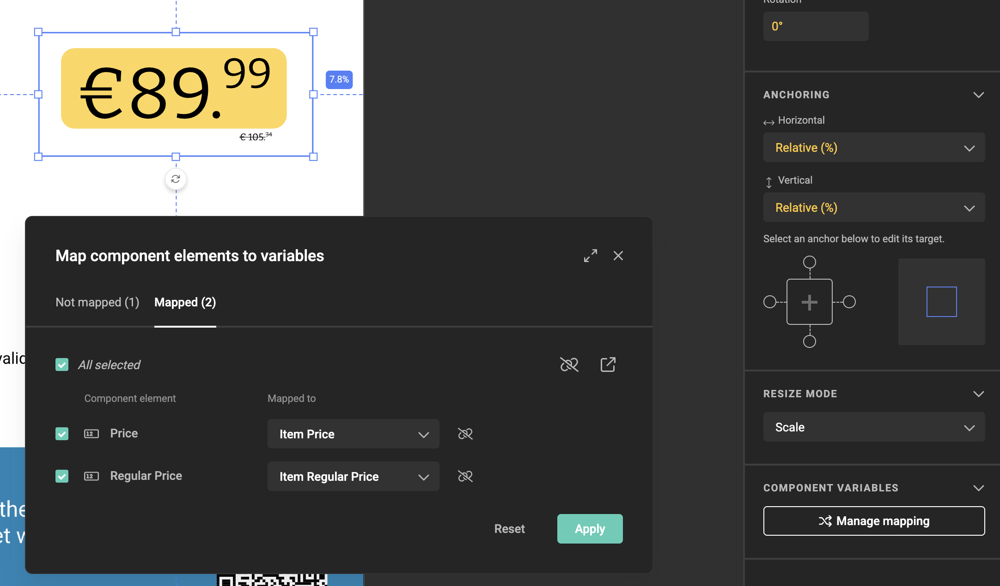
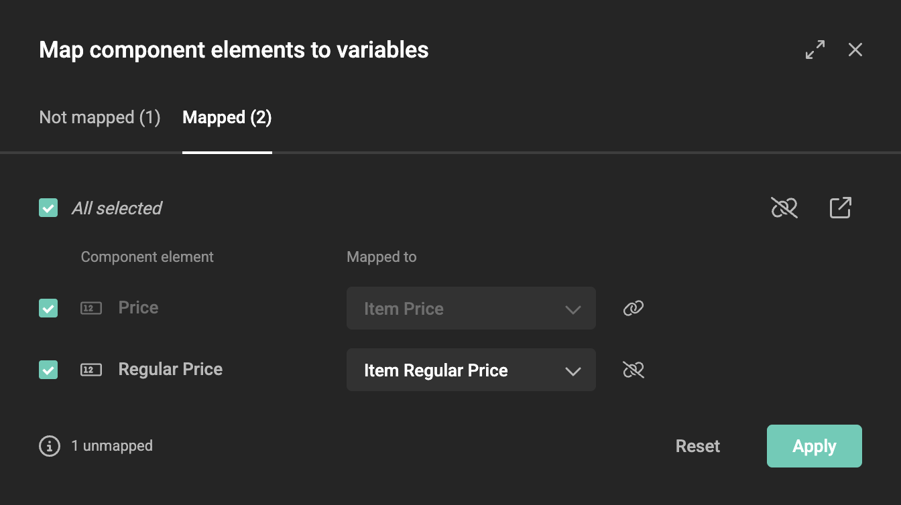

# Use components in a template

This guide explains how to place components on a template canvas, configure how they fill their frame, and map their variables to template variables.

See [Components](/GraFx-Studio/concepts/components/) for an introduction, or [Build a component](/GraFx-Studio/guides/build-component/) to create one first. New to components? Start with the [tutorial](/GraFx-Studio/guides/components-tutorial/) for a full end-to-end walkthrough.

!!! warning "HTML output not supported"
    Templates that include components cannot be exported as HTML. Print, static digital, and animated digital (GIF, MP4) output are all supported.

## Place a component

Open the template in the Template Designer Workspace. In the left toolbar, click the **Resources** icon at the bottom.

The Resources panel opens. Select **Components**.

{.screenshot}

The component browser opens, showing all available components. Use the search field to find a component by name.

{.screenshot}

Click a component to place it on the canvas. The component is placed as a frame at the center of the active layout.

> **Placement rules:** The component is placed at the center of the canvas. If the component's default size is larger than the current layout, it is scaled down to fit within the layout boundaries.

## Multiple instances

You can place the same component multiple times on the same page. Each placement is an independent instance with its own position, size, and variable mapping.

{.screenshot-full}

This is the basis for use cases like a coupon sheet (same pricing component, once per coupon) or a leaflet page (same product ad component, once per product).

## Resize Mode

A component can have multiple layouts — for example a square, horizontal, and vertical version of the same design. The **Resize Mode** setting controls how the component fills the frame you've placed it in.

With a component frame selected, find the **Resize Mode** section in the right properties panel.

{.screenshot-full}

### Scale

Scale always fits the component inside the frame. It scales down (or up) to fit while preserving its aspect ratio, using whichever internal layout is currently active. Any space in the frame that the component doesn't cover appears as white space.

Use Scale when you want the component to fit cleanly in any frame size without distortion.

### Resize

The component **stretches to fill the entire frame** by applying the anchoring, copyfitting, and autogrow rules configured inside the component.

Use Resize when the component's internal layout is flexible enough to fill any frame size gracefully.

### Scale and resize

Scale and resize always keeps the component inside the frame — like Scale — and in addition lets the component's internal resize rules (anchoring, copyfitting, autogrow) expand or reposition elements to use more of the available space. The frame boundary is always respected, so nothing extends outside the frame.

Use Scale and resize when you want the component to fill the frame as much as its internal rules allow, without overflowing the frame or distorting the design.

### Switching layouts via an action

Resize Mode controls how the component fits the frame, but not which internal layout is active. Layout switching is not part of any Resize Mode — it happens only when an action inside the component calls `selectLayout`. The mechanism below works the same way in all three modes, though it's most useful with **Scale**, where aspect ratio is preserved and picking the right layout prevents unnecessary white space.

When the frame is resized in the template, a **Page size changed** event fires inside the component, regardless of which Resize Mode is selected. Use that event together with **Document loaded** (for the initial open) to run a script that picks a layout.

The example below chooses between a vertical and horizontal layout based on aspect ratio. A component is a self-contained page in its own right, so inside the action `getPageWidth()` and `getPageHeight()` give you the component's current page dimensions, and `selectLayout` swaps the active layout.

Open the component, add a new action, and on the **Triggers** tab add both **Document loaded** and **Page size changed**.

{.screenshot-full}

On the **Action** tab, paste the script below. It reads the page dimensions and calls `selectLayout` with the name of the layout to switch to. Replace `"vertical"` and `"horizontal"` with the names of the layouts you've defined — and feel free to extend the logic for more than two layouts.

{.screenshot-full}

Script to place inside the component:

```javascript
/* Based on the aspect ratio of the page, select one layout or the other.
   For a taller aspect ratio, select the vertical layout; otherwise the horizontal one. */
const pageWidth = getPageWidth();
const pageHeight = getPageHeight();
const aspectRatio = pageHeight / pageWidth;

if (aspectRatio > 1) {
  selectLayout("vertical");
} else {
  selectLayout("horizontal");
}
```

## Variable mapping

Variable mapping is how you connect the component's variables to variables at the template level. This is what allows each component instance to show different data — even when it's the same component placed multiple times on the same page.

### Open the mapping modal

Select a component frame on the canvas. In the right properties panel, find the **Component Variables** section and click **Manage mapping**.

The **Map component elements to variables** modal opens.

{.screenshot-full}

### The mapping modal

The modal has two tabs:

- **Not mapped** — component variables that are not yet connected to a template variable
- **Mapped** — component variables that have already been connected

{.screenshot}

{.screenshot}

Each row shows:

- **Component element** — the variable defined in the component, with its type icon
- **Map to** — how the connection is made: to a new variable or an existing one
- **Variable** — the template variable that will receive or supply the value

### Map to a new variable

If the template does not yet have matching variables, set **Map to** to **New variable**. GraFx Studio creates a new template variable for each component variable, named automatically based on the component variable name.

The summary at the bottom of the modal shows how many mappings will be created and how many new variables will be added. Click **Apply** to confirm.

{.screenshot-full}

### Map to an existing variable

If the template already has variables — for example because another instance of the same component was already mapped — set **Map to** to **Variable** and choose the existing template variable from the dropdown.

This is also how you connect two component instances to the **same** template variable, if you want them to always show the same value.

{.screenshot-full}

### Per-instance mapping

Each component instance on the canvas has its own mapping configuration. A template with three price tag components on one page can map each to a completely different set of template variables — `price_1`, `price_2`, `price_3` — so each coupon shows its own price independently.

### Mapped variables in the variable list

After applying the mapping, the new template variables appear in the variable list under a **Component** group, named after the component instance.

These variables work like any other template variable — they can be used in actions, exposed in Studio UI, or driven by a data source.

## Constraint compatibility

When you map a component variable to an existing template variable, GraFx Studio checks whether the two variables are compatible. If the component variable has a range constraint (e.g. a number variable restricted to `[-10, -5]`) and the template variable has an overlapping or incompatible range (e.g. `[0, 10]`), the mapping row shows an **error state** and the mapping cannot be applied until the ranges are made consistent — either by updating the component variable or the template variable.

!!! warning "Required variables are not inherited"
    If a component variable is marked as **required**, mapping it to a template variable does **not** automatically make the template variable required. There is no visual indicator in Run Mode or Studio UI that a mapped template variable feeds into a required component variable. If output is generated while the value is empty, the output will fail. Check the error report on the output task page for details.

## Reset a mapping

To remove all mappings for a component instance, open **Manage mapping** and click **Reset**. This clears all connections without deleting the template variables that were created.
