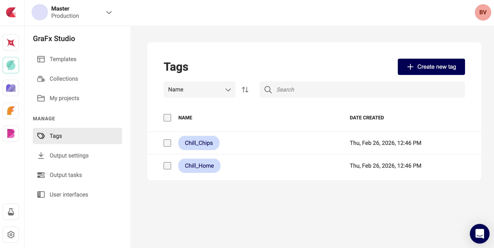
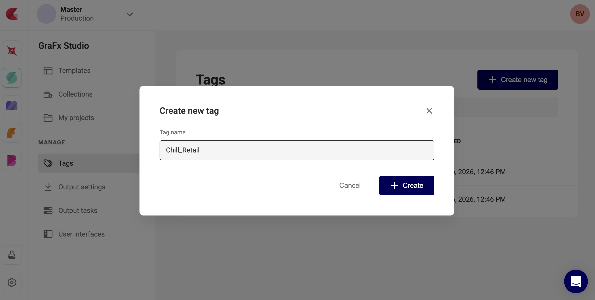
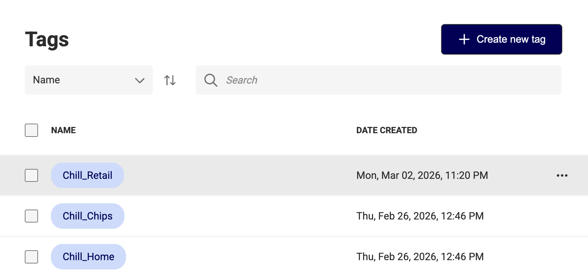
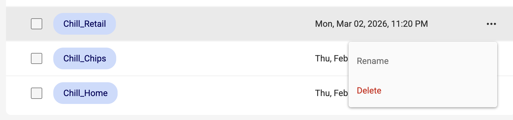
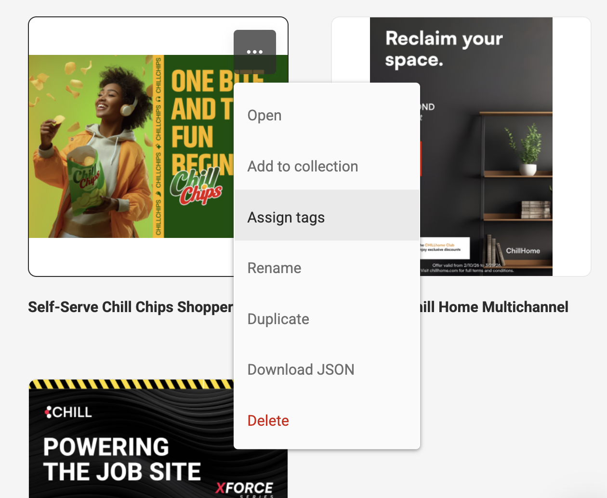
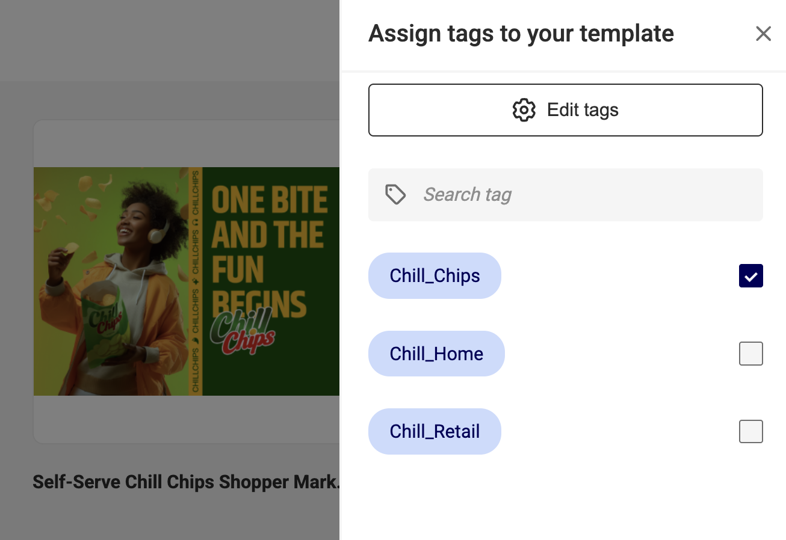
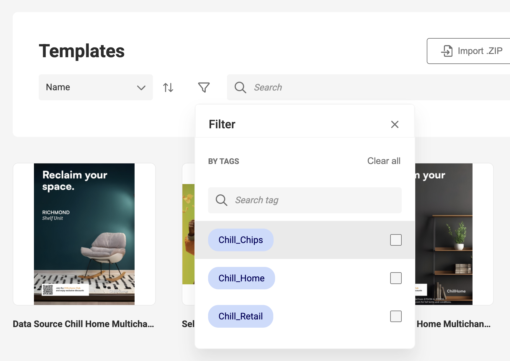
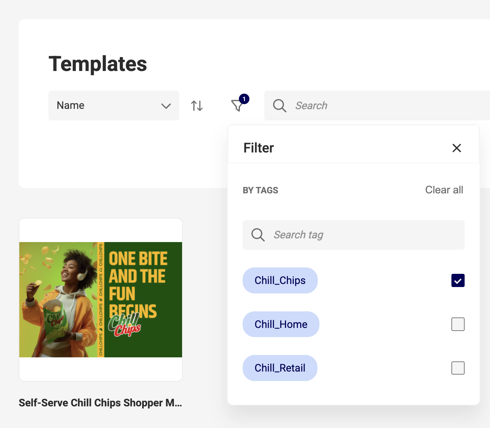

# Manage & Use Tags

## Prerequisites

- Access to GraFx Studio in your environment
- Template Designer or Environment Admin role

## Create a tag

1. In GraFx Studio, go to **Manage > Tags**.
2. Click **+ Create new tag** (top right).
3. In the **Create new tag** dialog, enter a **Tag name**.
4. Click **Create**.

The tag appears in the Tags list with its creation date.

{.screenshot-full}

{.screenshot-full}

{.screenshot-full}

## Rename a tag

1. In **Manage > Tags**, hover over the tag you want to rename.
2. Click the **···** menu on the right.
3. Select **Rename**.
4. Enter the new name and confirm.

{.screenshot-full}

## Delete a tag

1. In **Manage > Tags**, hover over the tag you want to delete.
2. Click the **···** menu on the right.
3. Select **Delete**.

!!! warning
    Deleting a tag removes it from every template it was assigned to. This cannot be undone.

## Assign tags to a template

1. In GraFx Studio, go to **Templates**.
2. Hover over the template you want to tag.
3. Click the **···** menu.
4. Select **Assign tags**.
5. In the **Assign tags to your template** panel, select one or more tags.  
   Use the **Search tag** field to filter the list if needed.

{.screenshot-full}

{.screenshot-full}

To manage the available tags from this panel, click **Edit tags** at the top.

## Filter templates by tag

1. In **Templates**, click the **Filter** icon in the toolbar.
2. Under **By Tags**, select one or more tags.  
   Use **Search tag** to find a specific tag quickly.
3. The template list updates to show only templates matching the selected tags.
4. To remove the filter, click **Clear all** in the Filter panel.

{.screenshot-full}

{.screenshot-full}

## Result

Your templates are organized by tag and filterable by one or more tags. Designers can narrow the template library to the brand or campaign they are working on without scrolling through unrelated content.

## Related

- [Tags concept](/GraFx-Studio/concepts/tags/)