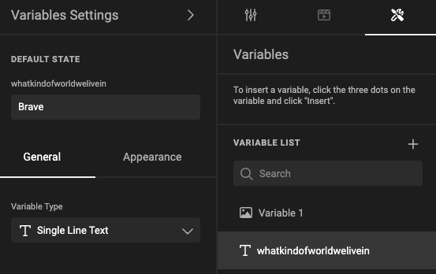

# How to work with variables

Be sure to also check the [variables concept page](/GraFx-Studio/concepts/variables/)

## Insert variable in a text frame

Choose "Insert" from the variable "..." menu to insert it into a text frame

In edit mode, the variable name is shown in a gray box in the text.

If the frame is not wide enough to show the full variable name, the variable name will be truncated to avoid overflow.

## Assign variable to image frame

Select the image frame you want to assign the variable to.

In the Variable tab, choose the image variable from the "Insert variable" drop-down menu.

## Un-assign a variable from an image frame

To remove the variable from the image frame, select the frame and choose "None" from the "Insert variable" drop-down menu.

