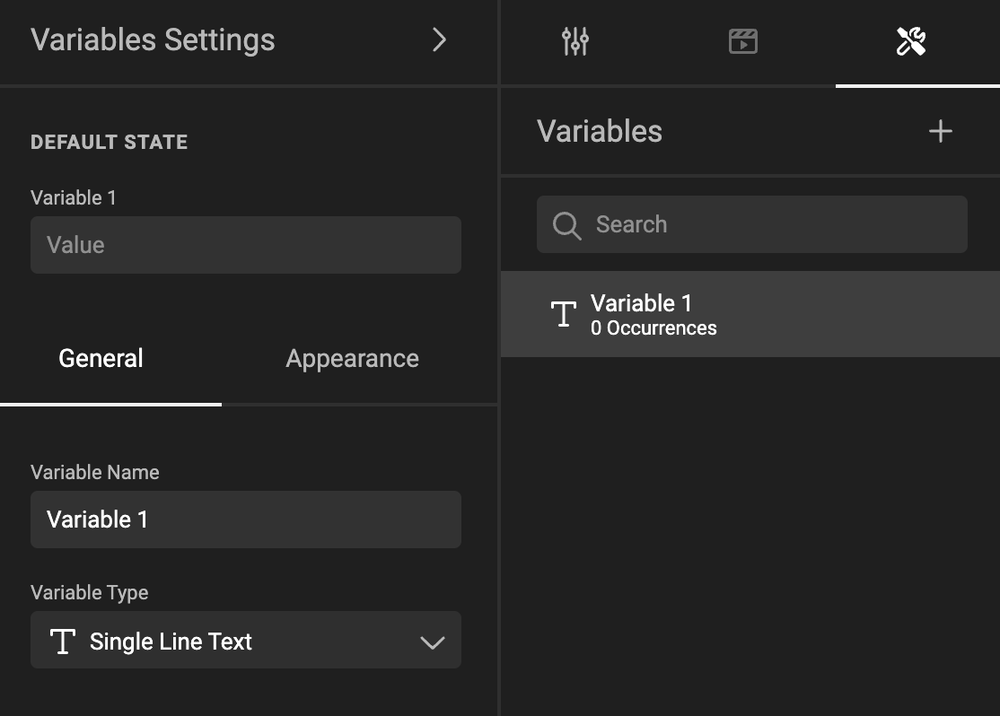

---
tags:
  - unfinished
---

# Organize variables in your document

In the properties panel, click the tool wrench.

A Variable panel will appear, where you can define/organize your variables.

## Selecting

You can click to select / unselect a variable.

With several variables selected, you can [group](#group-variables) variables.

See [Define Variables](/GraFx-Studio/guides/variables/define/) for the other options.

## Group variables

You can put variables into variable groups.

These groups can be used as a filter in the variable input form for the end-user. E.g. the variables can be presented as different steps the end-user needs to go through, with different input panels, each showing the variables from a specific variable group.

It is possible to drag and drop one or more variables in and out of groups and from one group to another.

## Ordering variables

You can drag and drop variables in the variable list to change the order of the variables.

This is also the order in which they will be presented to the end-user.

It is possible to select multiple variables and move them together in a group.

## Search variables

This will search on variable name and label.

Doing a search does not impact the list of variables that is presented to the end-user. It's just a tool to make it easier to find variables.