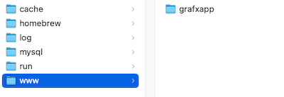
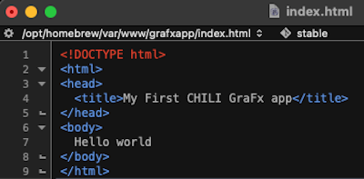
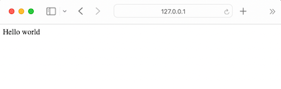

# Set up your local environment

JavaScript could run in the browser, served from a file.
Running it from a webserver, will have several advantages, e.g. access to objects in the code you are writing.
We also need a webserver to be able to fetch content from other domains.

## Setting up a webserver

Set up a local webserver of your choice

- [Apache](https://httpd.apache.org/){target="_blank"}
- [Nginx](https://www.nginx.com/){target="_blank"}
- [IIS](https://www.iis.net/overview){target="_blank"}

To speedup and facilitate your setup, you can use tools like [MAMP](https://www.mamp.info/en/mac/){target="_blank"}

## Create a Folder for you application



## DNS or not?

Up to you, to serve the files from localhost / 127.0.0.1 or from a local DNS.

My preference is to use the .hosts file to setup a local domain.

```
127.0.0.1       my.grafxapp.dev
```

!!! note

	Remember to setup a local SSL certificate, to be able to run secure

## Testing the setup

Add an index.html to the root of your folder, and insert "Hello world"



Browse to the webserver / folder to see



You now have a working website on a local webserver!