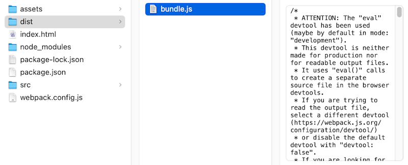

# First build

We allmost have all elements in place. Before we start customizing, we need to define a build process, in WebPack.

Add to "package.json"

``` json
  "scripts": {
    "build": "webpack"
```

Full file looks something like this
``` json
{
  "name": "grafxapp",
  "version": "1.0.0",
  "description": "SDK test app",
  "main": "index.js",
  "scripts": {
    "build": "webpack"
  },
  "author": "Bram",
  "license": "MIT",
  "devDependencies": {
    "webpack": "^5.74.0",
    "webpack-cli": "^4.10.0"
  },
  "dependencies": {
    "@chili-publish/studio-sdk": "^0.47.1"
  }
}
```

## Time to build

Build the output

``` zsh
npm run build
```

Result should be like this

``` zsh
> grafxapp@1.0.0 build
> webpack

asset bundle.js 429 KiB [emitted] (name: main)
runtime modules 937 bytes 4 modules
cacheable modules 416 KiB
  ./src/index.js 2.08 KiB [built] [code generated]
  ./node_modules/@chili-publish/studio-sdk/_bundles/main.js 414 KiB [built] [code generated]
webpack 5.74.0 compiled successfully in 221 ms
```

Your bundled code can be found in the "dist" folder




All the prep work is done