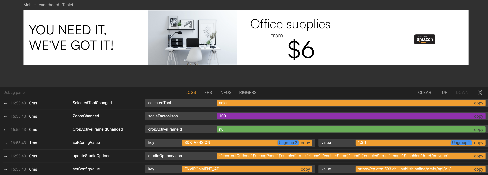

# GraFx studio integration

GraFx studio is a client side browser application.
It contains 3 elements

- The Editor SDK
- The workspace
- Your application

The **Editor SDK** is an open source SDK that connects the Editor Engine (also referenced as "The Canvas") which renders your document. This engine does not have tools (aka the Editor Engine).

The **Workspace** is the set of panels and elements pre-built by CHILI publish to interact with your document canvas aka the **Editor SDK**.
The **workspace** will NOT be covered in this first version.

**Your application** is the custom code that will make it your application, also referenced as "the integration".

[Next up: setting up your Local environment](\GraFx-Studio\integration\environment\)

Or click "Next" on the bottom right of the page to see the next page.

---

## I want to: Integrate the editor

### SDK

To integrate GraFx Studio you will make use of the editor SDK. This SDK dynamically loads the editor engine and can be integrated in a custom application.

We have [SDK reference documentation](https://chili-publish.github.io/studio-sdk/index.html){target="_blank"} and the [SDK codebase](https://github.com/chili-publish/studio-sdk){target="_blank"} is open sourced.

### SDK Version

Integrating an SDK into your project can be done in two ways: using a **JavaScript link** or a **package manager** like NPM. 

Using a JavaScript link connects directly to the **latest hosted version**, ensuring automatic updates and access to new features. However, this method can lead to unexpected changes if the SDK is updated. 

Using a package manager like NPM allows you to download and install a **specific SDK version**, offering more control and stability. This approach is beneficial for maintaining consistency, especially in larger projects, but requires manual updates to access new features or security improvements. 

The choice between these methods depends on your project's needs for latest updates versus stability and the team's ability to manage SDK updates.

### Demo integrations

To make life easier, we have created a couple of [demo integrations](https://github.com/chili-publish/studio-sdk-integration-examples){target="_blank"}, so you don't have to start from scratch.

You can use this script in your HTML to always get the latest SDK version:


``` js
<script src="https://studio-cdn.chiligrafx.com/sdk/latest/main.js"></script>
```

Or you can use NPM to install a specific SDK version, with the following command:

``` bash
npm install @chili-publish/studio-sdk
```

#### stateChanged event will be deprecated

You should subscribe to specific events instead of the global stateChanged event, which will be deprecated soon. You can find the available events in the [documentation](https://chili-publish.github.io/studio-sdk/){target="_blank"}.

### Debug panel

The shortcut will open the debug panel.

Mac: ⌥ (option) + 🌐 fn + F1

Windows: Alt + F1



This panel shows a log of all interactions with the SDK. This can help while building your integration.

There is also an FPS graph, to display the performance of the Editor.

The "Info" tab shows versions of the Engine and SDK.

A triggers tab holds several buttons to trigger events for the template.

### GraFx Connector

With a GraFx Connector you can connect GraFx Studio to a resource provider.

We prepared a [GraFx Connector template](https://github.com/chili-publish/grafx-connector-template){target="_blank"} that you can use to create a custom media connector to connect with your DAM system or to add hardcoded image URLs. With this media connector you can assign your own assets to image frames in GraFx Studio.

In the demo integrations project there is an [example](https://github.com/chili-publish/studio-sdk-integration-examples/tree/main/ts-connector-example){target="_blank"} that shows how to set up and use a very simple media connector. When your custom connector is ready, you can use this example as inspiration to set it up and start using it.